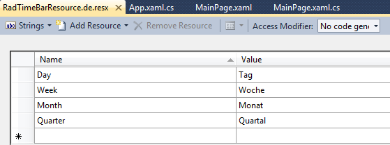
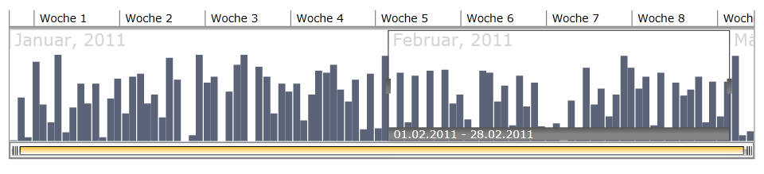

# Localization

The built-in localization mechanism in Silverlight and WPF (which is available since __Q2 2011__) allows you to localize any string resource used by the standard __RadTimeBar__ control. Once translated you might use your resources in both Silverlight and WPF projects without changing anything.


__Localization using Resource Manager__

You can base your localization on the standard resource files provided by the .NET framework. For that purpose you will have to create a separate __.ResX file__ for each one of the languages that your application will support.
Imagine that you want to translate your schedule control into English and German. For that purpose you will have to add two new resource files to your project:

* __RadTimeBarResources.resx__ - this resource file will store the __English(default)__ resources for the ScheduleView control. Set the __AccessModifier__ property to __Public__. 

* __RadTimeBarResources.de.resx__ - this resource file will store the __German__ resources for the TimeBar control. Set the __AccessModifier__ property to __No code generation__. 

Now, having the needed files, it's time to illustrate the idea and localize for example the text for the Day, Week, Month and Quarter navigation strings. For that purpose you need to create four resource strings in each one of the resource files and translate them to the appropriate language.

>Note that the name of the resource string should be the same as the resource key for the string you are localizing i.e. the resource key for the Day is Day, for the Week is Week, for Month is Month and for the Quarter is Quarter.

The snapshot below shows the content of the __RadTimeBarResources.de.resx__ file. The Value column will contain the translation for the appropriate language:



The last step is to instantiate the __LocalizationManager__ class and set its __ResourceManager__ to the resources that have been just created.

__Example 1: Setting ResourceManager__
<snippet id='radtimebar-features-localization-block_1-cs' />
<snippet id='radtimebar-features-localization-block_2-vb' />

>tip If you rely on culture settings to load the right resources automatically, you have to write some code inside your application's project file. For example, if you have to support English and German languages, you can store the localized strings in Resources.resx and Resources.de.resx files. For the Resources.resx file you can set ResXFileCodeGenerator to Internal or Public and for others - to No code generation. Then, open the project file in a text-mode and insert the code below into the section. In this way you notify the framework about the supported cultures

__Example 2: Adding supported cultures__
```XML
	<SupportedCultures>en;de</SupportedCultures>
```

To see the __RadTimeBar__ localized in German for example you should set the *CurrentCulture* and *CurrentUICulture* in *App.xaml.cs/ App.xaml.vb* like this:

__Example 3: Setting the application's culture__
<snippet id='radtimebar-features-localization-block_3-cs' />
<snippet id='radtimebar-features-localization-block_4-vb' />

Here is how the localized *RadTimeBar* will look like:



__Localization Using Custom Localization Manager__

The other way to localize your __RadTimeBar__ control is to create a class that derives from the __LocalizationManager__ object and to override its method __GetStringOverride()__. The logic is pretty simple, you just have to create a switch statement and return the correct translation for each resource key, as it is shown below for German language:

__Example 4: Creating custom LocalizationManager__
<snippet id='radtimebar-features-localization-block_5-cs' />
<snippet id='radtimebar-features-localization-block_6-vb' />

To apply custom localization to your controls just instantiate your custom __LocalizationManager__ and set it to the static property __LocalizationManager.Manager__, before the creation of the UI.

__Example 5: Setting the localization manager__
<snippet id='radtimebar-features-localization-block_7-cs' />
<snippet id='radtimebar-features-localization-block_8-vb' />

>Note that you have to set the localization manager before the creation of the UI, otherwise some parts might remain not-localized.

__Using Built-In Resources__

__RadTimeBar__ provides you with built-in resources for several cultures:  Spanish, German, Italian, Turkish, Dutch.

To change the default culture, you should set the __CurrentCulture__ and the __CurrentUICulture__ of the __CurrentThread__. Note that this must happen in the code-behind of your __Application__ (__App.xaml.cs/ App.xaml.vb__) file, right before the UI initialization. The next code-snippet shows you how to change the __CurrentCulture__ to __Dutch__.

__Example 6: Setting the current culture to Dutch__
<snippet id='radtimebar-features-localization-block_9-cs' />
<snippet id='radtimebar-features-localization-block_10-vb' />

__RadTimeBar Resource Keys__

The following __Resource Keys__ are available:
* Century 
* DecadeEnding 
* Quarter 
* QuarterShort 
* Week 
* WeekShort 