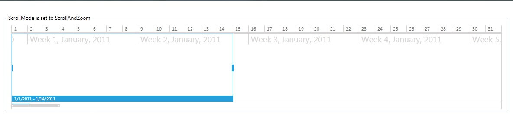
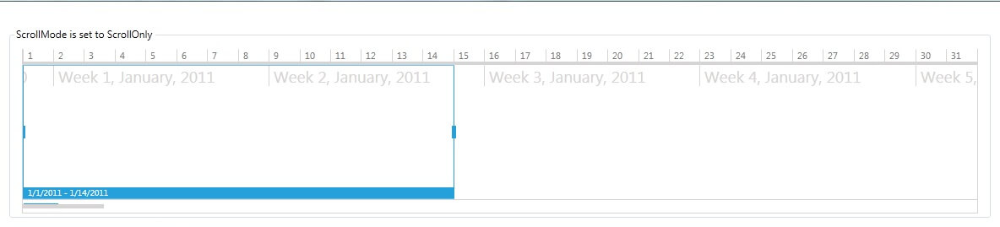
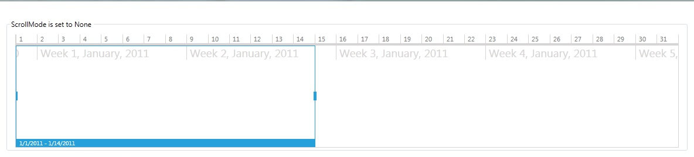

# ScrollMode

The ScrollMode property of RadTimeBar configures the horizontal scrolling and zooming behavior of the control.
      

## Scroll Modes

__ScrollAndZoom (Default)__

A value of ScrollAndZoom indicates that both scrolling and zooming are enabled for
          the RadTimeBar instance. The slider of the RadTimeBar control and the resize handles
          of the slider selection are visible. The user can adjust the zoom level of the control either
          with the mouse wheel, or by dragging the resize handles of the slider selection.
          The horizontal scroll offset can be changed by dragging the selection of the slider.
        

Additional features that change the scroll offset and zoom level:
        

* Double-click on the slider selection – changes the current zoom level to 1.
              That is, the visible period expands to show the whole period.
            

* Double-click on the slider right resize handle – changes the VisiblePeriodEnd to PeriodEnd.
            

* Double-click on the slider left resize handle – changes the VisiblePeriodStart to PeriodStart.
            

* Click on a selection visibility indicator – in case the current selected period is larger 
              than the current visible period, the visible period expands to show the whole selected period.
            

* Dragging the TimeBar selection element or its right or left resize handles outside of the 
              visible period, changes the horizontal scroll offset towards the mouse position.
            

__ScrollOnly__

The ScrollIOnly value indicates that only scrolling is enabled for the RadTimeBar instance. 
          The Slider of the RadTimeBar control is visible, but the resize handles of the slider 
          selection are collapsed. The horizontal scroll offset can be changed either with 
          the mouse wheel or by dragging the selection of the slider.
        

__None__

In order to disable both scrolling and zooming of a RadTimeBar instance, specify a None value for the ScrollMode property.
          In this case, the slider of the RadTimeBar control is collapsed and the mouse wheel event is not handled.
        

# See Also
