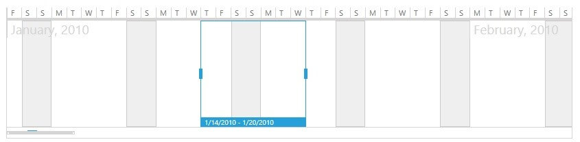

# Special Slots

__RadTimeBar__ provides an easy way to mark certain intervals along the visible range of the control as special slots. This is done through a custom __RangeGenerator__ class which implements __ITimeRangeGenerator__ interface. This interface defines the __GetRanges()__ method. Given the current visible period, this method returns __IEnumerable<IPeriodSpan>__ - an array of __PeriodSpan__ instances each of which defines a special slot with a start and end date. E.g. new PeriodSpan(System.DateTime date, System.TimeSpan slotSpan)        

Below you can find a sample weekends generator implementation:
        
	
<snippet id='radtimebar-features-special-slots-block_1-cs' />
<snippet id='radtimebar-features-special-slots-block_2-vb' />

Using the __SpecialSlotsGenerator__ property of the __RadTimeBar__ control you can specify a custom __ITimeRangeGenerator__ instance that defines certain time intervals as special. The example below shows how you can specify a time range generator for a __RadTimeBar__ control:

	
<snippet id='radtimebar-features-special-slots-block_3-xaml' />

Using the sample weekends generator above, you will get the following result:

## See Also
 * [Intervals Formatters]()
 * [Formatter Provider]()
 * [Properties]()