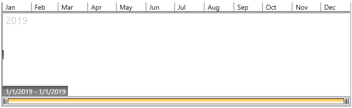
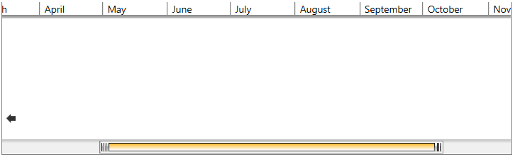
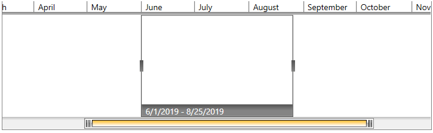
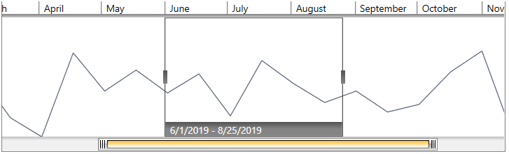

# Getting Started with {{ site.framework_name }} TimeBar

This tutorial will walk you through the creation of a sample application that contains __RadTimeBar__.

## Assembly References

In order to use __RadTimeBar__, you will need to add references to the following assemblies:

* __Telerik.Licensing.Runtime__
* __Telerik.Windows.Controls__
* __Telerik.Windows.Controls.DataVisualization__
* __Telerik.Windows.Data__

You can find the required assemblies for each control from the suite in the [Controls Dependencies]()[Controls Dependencies]() help article.

>tip With the 2025 Q1 release, the Telerik UI for WPF has a new licensing mechanism. You can learn more about it [here]().

### Adding Telerik Assemblies Using NuGet

To use __RadTimeBar__ when working with NuGet packages, install the `Telerik.Windows.Controls.DataVisualization.for.Wpf.Xaml` package. The [package name may vary]() slightly based on the Telerik dlls set - [Xaml or NoXaml]()

## Defining the Control

Defining the control requires setting several vital properties. Those are __PeriodStart__, __PeriodEnd__ and __Intervals__.

#### __[XAML] Example 1: Adding RadTimeBar in XAML__
{{region radtimebar-getting-started-0}}
	<telerik:RadTimeBar PeriodStart="1-Jan-2019 12:00:00 AM" 
						PeriodEnd="31-Dec-2019 11:59:59 PM">
		<telerik:RadTimeBar.Intervals>
			<telerik:YearInterval />
			<telerik:MonthInterval />
			<telerik:WeekInterval />
			<telerik:DayInterval />
		</telerik:RadTimeBar.Intervals>
	</telerik:RadTimeBar>
{{endregion}}

#### __[C#] Example 2: Adding RadTimeBar in code__
{{region radtimebar-getting-started-1}}	
	RadTimeBar timeBar = new RadTimeBar();
	timeBar.BeginInit();
	timeBar.PeriodStart =  new DateTime(2019, 1, 1, 12, 0, 0);
	timeBar.PeriodEnd = new DateTime(2019, 12, 31, 23, 59, 59);
	timeBar.Intervals.Add(new YearInterval());
	timeBar.Intervals.Add(new MonthInterval());
	timeBar.Intervals.Add(new WeekInterval());
	timeBar.Intervals.Add(new DayInterval());
	timeBar.EndInit();
{{endregion}}

#### __[VB.NET] Example 2: Adding RadTimeBar in code__
{{region radtimebar-getting-started-2}}	
	Dim timeBar As RadTimeBar = New RadTimeBar()
    timeBar.BeginInit()
    timeBar.PeriodStart = New DateTime(2019, 1, 1, 12, 0, 0)
    timeBar.PeriodEnd = New DateTime(2019, 12, 31, 23, 59, 59)
    timeBar.Intervals.Add(New YearInterval())
    timeBar.Intervals.Add(New MonthInterval())
    timeBar.Intervals.Add(New WeekInterval())
    timeBar.Intervals.Add(New DayInterval())
    timeBar.EndInit()
{{endregion}}

#### __Figure 1: RadTimeBar__

## Setting the Visible Period

The visible period defines what portion of the period to be brought into the viewport. This can be also looked as zooming. The visible period is defined via the __VisiblePeriodStart__ and __VisiblePeriodEnd__ properties.

#### __[XAML] Example 3: Setting the visible period in XAML__
{{region radtimebar-getting-started-3}}
	<telerik:RadTimeBar PeriodStart="1-Jan-2019 12:00:00 AM" 
						PeriodEnd="31-Dec-2019 11:59:59 PM"
						
						VisiblePeriodStart="14-March-2019 12:00:00 AM" 
						VisiblePeriodEnd="11-Nov-2019 11:59:59 PM">
		<telerik:RadTimeBar.Intervals>
			<telerik:YearInterval />
			<telerik:MonthInterval />
			<telerik:WeekInterval />
			<telerik:DayInterval />
		</telerik:RadTimeBar.Intervals>
	</telerik:RadTimeBar>
{{endregion}}

#### __[C#] Example 4: Setting the visible period in code__
{{region radtimebar-getting-started-4}}
	RadTimeBar timeBar = new RadTimeBar();
	timeBar.BeginInit();
	timeBar.PeriodStart = new DateTime(2019, 1, 1, 12, 0, 0);
	timeBar.PeriodEnd = new DateTime(2019, 12, 31, 23, 59, 59);
	timeBar.VisiblePeriodStart = new DateTime(2019, 3, 14, 23, 59, 59);
	timeBar.VisiblePeriodEnd = new DateTime(2019, 11, 11, 12, 0, 0);
	timeBar.Intervals.Add(new YearInterval());
	timeBar.Intervals.Add(new MonthInterval());
	timeBar.Intervals.Add(new WeekInterval());
	timeBar.Intervals.Add(new DayInterval());
	timeBar.EndInit();
{{endregion}}

#### __[VB.NET] Example 4: Setting the visible period in code__
{{region radtimebar-getting-started-5}}
	Dim timeBar As RadTimeBar = New RadTimeBar()
    timeBar.BeginInit()
    timeBar.PeriodStart = New DateTime(2019, 1, 1, 12, 0, 0)
    timeBar.PeriodEnd = New DateTime(2019, 12, 31, 23, 59, 59)
    timeBar.VisiblePeriodStart = New DateTime(2019, 3, 14, 23, 59, 59)
    timeBar.VisiblePeriodEnd = New DateTime(2019, 11, 11, 12, 0, 0)
    timeBar.Intervals.Add(New YearInterval())
    timeBar.Intervals.Add(New MonthInterval())
    timeBar.Intervals.Add(New WeekInterval())
    timeBar.Intervals.Add(New DayInterval())
    timeBar.EndInit()
{{endregion}}

#### __Figure 2: RadTimeBar with visible period set__

## Selecting an Interval

To select an interval you can set the RadTimeBar's __SelectionStart__ and __SelectionEnd__ properties.

#### __[XAML] Example 5: Setting the selection in XAML__
{{region radtimebar-getting-started-6}}
	<telerik:RadTimeBar PeriodStart="1-Jan-2019 12:00:00 AM" 
						PeriodEnd="31-Dec-2019 11:59:59 PM"						
						VisiblePeriodStart="14-March-2019 12:00:00 AM" 
						VisiblePeriodEnd="11-Nov-2019 11:59:59 PM"
						SelectionStart="1-Jun-2019 12:00:00 AM" 
						SelectionEnd="25-Aug-2019 11:59:59 PM">
		<telerik:RadTimeBar.Intervals>
			<telerik:YearInterval />
			<telerik:MonthInterval />
			<telerik:WeekInterval />
			<telerik:DayInterval />
		</telerik:RadTimeBar.Intervals>
	</telerik:RadTimeBar>
{{endregion}}

#### __[C#] Example 6: Setting the selection in code__
{{region radtimebar-getting-started-7}}
	RadTimeBar timeBar = new RadTimeBar();
	timeBar.BeginInit();
	timeBar.PeriodStart = new DateTime(2019, 1, 1, 12, 0, 0);
	timeBar.PeriodEnd = new DateTime(2019, 12, 31, 23, 59, 59);
	timeBar.VisiblePeriodStart = new DateTime(2019, 3, 14, 12, 0, 0);
	timeBar.VisiblePeriodEnd = new DateTime(2019, 11, 11, 23, 59, 59);
	timeBar.SelectionStart = new DateTime(2019, 6, 1, 12, 0, 0);
	timeBar.SelectionEnd = new DateTime(2019, 8, 25, 23, 59, 59);
	timeBar.Intervals.Add(new YearInterval());
	timeBar.Intervals.Add(new MonthInterval());
	timeBar.Intervals.Add(new WeekInterval());
	timeBar.Intervals.Add(new DayInterval());
	timeBar.EndInit();
{{endregion}}

#### __[VB.NET] Example 6: Setting the selection in code__
{{region radtimebar-getting-started-8}}
	Dim timeBar As RadTimeBar = New RadTimeBar()
    timeBar.BeginInit()
    timeBar.PeriodStart = New DateTime(2019, 1, 1, 12, 0, 0)
    timeBar.PeriodEnd = New DateTime(2019, 12, 31, 23, 59, 59)
    timeBar.VisiblePeriodStart = New DateTime(2019, 3, 14, 12, 0, 0)
    timeBar.VisiblePeriodEnd = New DateTime(2019, 11, 11, 23, 59, 59)
    timeBar.SelectionStart = New DateTime(2019, 6, 1, 12, 0, 0)
    timeBar.SelectionEnd = New DateTime(2019, 8, 25, 23, 59, 59)
    timeBar.Intervals.Add(New YearInterval())
    timeBar.Intervals.Add(New MonthInterval())
    timeBar.Intervals.Add(New WeekInterval())
    timeBar.Intervals.Add(New DayInterval())
    timeBar.EndInit()
{{endregion}}

#### __Figure 3: RadTimeBar with selection defined__

## Hosting Another Control

The RadTimeBar component allows you to host another control in it, thus enchancing the visualization. The most common scenario is hosting a RadSparkline control.

The following example demonstrates how to populate a simple RadLinearSparkline with data and host it in RadTimeBar. Read more about the RadSparkline controls in its [help documentation]().

#### __[XAML] Example 7: Hosting RadSparkline in RadTimeBar in XAML__
{{region radtimebar-getting-started-9}}
	<telerik:RadTimeBar PeriodStart="1-Jan-2019 12:00:00 AM" 
						PeriodEnd="31-Dec-2019 11:59:59 PM"						
						VisiblePeriodStart="14-March-2019 12:00:00 AM" 
						VisiblePeriodEnd="11-Nov-2019 11:59:59 PM"
						SelectionStart="1-Jun-2019 12:00:00 AM" 
						SelectionEnd="25-Aug-2019 11:59:59 PM">
		<telerik:RadTimeBar.Intervals>
			<telerik:YearInterval />
			<telerik:MonthInterval />
			<telerik:WeekInterval />
			<telerik:DayInterval />
		</telerik:RadTimeBar.Intervals>
		<telerik:RadTimeBar.Content>
			<telerik:RadLinearSparkline x:Name="sparkline"/>
		</telerik:RadTimeBar.Content>
	</telerik:RadTimeBar>
{{endregion}}

#### __[C#] Example 8: Hosting RadSparkline in RadTimeBar in code__
{{region radtimebar-getting-started-10}}
	this.timeBar = new RadTimeBar();
	timeBar.BeginInit();
	timeBar.PeriodStart = new DateTime(2019, 1, 1, 12, 0, 0);
	timeBar.PeriodEnd = new DateTime(2019, 12, 31, 23, 59, 59);
	timeBar.VisiblePeriodStart = new DateTime(2019, 3, 14, 12, 0, 0);
	timeBar.VisiblePeriodEnd = new DateTime(2019, 11, 11, 23, 59, 59);
	timeBar.SelectionStart = new DateTime(2019, 6, 1, 12, 0, 0);
	timeBar.SelectionEnd = new DateTime(2019, 8, 25, 23, 59, 59);
	timeBar.Intervals.Add(new YearInterval());
	timeBar.Intervals.Add(new MonthInterval());
	timeBar.Intervals.Add(new WeekInterval());
	timeBar.Intervals.Add(new DayInterval());
	timeBar.EndInit();            
	timeBar.Content = new RadLinearSparkline();
{{endregion}}

#### __[VB.NET] Example 8: Hosting RadSparkline in RadTimeBar in code__
{{region radtimebar-getting-started-11}}	
	Dim timeBar As RadTimeBar = New RadTimeBar()
	timeBar.BeginInit()
	timeBar.PeriodStart = New DateTime(2019, 1, 1, 12, 0, 0)
	timeBar.PeriodEnd = New DateTime(2019, 12, 31, 23, 59, 59)
	timeBar.VisiblePeriodStart = New DateTime(2019, 3, 14, 12, 0, 0)
	timeBar.VisiblePeriodEnd = New DateTime(2019, 11, 11, 23, 59, 59)
	timeBar.SelectionStart = New DateTime(2019, 6, 1, 12, 0, 0)
	timeBar.SelectionEnd = New DateTime(2019, 8, 25, 23, 59, 59)
	timeBar.Intervals.Add(New YearInterval())
	timeBar.Intervals.Add(New MonthInterval())
	timeBar.Intervals.Add(New WeekInterval())
	timeBar.Intervals.Add(New DayInterval())
	timeBar.EndInit()
	timeBar.Content = New RadLinearSparkline()
{{endregion}}

#### __[C#] Example 9: Setting up the ItemsSource of the sparkline control__
{{region radtimebar-getting-started-12}}
	private static Random r = new Random();
	
	// You can decide where to use this method. 
	// For example, you can call it after the InitializeComponent() call of the view where the control is used (ex: MainWindow.xaml.cs).
	private void SetupSparkLineSource()
	{
		List<int> data = new List<int>();
		DateTime startDate = new DateTime(2019, 1, 1, 12, 0, 0);
		DateTime endDate = new DateTime(2019, 12, 31, 23, 59, 59);
		for (DateTime currentDate = startDate; currentDate <= endDate; currentDate = currentDate.AddDays(15))
		{
			data.Add(r.Next(0, 60));
		}
		this.sparkline.ItemsSource = data;
	}
{{endregion}}

#### __[VB.NET] Example 9: Setting up the ItemsSource of the sparkline control__
{{region radtimebar-getting-started-13}}
	Private Shared r As Random = New Random()
	' You can decide where to use this method. 
	' For example, you can call it after the InitializeComponent() call of the view where the control is used (ex: MainWindow.xaml.cs).
    Private Sub SetupSparkLineSource()
        Dim data As List(Of Integer) = New List(Of Integer)()
        Dim startDate As DateTime = New DateTime(2019, 1, 1, 12, 0, 0)
        Dim endDate As DateTime = New DateTime(2019, 12, 31, 23, 59, 59)
        Dim currentDate As DateTime = startDate

        While currentDate <= endDate
            data.Add(r.[Next](0, 60))
            currentDate = currentDate.AddDays(15)
        End While

        Me.sparkline.ItemsSource = data
    End Sub
{{endregion}}

#### __Figure 4: RadTimeBar and RadSparkline__

#### DataBinding the RadSparkLine

In order to learn how you can bind the ItemsSource of a RadSparkLine component in general, you can read the [DataBinding]() article in the RadSparkLine section.

> In case the ItemsSource of the sparkline is a collection of business objects, where the property bound to the XValue of the sparkline is of type DateTime, you need to make sure that the collection is ordered (ascending) by that property. This is needed for the virtualization of the RadSparkLine, which is enabled by the __EnableSparklineVirtualization__ property of the RadTimeBar(__True__ by default).

## Setting a Theme

The controls from our suite support different themes. You can see how to apply a theme different than the default one in the [Setting a Theme]() help article.

>important Changing the theme using implicit styles will affect all controls that have styles defined in the merged resource dictionaries. This is applicable only for the controls in the scope in which the resources are merged. 

To change the theme, you can follow the steps below:

* Choose between the themes and add reference to the corresponding theme assembly (ex: **Telerik.Windows.Themes.Windows8.dll**). You can see the different themes applied in the **Theming** examples from our [WPF Controls Examples](https://demos.telerik.com/wpf/)[Silverlight Controls Examples](https://demos.telerik.com/silverlight/#TimeBar/Theming) application.

* Merge the ResourceDictionaries with the namespace required for the controls that you are using from the theme assembly. For the RadTimeBar, you will need to merge the following resources:

	* __Telerik.Windows.Controls__
	* __Telerik.Windows.Controls.DataVisualization__

__Example 10__ demonstrates how to merge the ResourceDictionaries so that they are applied globally for the entire application.

#### __[XAML] Example 10: Merge the ResourceDictionaries__  
{{region radtimebar-getting-started_7}}
	<Application.Resources>
		<ResourceDictionary>
			<ResourceDictionary.MergedDictionaries>
				<ResourceDictionary Source="/Telerik.Windows.Themes.Windows8;component/Themes/System.Windows.xaml"/>
				<ResourceDictionary Source="/Telerik.Windows.Themes.Windows8;component/Themes/Telerik.Windows.Controls.xaml"/>
				<ResourceDictionary Source="/Telerik.Windows.Themes.Windows8;component/Themes/Telerik.Windows.Controls.DataVisualization.xaml"/>
			</ResourceDictionary.MergedDictionaries>
		</ResourceDictionary>
	</Application.Resources>
{{endregion}}

>Alternatively, you can use the theme of the control via the [StyleManager](https://docs.telerik.com/devtools/wpf/styling-and-appearance/stylemanager/common-styling-apperance-setting-theme-wpf)[StyleManager](https://docs.telerik.com/devtools/silverlight/styling-and-appearance/stylemanager/common-styling-apperance-setting-theme).

__Figure 5__ shows a RadTimeBar with the **Windows8** theme applied.

#### __Figure 5: RadTimeBar with the Windows8 theme__


## Telerik UI for WPF Learning Resources

* [Telerik UI for WPF TimeBar Component](https://www.telerik.com/products/wpf/timebar.aspx)
* [Getting Started with Telerik UI for WPF Components]()
* [Telerik UI for WPF Installation]()
* [Telerik UI for WPF and WinForms Integration]()
* [Telerik UI for WPF Visual Studio Templates]()
* [Setting a Theme with Telerik UI for WPF]()
* [Telerik UI for WPF Virtual Classroom (Training Courses for Registered Users)](https://learn.telerik.com/learn/course/external/view/elearning/16/telerik-ui-for-wpf) 
* [Telerik UI for WPF License Agreement](https://www.telerik.com/purchase/license-agreement/wpf-dlw-s)


## See Also  
* [Properties]()
* [SDK Examples]()
* [MVVM Support]()
