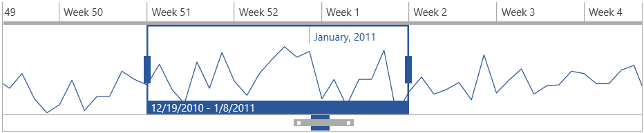

# Overview



__RadTimeBar__ is a time bound DataVisualization control. Its chief purpose is to allow lightweight scrolling and navigation through large periods of time. Additionally, the control exposes intuitive API which allows for both declarative and programmatic manipulation of the control. The RadTimeBar control can host other controls; however its true power comes when combined with [RadSparklines]() or [RadChartView]() to show trends in large data collections. The control can be easily combined with other controls such as RadScheduleView, RadGridView, RadBulletGraph, etc. to create rich and powerful dashboards.

## Key Features

* __Intervals__: The control allows you to define the available intervals that will be visualized when you zoom-in/out the control. Read more about this in the [Properties]() article.

* __Selection__: A time interval can be easily selected via the mouse or by setting couple of properties of the control.

* __Special slots__: This feature can be used to highlight different time intervals in the control. Read more about this in the [Special Slots]() article.

* __Custom intervals and formats__: The intervals can be customized by implement couple of interfaces. This way you can modify the intervals and the date-time formats used to define the appearance of the periods. Read more about this in the [Custom Interval Types]() and [Formatter Provider]() articles.

* __Localization__: As all controls in the suite, the RadTimeBar supports several languages. The strings that are localized are the date labels (month, week, etc.). Read more about this in the [Localization]() article.

>tip Get started with the control with its [Getting Started]() help article that shows how to use it in a basic scenario.

> Check out the online demo at [demos.telerik.com](https://demos.telerik.com/silverlight/#TimeBar/FirstLook)[demos.telerik.com](https://demos.telerik.com/wpf/)

## See Also   
 * [Visual Structure]()
 * [MVVM Support]()
 * [Events]()
