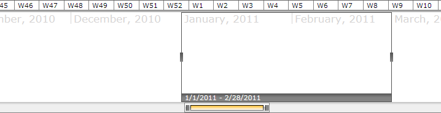
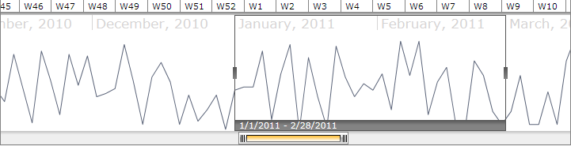

# Overview

## 



Thank you for choosing __RadTimeBar__!

The __RadTimeBar__ is a time bound DataVisualization control. Its chief purpose is to allow lightweight scrolling and navigation through large periods of time. Additionally, the control exposes intuitive API which allows for both declarative and programmatic manipulation of the control.

    The __RadTimeBar__ control can host other controls; however its true power comes when combined with RadSparklines to show trends in large data collections. The control can be easily combined with other controls such as RadChart, RadGridView, RadBulletGraph, etc. to create rich and powerful dashboards.

>In order to use __RadTimeBar__control in your projects you have to add references to __Telerik.Windows.Controls.dll, Telerik.Windows.Controls.DataVisualization.dll__and__Telerik.Windows.Data.dll.__

A sample __TimeBar__ definition may look like this:

#### __XAML__

{{region radtimebar-overview_0}}
	<telerik:RadTimeBar PeriodStart="1-Jan-2010 12:00:00 AM" PeriodEnd="31-Dec-2011 11:59:59 PM"
	                      VisiblePeriodStart="11-Nov-2010 12:00:00 AM" VisiblePeriodEnd="14-March-2011 11:59:59 PM"
	                      SelectionStart="1-Jan-2011 12:00:00 AM" SelectionEnd="28-Feb-2011 11:59:59 PM">
	        <telerik:RadTimeBar.Intervals>
	            <telerik:YearInterval />
	            <telerik:MonthInterval />
	            <telerik:WeekInterval />
	            <telerik:DayInterval />
	        </telerik:RadTimeBar.Intervals>
	    </telerik:RadTimeBar>
	{{endregion}}

Visually, such a setup looks as shown below:

Now let's combine it with linear RadSparkline. This can be easily achieved, as the content of the TimeBar will be set to an instance of RadSparkline:
        

#### __XAML__

{{region radtimebar-overview_1}}
	<telerik:RadTimeBar PeriodStart="1-Jan-2010 12:00:00 AM" PeriodEnd="31-Dec-2011 11:59:59 PM"
	                      VisiblePeriodStart="11-Nov-2010 12:00:00 AM" VisiblePeriodEnd="14-March-2011 11:59:59 PM"
	                      SelectionStart="1-Jan-2011 12:00:00 AM" SelectionEnd="28-Feb-2011 11:59:59 PM">
	        <telerik:RadTimeBar.Intervals>
	            <telerik:YearInterval />
	            <telerik:MonthInterval />
	            <telerik:WeekInterval />
	            <telerik:DayInterval />
	        </telerik:RadTimeBar.Intervals>
		<telerik:RadLinearSparkline ItemsSource="{Binding}"/>
	    </telerik:RadTimeBar>
	{{endregion}}

Voilà:

Here's the way our sparkline was populated with data. For more details please refer to RadSparkline's 
[Databinding](http://www.telerik.com/help/silverlight/radsparkline_databinding.html)
 topic.

#### __C#__

{{region radtimebar-overview_2}}
	Random r = new Random();
	List<int> LinearData = new List<int>();
	for (DateTime currentDate = DateTime.Today; currentDate < DateTime.Today.AddDays(365);
	    currentDate = currentDate.AddDays(1))
	{
	    LinearData.Add(r.Next(0, 60));
	}
	this.DataContext = LinearData;
	{{endregion}}

#### __VB.NET__

{{region radtimebar-overview_2}}
	Dim r As New Random()
	Dim LinearData As New List(Of Integer)()
	Dim currentDate As Date = Date.Today
	Do While currentDate < Date.Today.AddDays(365)
		LinearData.Add(r.Next(0, 60))
		currentDate = currentDate.AddDays(1)
	Loop
	Me.DataContext = LinearData
	{{endregion}}

