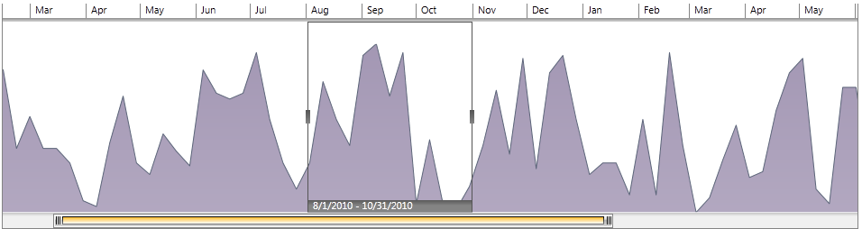

# Create a TimeBar control in Code-behind

RadTimeBar supports lightweight batch initialization through the [ISupportInitialize](http://msdn.microsoft.com/en-us/library/system.componentmodel.isupportinitialize.aspx) interface. You can use the methods of this interface in code behind to create and initialize a time bar before adding it in the visual tree. Here is an example:

1. Create *[RadAreaSparkLine](http://www.telerik.com/help/silverlight/radsparkline_overview.html)* to use it as Content for the TimeBar control:

	>tip You can use *RadChart*, *RadSparkline* or any other custom control as Content for the RadTimeBar.

	<snippet id='radtimebar-populating-with-data-create-a-timebar-control-in-code-behind-block_1-cs' />
	<snippet id='radtimebar-populating-with-data-create-a-timebar-control-in-code-behind-block_2-vb' />

2. Create new TimeBar and add the SparkLine as Content. 

	<snippet id='radtimebar-populating-with-data-create-a-timebar-control-in-code-behind-block_3-cs' />
	<snippet id='radtimebar-populating-with-data-create-a-timebar-control-in-code-behind-block_4-vb' />

The result:         
