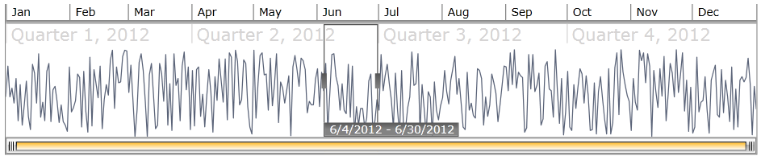

# MVVM Support

The Telerik __RadTimeBar__ control can be used with great success with the __Model-View-ViewModel (MVVM)__ pattern. This help topic will demonstrate how to use the control with the pattern.

1. Create new ViewModel class that inherits the *ViewModelBase* abstract class:

	```C#
		public class ExampleViewModel : ViewModelBase
			{
				private DateTime periodStart;
				private DateTime periodEnd;
				private IEnumerable<double> data;
				private DateTime visiblePeriodStart;
				private DateTime visiblePeriodEnd;
		
				[TypeConverter(typeof(DateTimeTypeConverter))]
				public DateTime PeriodStart
				{
					get
					{
						return this.periodStart;
					}
					set
					{
						if (this.periodStart == value)
							return;
		
						this.periodStart = value;
						this.OnPropertyChanged("PeriodStart");
					}
				}
		
				[TypeConverter(typeof(DateTimeTypeConverter))]
				public DateTime PeriodEnd
				{
					get
					{
						return this.periodEnd;
					}
					set
					{
						if (this.periodEnd == value)
							return;
		
						this.periodEnd = value;
						this.OnPropertyChanged("PeriodEnd");
					}
				}
		
				[TypeConverter(typeof(DateTimeTypeConverter))]
				public DateTime VisiblePeriodStart
				{
					get
					{
						return this.visiblePeriodStart;
					}
					set
					{
						if (this.visiblePeriodStart == value)
							return;
		
						this.visiblePeriodStart = value;
						this.OnPropertyChanged("VisiblePeriodStart");
					}
				}
		
				[TypeConverter(typeof(DateTimeTypeConverter))]
				public DateTime VisiblePeriodEnd
				{
					get
					{
						return this.visiblePeriodEnd;
					}
					set
					{
						if (this.visiblePeriodEnd == value)
							return;
		
						this.visiblePeriodEnd = value;
						this.OnPropertyChanged("VisiblePeriodEnd");
					}
				}
		
				public IEnumerable<double> Data
				{
					get
					{
						if (data == null)
						{
							Random r = new Random();
							List<double> collection = new List<double>();
							for (DateTime date = PeriodStart; date <= PeriodEnd; date = date.AddDays(1))
							{
								collection.Add(r.Next(0, 100));
							}
							this.data = collection;
						}
						return this.data;
					}
				}
			}
	```
	```VB.NET
		Public Class ExampleViewModel Inherits ViewModelBase
					Private periodStart_Renamed As Date
					Private periodEnd_Renamed As Date
					Private data_Renamed As IEnumerable(Of Double)
					Private visiblePeriodStart_Renamed As Date
					Private visiblePeriodEnd_Renamed As Date
		
					<TypeConverter(GetType(DateTimeTypeConverter))>
					Public Property PeriodStart() As Date
						  Get
								Return Me.periodStart_Renamed
						  End Get
						  Set(ByVal value As Date)
								If Me.periodStart_Renamed Is value Then
									  Return
								End If
		
								Me.periodStart_Renamed = value
								Me.OnPropertyChanged("PeriodStart")
						  End Set
					End Property
		
					<TypeConverter(GetType(DateTimeTypeConverter))>
					Public Property PeriodEnd() As Date
														Get
								Return Me.periodEnd_Renamed
						  End Get
						  Set(ByVal value As Date)
								If Me.periodEnd_Renamed Is value Then
									  Return
								End If
		
								Me.periodEnd_Renamed = value
								Me.OnPropertyChanged("PeriodEnd")
						  End Set
					End Property
		
					<TypeConverter(GetType(DateTimeTypeConverter))>
					Public Property VisiblePeriodStart() As Date
						  Get
								Return Me.visiblePeriodStart_Renamed
						  End Get
						  Set(ByVal value As Date)
								If Me.visiblePeriodStart_Renamed Is value Then
									  Return
								End If
		
								Me.visiblePeriodStart_Renamed = value
								Me.OnPropertyChanged("VisiblePeriodStart")
						  End Set
					End Property
		
					<TypeConverter(GetType(DateTimeTypeConverter))>
					Public Property VisiblePeriodEnd() As Date
						  Get
								Return Me.visiblePeriodEnd_Renamed
						  End Get
						  Set(ByVal value As Date)
								If Me.visiblePeriodEnd_Renamed Is value Then
									  Return
								End If
		
								Me.visiblePeriodEnd_Renamed = value
								Me.OnPropertyChanged("VisiblePeriodEnd")
						  End Set
					End Property
		
					Public ReadOnly Property Data() As IEnumerable(Of Double)
						  Get
								If data_Renamed Is Nothing Then
									  Dim r As New Random()
									  Dim collection As New List(Of Double)()
									  Dim [date] As Date = PeriodStart
									  Do While [date] <= PeriodEnd
											collection.Add(r.Next(0, 100))
											[date] = [date].AddDays(1)
									  Loop
									  Me.data_Renamed = collection
								End If
								Return Me.data_Renamed
						  End Get
					End Property
		End Class
	```

	The __PeriodStart__ and __PeriodEnd__ properties will specify the time period that the TimeBar will visualize. The __VisiblePeriodStart__ and __VisiblePeriodEnd__ properties will specify the visible time period on the screen. The Data collection will be used as datasource for the SparkLines that will be seen inside the TimeBar control.

2. Add new RadTimeBar and RadSparkLine declarations in XAML and bind the mentioned properties:

	>The properties should be bound using TwoWay binding. This is required because of the coercing of the values that happens when a binding is executed.

	```XAML
		<UserControl.DataContext>
			<local:ExampleViewModel PeriodStart="01/01/2012" PeriodEnd="01/01/2013" VisiblePeriodStart="01/01/2012" VisiblePeriodEnd="01/01/2013" />
		</UserControl.DataContext>
	
		<Grid x:Name="LayoutRoot" Background="White">
			<telerik:RadTimeBar Margin="8,8,8,0" Height="150" VerticalAlignment="Top"
								PeriodStart="{Binding PeriodStart, Mode=TwoWay}"
								PeriodEnd="{Binding PeriodEnd, Mode=TwoWay}"
								VisiblePeriodStart="{Binding VisiblePeriodStart, Mode=TwoWay}"
								VisiblePeriodEnd="{Binding VisiblePeriodEnd, Mode=TwoWay}">
				<telerik:RadTimeBar.Intervals>
					<telerik:YearInterval/>
					<telerik:QuarterInterval/>
					<telerik:MonthInterval/>
					<telerik:WeekInterval />
					<telerik:DayInterval />
				</telerik:RadTimeBar.Intervals>
	
				<telerik:RadLinearSparkline ItemsSource="{Binding Data}" />
			</telerik:RadTimeBar>
		</Grid>
	```

The result can be seen below:

