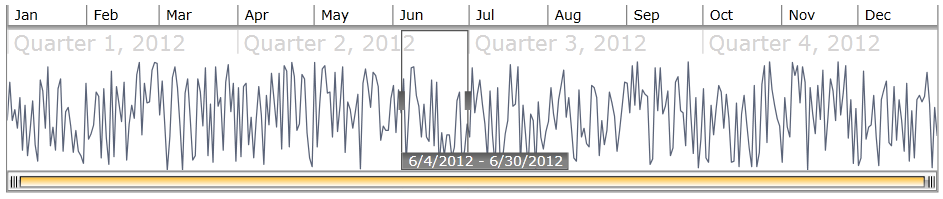

# MVVM Support

The Telerik __RadTimeBar__ control can be used with great success with the __Model-View-ViewModel (MVVM)__ pattern. This help topic will demonstrate how to use the control with the pattern.

1. Create new ViewModel class that inherits the *ViewModelBase* abstract class:

	<snippet id='radtimebar-populating-with-data-mvvm-support-block_1-cs' />
	<snippet id='radtimebar-populating-with-data-mvvm-support-block_2-vb' />

	The __PeriodStart__ and __PeriodEnd__ properties will specify the time period that the TimeBar will visualize. The __VisiblePeriodStart__ and __VisiblePeriodEnd__ properties will specify the visible time period on the screen. The Data collection will be used as datasource for the SparkLines that will be seen inside the TimeBar control.

2. Add new RadTimeBar and RadSparkLine declarations in XAML and bind the mentioned properties:

	>The properties should be bound using TwoWay binding. This is required because of the coercing of the values that happens when a binding is executed.

	<snippet id='radtimebar-populating-with-data-mvvm-support-block_3-xaml' />

The result can be seen below:

