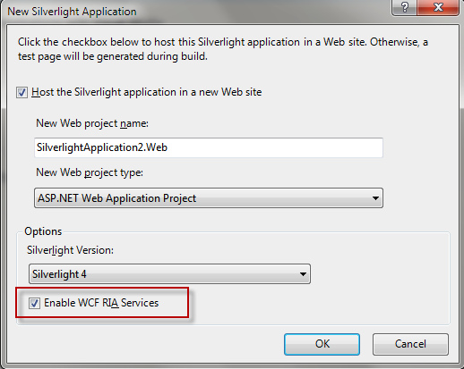
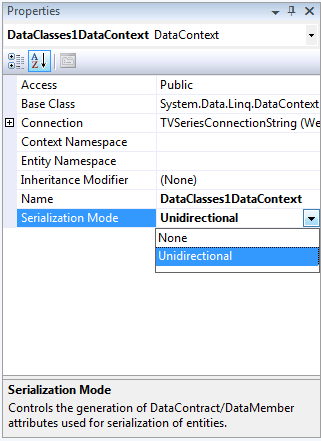
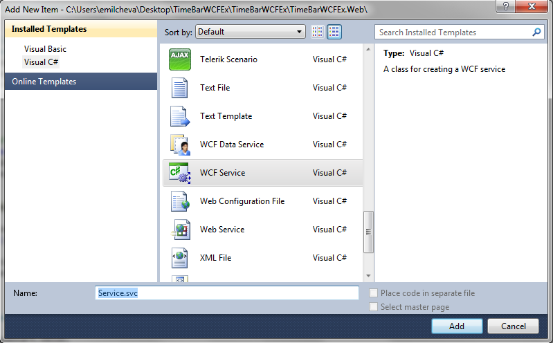
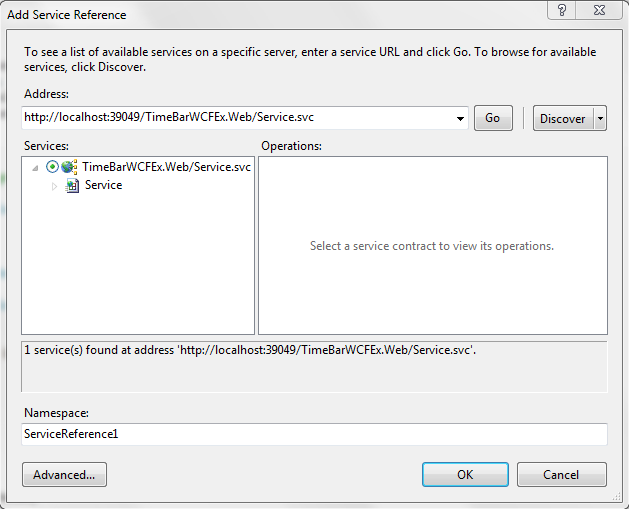

# Populating TimeBar from WCF service with LINQ to SQL

This help topic will demonstrate how to populate TimeBar with data from database using WCF service and LINQ to SQL. For the purpose - follow the steps below:

1. Create new Silverlight project and check "Enable WCF RIA Services":

	
	
2. Before writing any LINQ queries we will need a database. Right click on the Web application and choose* Add-New-Item* -> *SQL Server Database:*
    

	Visual Studio will ask you whether you want to place the database in the __App_Data__ folder. Click Yes to confirm.

3. Double-clicking the __.mdf__ file (the database) will automatically send the database to the __"Server Explorer"__ window.

4. It is out of the scope of this topic to demonstrate how to populate your Database with sample data. The attached archive contains the source code and the database file populated. Now right click on the *Web* project and add new "__SQL to LINQ classes__".

5. Open the __"Server Explorer"__ window and drag the database table onto the __"Object Relational Designer"__. (__"Object Relational Designer"__ opens automatically when you open the __DataClasses1.dbml__ file).

6. By default, the __LINQ__ class is not serializable. In order to use the table in a web service, we need to make the __DataClasse1.dbml__ file serializable. Right-click on the design surface and choose __Properties__ from the drop-down. In the properties window change the __"Serialization Mode"__ to __Unidirectional__.
    
7. Now it's time to add the WCF service. Right click on the Web project and choose Add New Item -> "WCF service".

	Visual Studio adds 3 files that hold the service contract for the WCF service - __IService.cs, Service.svc__ and a code-behind to it - __Service.svc.cs.__

	

8. Open the first file - __IService.cs__. This file contains the operation contract. Change the name and the signature of the __DoWork()__ method.

	#### __C#__

	```C#
		[ServiceContract]
		public interface IService
		{
		[OperationContract]
		List<SampleTable> GetTimeBarData();
		}
		```
		
	#### __VB.NET__

	```VB.NET
		<ServiceContract>
		Public Interface IService
		<OperationContract>
		Function GetTimeBarData() As List(Of SampleTable)
		End Interface
		```

9. Go to the __Service.svc.cs__ file and implement the __IService1__ interface. Then select all data from the SampleTables table by using LINQ query:

	#### __C#__

	```C#
		public class Service : IService
		{
		  public List<SampleTable> GetTimeBarData()
		  {
		   TimeBarSampleDataContext context = new TimeBarSampleDataContext();
		
		   var data = (from tb in context.SampleTables
		   select tb).ToList();
		   return data;
		  }
		}
		```


	#### __VB.NET__

	```VB.NET
		Public Class Service
		Implements IService
		Public Function GetTimeBarData() As List(Of SampleTable)
		Dim context As New TimeBarSampleDataContext()
		Dim data = (
		From tb In context.SampleTables
		Select tb).ToList()
		Return data
		End Function
		End Class
		```

10. You should open the Web.config file and change the binding type of the service. Make sure that your web service uses a basicHttpBinding, not the default __wsHttpBinding__. Scroll down until you find the __system.serviceModel__ tag. Change the __binding="wsHttpBinding"__ to __binding="basicHttpBinding"__. The reason to change the binding is because Silverlight supports only basic binding (SOAP 1.1 etc.).

11. Now you are ready to consume the service. Go to the Silverlight project and select "__Add Service Reference__"

	Hit the discover button in the popped up window.
    

12. Create new __TimeBar__ control in XAML and add the following Bindings:

	#### __XAML__

	```XAML
		<UserControl.DataContext>
				<viewModel:ViewModel />
			</UserControl.DataContext>
			<Grid x:Name="LayoutRoot" Background="White">
				<StackPanel Orientation="Vertical">
					<telerik:RadTimeBar x:Name="timeBar" Height="200"
										PeriodStart="{Binding StartDate, Mode=TwoWay}"
										PeriodEnd="{Binding EndDate, Mode=TwoWay}"
										VisiblePeriodStart="{Binding VisibleStartDate, Mode=TwoWay}"
										VisiblePeriodEnd="{Binding VisibleEndDate, Mode=TwoWay}"
										SelectionStart="{Binding SelectionStartDate, Mode=TwoWay}"
										SelectionEnd="{Binding SelectionEndDate, Mode=TwoWay}">
						<telerik:RadTimeBar.Intervals>
							<telerik:MonthInterval />
							<telerik:WeekInterval />
							<telerik:DayInterval />
						</telerik:RadTimeBar.Intervals>
					</telerik:RadTimeBar>
				</StackPanel>
			</Grid>
		```
	
	>You should use a TwoWay binding for the TimeBar's properties. This is required because of the coercing of the values that happens when a binding is executed.  

13. The __ViewModel__ is shown below:

	#### __C#__

	```C#
		public class ViewModel : INotifyPropertyChanged		
			{
				private DateTime _StartDate = DateTime.MinValue;
				private DateTime _EndDate = DateTime.MinValue;
				private DateTime _VisibleStartDate = DateTime.MinValue;
				private DateTime _VisibleEndDate = DateTime.MinValue;
				private DateTime _SelectionStartDate = DateTime.MinValue;
				private DateTime _SelectionEndDate = DateTime.MinValue;
		
				public ViewModel()
				{
					// Create a new instance of the web service and get the data from the table
					ServiceClient service = new ServiceClient();
					service.GetTimeBarDataCompleted += new EventHandler<GetTimeBarDataCompletedEventArgs>(service_GetTimeBarDataCompleted);
					service.GetTimeBarDataAsync();
				}
		
				void service_GetTimeBarDataCompleted(object sender, GetTimeBarDataCompletedEventArgs e)
				{
					List<SampleTable> dataCollection = new List<SampleTable>(e.Result);
					if (dataCollection != null)
					{
						var data = dataCollection.Where(d => d.Id == 1).FirstOrDefault();
						this.SetDataContent(data);
					}
				}
		
				private void SetDataContent(SampleTable data)
				{
					this.StartDate = data.PeriodStart.Value;
					this.EndDate = data.PeriodEnd.Value;
					this.VisibleStartDate = data.VisiblePeriodStart.Value;
					this.VisibleEndDate = data.VisiblePeriodEnd.Value;
					this.SelectionStartDate = data.SelectionStart.Value;
					this.SelectionEndDate = data.SelectionEnd.Value;
				}
		
				public DateTime StartDate
				{
					get
					{
						return _StartDate;
					}
					set
					{
		
						if (this._StartDate == value)
							return;
		
						this._StartDate = value;
						this.RaisePropertyChanged("StartDate");
					}
				}
		
				public DateTime EndDate
				{
					get
					{
						return _EndDate;
					}
					set
					{
						if (this._EndDate == value)
							return;
		
						this._EndDate = value;
						this.RaisePropertyChanged("EndDate");
					}
				}
		
				public DateTime VisibleStartDate
				{
					get
					{
						return _VisibleStartDate;
					}
					set
					{
		
						if (this._VisibleStartDate == value)
							return;
		
						this._VisibleStartDate = value;
						this.RaisePropertyChanged("VisibleStartDate");
					}
				}
		
				public DateTime VisibleEndDate
				{
					get
					{
						return _VisibleEndDate;
					}
					set
					{
		
						if (this._VisibleEndDate == value)
							return;
		
						this._VisibleEndDate = value;
						this.RaisePropertyChanged("VisibleEndDate");
					}
				}
		
				public DateTime SelectionStartDate
				{
					get
					{
						return _SelectionStartDate;
					}
					set
					{
		
						if (this._SelectionStartDate == value)
							return;
		
						this._SelectionStartDate = value;
						this.RaisePropertyChanged("SelectionStartDate");
					}
				}
		
				public DateTime SelectionEndDate
				{
					get
					{
						return _SelectionEndDate;
					}
					set
					{
		
						if (this._SelectionEndDate == value)
							return;
		
						this._SelectionEndDate = value;
						this.RaisePropertyChanged("SelectionEndDate");
					}
				}
		
				public event PropertyChangedEventHandler PropertyChanged;
		
				public void RaisePropertyChanged(string propertyName)
				{
					if (PropertyChanged != null)
					{
						PropertyChanged(this, new PropertyChangedEventArgs(propertyName));
					}
				}  
			}
		```

	#### __VB.NET__

	```VB.NET
		Public Class ViewModel
			  Implements INotifyPropertyChanged
		
					Private _StartDate As Date = Date.MinValue
					Private _EndDate As Date = Date.MinValue
					Private _VisibleStartDate As Date = Date.MinValue
					Private _VisibleEndDate As Date = Date.MinValue
					Private _SelectionStartDate As Date = Date.MinValue
					Private _SelectionEndDate As Date = Date.MinValue
		
					Public Sub New()						  
						  Dim service As New ServiceClient()
						  AddHandler service.GetTimeBarDataCompleted, AddressOf service_GetTimeBarDataCompleted
						  service.GetTimeBarDataAsync()
					End Sub
		
					Private Sub service_GetTimeBarDataCompleted(ByVal sender As Object, ByVal e As GetTimeBarDataCompletedEventArgs)
						  Dim dataCollection As New List(Of SampleTable)(e.Result)
						  If dataCollection IsNot Nothing Then
								Dim data = dataCollection.Where(Function(d) d.Id = 1).FirstOrDefault()
								Me.SetDataContent(data)
						  End If
					End Sub
		
					Private Sub SetDataContent(ByVal data As SampleTable)
						  Me.StartDate = data.PeriodStart.Value
						  Me.EndDate = data.PeriodEnd.Value
						  Me.VisibleStartDate = data.VisiblePeriodStart.Value
						  Me.VisibleEndDate = data.VisiblePeriodEnd.Value
						  Me.SelectionStartDate = data.SelectionStart.Value
						  Me.SelectionEndDate = data.SelectionEnd.Value
					End Sub
		
					Public Property StartDate() As Date
						  Get
								Return _StartDate
						  End Get
						  Set(ByVal value As Date)
		
								If Me._StartDate Is value Then
									  Return
								End If
		
								Me._StartDate = value
								Me.RaisePropertyChanged("StartDate")
						  End Set
					End Property
		
					Public Property EndDate() As Date
						  Get
								Return _EndDate
						  End Get
						  Set(ByVal value As Date)
								If Me._EndDate Is value Then
									  Return
								End If
		
								Me._EndDate = value
								Me.RaisePropertyChanged("EndDate")
						  End Set
					End Property
		
					Public Property VisibleStartDate() As Date
						  Get
								Return _VisibleStartDate
						  End Get
						  Set(ByVal value As Date)
		
								If Me._VisibleStartDate Is value Then
									  Return
								End If
		
								Me._VisibleStartDate = value
								Me.RaisePropertyChanged("VisibleStartDate")
						  End Set
					End Property
		
					Public Property VisibleEndDate() As Date
						  Get
								Return _VisibleEndDate
						  End Get
						  Set(ByVal value As Date)
		
								If Me._VisibleEndDate Is value Then
									  Return
								End If
		
								Me._VisibleEndDate = value
								Me.RaisePropertyChanged("VisibleEndDate")
						  End Set
					End Property
		
					Public Property SelectionStartDate() As Date
						  Get
								Return _SelectionStartDate
						  End Get
						  Set(ByVal value As Date)
		
								If Me._SelectionStartDate Is value Then
									  Return
								End If
		
								Me._SelectionStartDate = value
								Me.RaisePropertyChanged("SelectionStartDate")
						  End Set
					End Property
		
					Public Property SelectionEndDate() As Date
						  Get
								Return _SelectionEndDate
						  End Get
						  Set(ByVal value As Date)
		
								If Me._SelectionEndDate Is value Then
									  Return
								End If
		
								Me._SelectionEndDate = value
								Me.RaisePropertyChanged("SelectionEndDate")
						  End Set
					End Property
		
					Public Event PropertyChanged As PropertyChangedEventHandler
		
					Public Sub RaisePropertyChanged(ByVal propertyName As String)
						  RaiseEvent PropertyChanged(Me, New PropertyChangedEventArgs(propertyName))
					End Sub
		End Class
		```