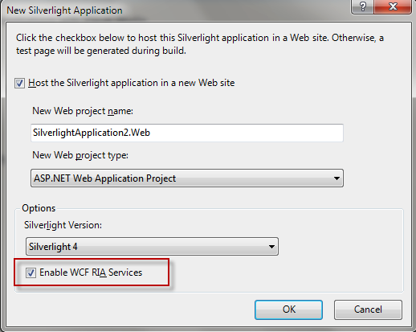
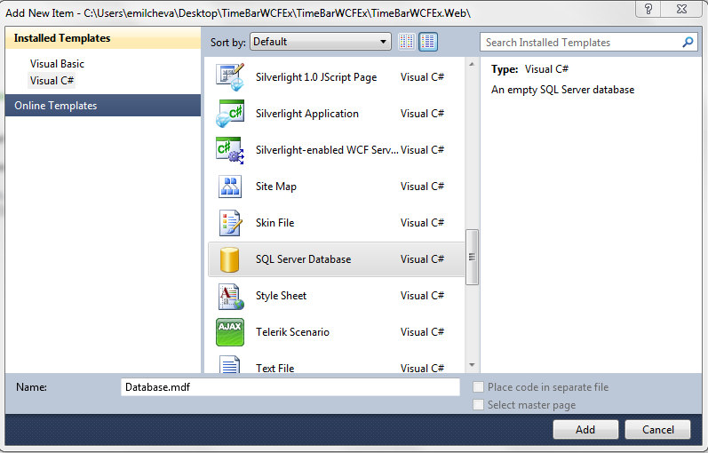
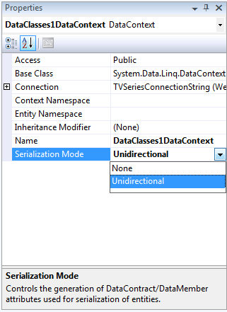
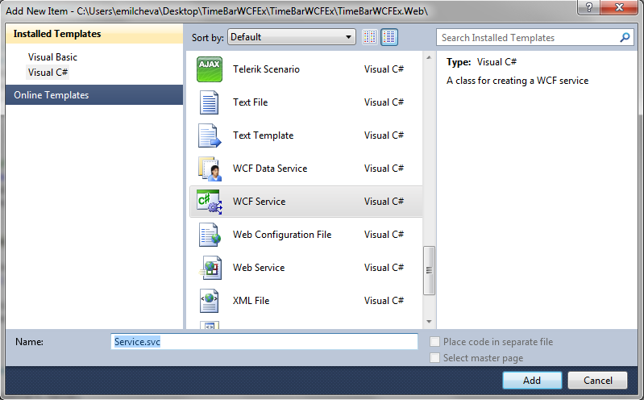
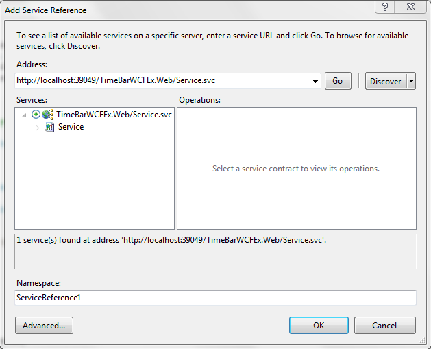

# Populating TimeBar from WCF service with LINQ to SQL

This help topic will demonstrate how to populate TimeBar with data from database using WCF service and LINQ to SQL. For the purpose - follow the steps below:

1. Create new Silverlight project and check "Enable WCF RIA Services":

	
	
2. Before writing any LINQ queries we will need a database. Right click on the Web application and choose* Add-New-Item* -> *SQL Server Database:*
    

	Visual Studio will ask you whether you want to place the database in the __App_Data__ folder. Click Yes to confirm.

3. Double-clicking the __.mdf__ file (the database) will automatically send the database to the __"Server Explorer"__ window.

4. It is out of the scope of this topic to demonstrate how to populate your Database with sample data. The attached archive contains the source code and the database file populated. Now right click on the *Web* project and add new "__SQL to LINQ classes__".

5. Open the __"Server Explorer"__ window and drag the database table onto the __"Object Relational Designer"__. (__"Object Relational Designer"__ opens automatically when you open the __DataClasses1.dbml__ file).

6. By default, the __LINQ__ class is not serializable. In order to use the table in a web service, we need to make the __DataClasse1.dbml__ file serializable. Right-click on the design surface and choose __Properties__ from the drop-down. In the properties window change the __"Serialization Mode"__ to __Unidirectional__.
    
7. Now it's time to add the WCF service. Right click on the Web project and choose Add New Item -> "WCF service".

	Visual Studio adds 3 files that hold the service contract for the WCF service - __IService.cs, Service.svc__ and a code-behind to it - __Service.svc.cs.__

	

8. Open the first file - __IService.cs__. This file contains the operation contract. Change the name and the signature of the __DoWork()__ method.

	<snippet id='radtimebar-populating-with-data-populating-timebar-from-wcf-service-with-linq-to-sql-block_1-cs' />
	<snippet id='radtimebar-populating-with-data-populating-timebar-from-wcf-service-with-linq-to-sql-block_2-vb' />

9. Go to the __Service.svc.cs__ file and implement the __IService1__ interface. Then select all data from the SampleTables table by using LINQ query:

	<snippet id='radtimebar-populating-with-data-populating-timebar-from-wcf-service-with-linq-to-sql-block_3-cs' />
	<snippet id='radtimebar-populating-with-data-populating-timebar-from-wcf-service-with-linq-to-sql-block_4-vb' />

10. You should open the Web.config file and change the binding type of the service. Make sure that your web service uses a basicHttpBinding, not the default __wsHttpBinding__. Scroll down until you find the __system.serviceModel__ tag. Change the __binding="wsHttpBinding"__ to __binding="basicHttpBinding"__. The reason to change the binding is because Silverlight supports only basic binding (SOAP 1.1 etc.).

11. Now you are ready to consume the service. Go to the Silverlight project and select "__Add Service Reference__"

	Hit the discover button in the popped up window.
    

12. Create new __TimeBar__ control in XAML and add the following Bindings:

	<snippet id='radtimebar-populating-with-data-populating-timebar-from-wcf-service-with-linq-to-sql-block_5-xaml' />
	
	>You should use a TwoWay binding for the TimeBar's properties. This is required because of the coercing of the values that happens when a binding is executed.  

13. The __ViewModel__ is shown below:

	<snippet id='radtimebar-populating-with-data-populating-timebar-from-wcf-service-with-linq-to-sql-block_6-cs' />
	<snippet id='radtimebar-populating-with-data-populating-timebar-from-wcf-service-with-linq-to-sql-block_7-vb' />