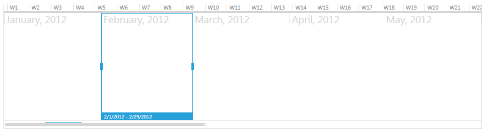
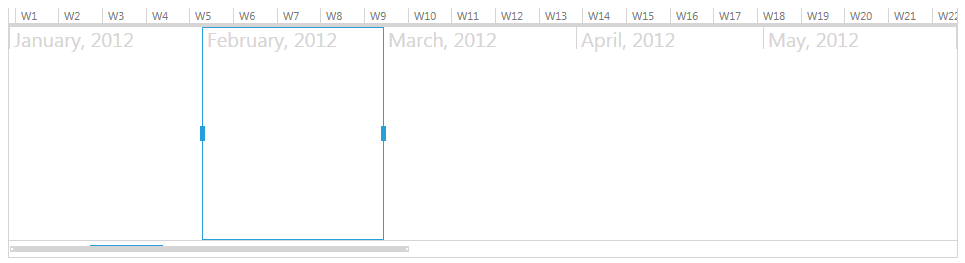

# Hide Selection Range Title

Since __Q1 2012 SP1__ we are providing new binaries for our controls, the so-called NoXAML binaries. In the normal assemblies you have all the XAML for all components for all themes included in the dll and the styling is done with explicitly set styles. This unfortunately affected the size of the binaries. With the NoXaml assemblies you will get completely clean assembly with absolutely no XAML included and you can add manually only needed resources for your application.

>The purpose of this topic is to demonstrate how you may hide the range title that is visible with selection range.
This will be achieved with completely implicit styles instead of the old way of styling which was used in [Styling the Items and Groups]() topic for example.

Here are the steps that you should follow to create a RadTimeBar with implicit Windows8 style:

2. Add reference to RadTimeBar related assemblies from __NoXaml__ folder (under your controls local installation path) - these are as usual Telerik.Windows.Controls, Telerik.Windows.Data and Telerik.Windows.Controls.DataVisualization. 

2. Copy from __Themes.Implicit__ folder the Timebar related XAML from desired Theme (Windows8 in our case).
  Similar to dlls the related resources are: Telerik.Windows.Controls.xaml, Telerik.Windows.Data.xaml and Telerik.Windows.Controls.DataVisualization.xaml. While you do not have XAML
  for the Data assembly you have here one additional resource for standard WPF components - System.Windows.xaml.

3. Declare the XAML resources that you will use. In our case this is Telerik.Windows.Controls.DataVisualization.xaml:

	<snippet id='radtimebar-styles-and-templates-hide-selection-range-title-block_1-xaml' />

4. Set *Telerik.Windows.Controls.StyleManager.IsEnabled* to false in your application constructor.

Now let's add a sample TimeBar:

<snippet id='radtimebar-styles-and-templates-hide-selection-range-title-block_2-xaml' />

To hide the range selection title you'll need to remove it from the SelectionRange Style, which can be found in *Telerik.Windows.Controls.DataVisualization.xaml*:

<snippet id='radtimebar-styles-and-templates-hide-selection-range-title-block_3-xaml' />

Run the application and check the result:

