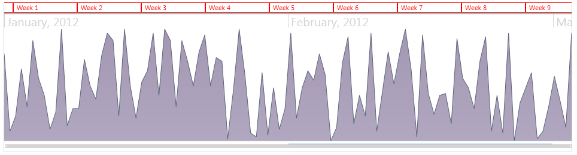

# Styling the Items and Groups

This section is intended to give you a broad understanding of the possible way in which you can customize the visual appearance of the __RadTimeBar__.        

>This topic will be based on the Windows8 theme          

To learn how to style Silverlight RadControls read the common topics about [Styling and Appearance](http://www.telerik.com/help/silverlight/common-styling-apperance-setting-theme.html) [Styling and Appearance](http://www.telerik.com/help/wpf/common-styling-apperance-setting-theme-wpf.html). If you are new to the controls they will give you the basic knowledge about it.

You have two options:

* To create an empty styles and set it up on your own.
* To copy the default styles of the control and modify it.

This topic will show you how to perform the second one.        

1. Extract the __RadTimeBar__ template through Blend. To learn how refer to the Styling and Appearance link mentioned above and open the "Editing Control Templates in Expression Blend" topic.            

2. Add the Windows8 theme as Resource in your application. The Silverlight themes are located 
            in separate assemblies in order the size of the control assembly to be optimized. 
            The WPF themes are embedded in the control assemblies.

3. Your new Style should be based on the Windows8 Theme using the BasedOn property. When you use this property, the new style will inherit the values of the original style that are not explicitly redefined in the new style.

4. Delete the Theme property setting from the *ItemContainer* of the __RadTimeBar__ Style

5. Extract the default ItemControl style through Blend (to learn how refer to 1.)

6. Edit the ItemControl style as you need and add it as implicit style in your applicationFor example:

	```XAML
		<UserControl.Resources>
				<telerik:Windows8Theme x:Key="Theme" />
		
				<telerik:DateTicksConverter x:Key="dateConverter" />
				<telerik:TimeSpanTicksConverter x:Key="timespanConverter" />
				<telerik:SelectionRangeDateTicksConverter x:Key="selectionRangeConverter" />
		
				<!-- Items -->
				<SolidColorBrush x:Key="TimeBar_Item_Foreground" Color="#FF000000" />
				<LinearGradientBrush x:Key="TimeBar_Item_Background_MouseOver" EndPoint="0.5,1" StartPoint="0.5,0">
					<GradientStop Color="#33FEC241" Offset="0"/>
					<GradientStop Color="#33FEDC96" Offset="1"/>
				</LinearGradientBrush>
				<Thickness x:Key="TimeBar_Button_BorderThickness">1,0,0,0</Thickness>
				<SolidColorBrush x:Key="TimeBar_Button_Border" Color="#FF848484" />
				<LinearGradientBrush x:Key="TimeBar_Button_InnerBorder" EndPoint="0.5,1" StartPoint="0.5,0">
					<GradientStop Color="#FF848484" Offset="0"/>
					<GradientStop Color="#FFCCCCCC" Offset="1"/>
				</LinearGradientBrush>
				<LinearGradientBrush x:Key="TimeBar_Button_InnerBorder_MouseOver" EndPoint="0.5,1" StartPoint="0.5,0">
					<GradientStop Color="#FFFEC241" Offset="0"/>
					<GradientStop Color="#FFFEE1A5" Offset="1"/>
				</LinearGradientBrush>
				<Thickness x:Key="TimeBar_Button_InnerBorder_InnerBorderThickness">0</Thickness>
				<LinearGradientBrush x:Key="TimeBar_Button_InnerBorder_InnerBorder" EndPoint="0.5,1" StartPoint="0.5,0">
					<GradientStop Color="#FF848484" Offset="0"/>
					<GradientStop Color="#FFCCCCCC" Offset="1"/>
				</LinearGradientBrush>
		
				<Style TargetType="telerik:ItemControl">
					<Setter Property="BorderBrush" Value="Red" />
					<Setter Property="BorderThickness" Value="1" />
					<Setter Property="Foreground" Value="Red" />
				</Style>
		
				<!-- /Items -->
		<Style TargetType="telerik:RadTimeBar" x:Key="CustomTimeBar" telerik:StyleManager.BasedOn="{StaticResource Theme}">
			<Setter Property="Template">
				<Setter.Value>
					<ControlTemplate TargetType="telerik:RadTimeBar">
						<Border
						BorderBrush="{TemplateBinding BorderBrush}"
						BorderThickness="{TemplateBinding BorderThickness}">
							<Grid>
								<Grid.RowDefinitions>
									<RowDefinition Height="*" />
									<RowDefinition Height="Auto" />
								</Grid.RowDefinitions>
								<Grid Grid.Row="0">
									<Grid.RowDefinitions>
										<RowDefinition MinHeight="20" Height="Auto" />
										<RowDefinition MinHeight="25" Height="Auto" />
										<RowDefinition Height="*" />
									</Grid.RowDefinitions>
		
									<!-- No Items -->
									<Border Grid.Row="0" Background="{StaticResource TimeBar_Button_InnerBorder}" Height="4" VerticalAlignment="Bottom" />
									<!-- /No Items -->
		
									<Border Grid.Row="1" Grid.RowSpan="2" Background="{TemplateBinding Background}" />
		
									<telerik:TimeBarContentPanel Slider="{Binding ElementName=PART_Slider}" Grid.Row="2">
										<ContentPresenter />
									</telerik:TimeBarContentPanel>
		
									<telerik:GroupContainer x:Name="PART_GroupContainer" Grid.Row="1" Grid.RowSpan="2"
															Selection="{Binding Path=Selection, RelativeSource={RelativeSource TemplatedParent}, Mode=TwoWay}"
															ItemsSource="{TemplateBinding IntervalGroups}"
															telerik:StyleManager.Theme="{StaticResource Theme}">
										<telerik:GroupContainer.ItemsPanel>
											<ItemsPanelTemplate>
												<telerik:LabelMeasurementPanel Slider="{Binding ElementName=PART_Slider}" />
											</ItemsPanelTemplate>
										</telerik:GroupContainer.ItemsPanel>
										<telerik:GroupContainer.Template>
											<ControlTemplate>
												<ItemsPresenter />
											</ControlTemplate>
										</telerik:GroupContainer.Template>
									</telerik:GroupContainer>
		
									<telerik:ItemContainer x:Name="PART_ItemContainer" Grid.Row="0" Grid.RowSpan="3"
														Selection="{Binding Path=Selection, RelativeSource={RelativeSource TemplatedParent}, Mode=TwoWay}"
														ItemsSource="{TemplateBinding IntervalItems}">
										<telerik:ItemContainer.ItemsPanel>
											<ItemsPanelTemplate>
												<telerik:LabelMeasurementPanel Slider="{Binding ElementName=PART_Slider}" />
											</ItemsPanelTemplate>
										</telerik:ItemContainer.ItemsPanel>
										<telerik:ItemContainer.Template>
											<ControlTemplate>
												<ItemsPresenter />
											</ControlTemplate>
										</telerik:ItemContainer.Template>
									</telerik:ItemContainer>
		
									<telerik:TimeBarStackPanel Slider="{Binding ElementName=PART_Slider}" Grid.Row="1" Grid.RowSpan="2">
										<telerik:ShadeControl StartDate="{TemplateBinding PeriodStart}"
															EndDate="{Binding ElementName=PART_SelectionThumb, Path=StartDate}"
															telerik:StyleManager.Theme="{StaticResource Theme}" />
										<telerik:SelectionThumb x:Name="PART_SelectionThumb"
																Canvas.ZIndex="2"
																PeriodStart="{TemplateBinding PeriodStart}"
																PeriodEnd="{TemplateBinding PeriodEnd}"
																VisiblePeriodRange="{Binding Path=ActualVisiblePeriodRange, RelativeSource={RelativeSource TemplatedParent}, Mode=TwoWay}"
																IsSnapToIntervalEnabled="{TemplateBinding IsSnapToIntervalEnabled}"
																IntervalGroups="{TemplateBinding IntervalGroups}"
																IntervalItems="{TemplateBinding IntervalItems}"
																MinSelectionRange="{TemplateBinding MinSelectionRange}"
																MaxSelectionRange="{TemplateBinding MaxSelectionRange}"
																TitleFormatString="{TemplateBinding SelectionTitleFormatString}"
																Selection="{Binding Path=Selection, RelativeSource={RelativeSource TemplatedParent}, Mode=TwoWay}"
																StartDate="{Binding Path=ActualSelectionStart, RelativeSource={RelativeSource TemplatedParent}, Mode=TwoWay}"
																EndDate="{Binding Path=ActualSelectionEnd, RelativeSource={RelativeSource TemplatedParent}, Mode=TwoWay}"
																SelectionPreviewControl="{Binding ElementName=PART_SelectionThumbPreview}"
																telerik:StyleManager.Theme="{StaticResource Theme}" />
										<telerik:ShadeControl StartDate="{Binding ElementName=PART_SelectionThumb, Path=EndDate}"
															EndDate="{TemplateBinding PeriodEnd}"
															telerik:StyleManager.Theme="{StaticResource Theme}"/>
									</telerik:TimeBarStackPanel>
									<telerik:TimeBarPanel Slider="{Binding ElementName=PART_Slider}" Grid.Row="1" Grid.RowSpan="2">
										<telerik:SelectionThumbPreview x:Name="PART_SelectionThumbPreview"
																	telerik:StyleManager.Theme="{StaticResource Theme}" />
									</telerik:TimeBarPanel>
		
								</Grid>
		
								<telerik:SelectionVisibilityIndicator
								Grid.Row="0"
								Style="{TemplateBinding SelectionVisibilityIndicatorStyle}"
								HorizontalAlignment="Left"
								Visibility="{TemplateBinding LeftSelectionIndicatorVisibility}"
								VisibilityListener="{TemplateBinding LeftSelectionIndicatorVisibility}">
									<telerik:SelectionVisibilityIndicator.RenderTransform>
										<RotateTransform CenterX="8" CenterY="8" Angle="180" />
									</telerik:SelectionVisibilityIndicator.RenderTransform>
								</telerik:SelectionVisibilityIndicator>
		
								<telerik:SelectionVisibilityIndicator
								Grid.Row="0"
								HorizontalAlignment="Right"
								Style="{TemplateBinding SelectionVisibilityIndicatorStyle}"
								Visibility="{TemplateBinding RightSelectionIndicatorVisibility}"
								VisibilityListener="{TemplateBinding RightSelectionIndicatorVisibility}"/>
		
								<telerik:RadSlider x:Name="PART_Slider" Grid.Row="1"
								telerik:StyleManager.Theme="{StaticResource Theme}" 
								Style="{TemplateBinding SliderStyle}"
								Minimum="{Binding Path=PeriodStart, RelativeSource={RelativeSource TemplatedParent}, Converter={StaticResource dateConverter}}"
								Maximum="{Binding Path=PeriodEnd, RelativeSource={RelativeSource TemplatedParent}, Converter={StaticResource dateConverter}}"
								MinimumRangeSpan="{Binding Path=ActualMinZoomRange, RelativeSource={RelativeSource TemplatedParent}, Converter={StaticResource timespanConverter}}"
								Selection="{Binding Path=ActualVisiblePeriodRange, RelativeSource={RelativeSource TemplatedParent}, Mode=TwoWay, Converter={StaticResource selectionRangeConverter}}"
								SmallChange="{Binding Path=SmallChange, RelativeSource={RelativeSource TemplatedParent}, Converter={StaticResource timespanConverter}}"
								LargeChange="{Binding Path=LargeChange, RelativeSource={RelativeSource TemplatedParent}, Converter={StaticResource timespanConverter}}" />
							</Grid>
						</Border>
					</ControlTemplate>
				</Setter.Value>
			</Setter>
		</Style>
		
		</UserControl.Resources>
			
		<Grid x:Name="LayoutRoot">
			<telerik:RadTimeBar x:Name="timeBar" Width="950" Height="250"   
								PeriodStart="01-01-2012"
								PeriodEnd="03/03/2012"
								VisiblePeriodStart="01/01/2012"
								VisiblePeriodEnd="06/01/2012"
								SelectionStart="02/01/2012"
								SelectionEnd="03/01/2012"                          
								IsSnapToIntervalEnabled="True"
								Style="{StaticResource CustomTimeBar}">
				<telerik:RadTimeBar.Intervals>
					<telerik:MonthInterval />
					<telerik:WeekInterval />
				</telerik:RadTimeBar.Intervals>
				<telerik:RadAreaSparkline x:Name="sparkline"/>
			</telerik:RadTimeBar>
		</Grid>
	```

	```C#
		Random r = new Random();
		List<int> data = new List<int>();
		for (DateTime currentDate = DateTime.Today; currentDate < DateTime.Today.AddDays(100);
		  currentDate = currentDate.AddDays(1))
		{
			data.Add(r.Next(0, 60));
		}
		sparkline.ItemsSource = data;   
	```
	```VB.NET
		Dim r As New Random()
		Dim data As New List(Of Integer)()
		Dim currentDate As Date = Date.Today
		Do While currentDate < Date.Today.AddDays(100)
			data.Add(r.Next(0, 60))
			currentDate = currentDate.AddDays(1)
		Loop
		sparkline.ItemsSource = data
	```

The result can be seen below:
