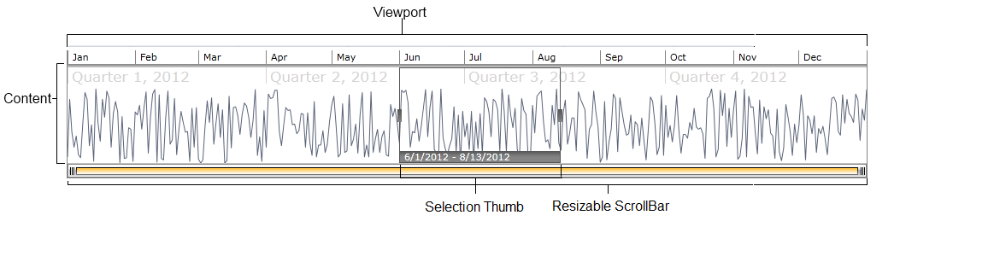
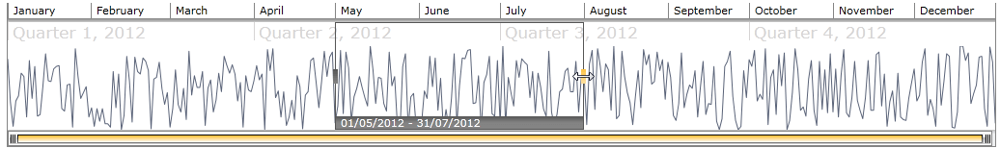
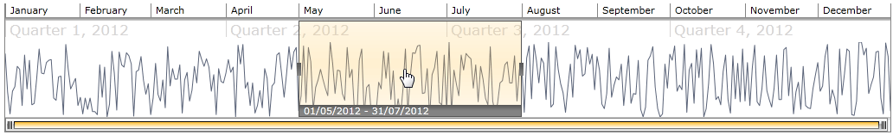
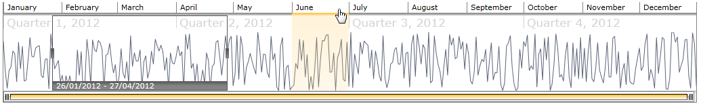

# Visual Structure

## 

This section defines the terms and concepts used in the scope of the __RadTimeBar__ control. They can be helpful when contacting with the support service in order to describe your issue better. Below you can see snapshots and explanations of the main visual elements of the control:

__Viewport__ - The rectangular region representing the time span between __VisiblePeriodStart__ and __VisiblePeriodEnd__. 

__Content__ - The area between the two levels of Labels. You can use the __Content__ to visualize *RadChart*, *RadSparkline* or any other custom controls. The picture above demonstrates *RadColumnSparkLine*.

__Resizable ScrollBar__ - You can use the Resizable ScrollBar or the __SelectionThumb__ to change the time span of the TimeBar control.

__SelectionThumb__ - The Selection thumb is a visual element, which is used to handle the selection of a time span in the TimeBar control. It is positioned according to the *SelectionStart* and *SelectionEnd* properties of the __RadTimeBar__.

__Selection Visibility Indicator__ - This visual element indicates (as its name implies) where is the SelectionThumb if it is not in the visible period of the time span.

__Selection Indicator__ - Indicates whether the Selected range is on the right or left side of the current visible time span.

The Selection thumb can be resized in both directions using the mouse. Clicking in the middle of the selection thumb and dragging it moves the entire selection left or right.

Selecting a time interval can be done also by creating a selection region with the mouse over the time bar like in the image below:

