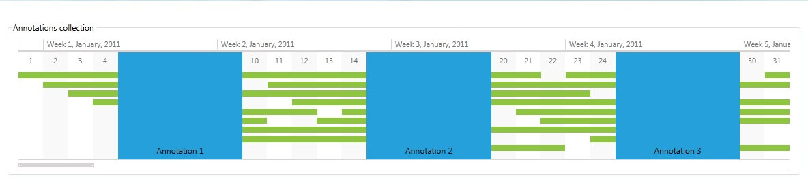
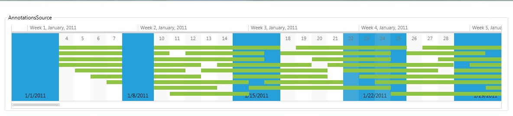
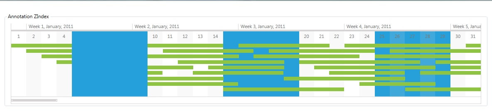
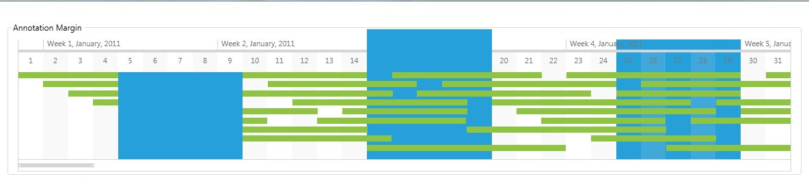

# Annotations

A TimelineAnnotation instance, specifies a single annotation that is positioned in the timeline control according to its StartDate and Duration values.

## Adding Annotations

There are two ways to add annotations to a timeline. The first is to manually add them to the __Annotations collection__ and the second one is to use the __AnnotationsSource__ property.        

__Annotations Collection__

Every timeline contains an Annotations collection which holds all the TimelineAnnotation-s plotted against the timeline.

The following example demonstrates how you can add a couple of annotations to the Annotations collection of a RadTimeline control:           

```XAML
	<telerik:RadTimeline PeriodStart="2011-01-01"
	                        PeriodEnd="2012-01-01"
	                        VisiblePeriodStart="2011-01-01"
	                        VisiblePeriodEnd="2011-02-01"
	                        StartPath="StartDate"
	                        DurationPath="Duration"
	                        ItemsSource="{Binding TimelineItems}">
	                
	    <telerik:RadTimeline.Resources>
	        <DataTemplate x:Key="TimelineAnnotationTemplate">
	            <Border Background="#FF25A0DA">
	                <TextBlock Text="{Binding}" VerticalAlignment="Bottom" HorizontalAlignment="Center" Margin="5" />
	            </Border>
	        </DataTemplate>
	    </telerik:RadTimeline.Resources>
	                
	    <telerik:RadTimeline.Intervals>
	        <telerik:YearInterval />
	        <telerik:MonthInterval />
	        <telerik:WeekInterval />
	        <telerik:DayInterval />
	    </telerik:RadTimeline.Intervals>
	    <telerik:RadTimeline.Annotations>
	        <telerik:TimelineAnnotation StartDate="2011-01-05"
	                                    Duration="5.00:00:00"
	                                    Content="Annotation 1"
	                                    ContentTemplate="{StaticResource TimelineAnnotationTemplate}" />
	        <telerik:TimelineAnnotation StartDate="2011-01-15"
	                                    Duration="5.00:00:00"
	                                    Content="Annotation 2"
	                                    ContentTemplate="{StaticResource TimelineAnnotationTemplate}" />
	        <telerik:TimelineAnnotation StartDate="2011-01-25"
	                                    Duration="5.00:00:00"
	                                    Content="Annotation 3"
	                                    ContentTemplate="{StaticResource TimelineAnnotationTemplate}" />
	    </telerik:RadTimeline.Annotations>
	</telerik:RadTimeline>
```



__АnnotationsSource__

The AnnotationsSource property specifies a collection, used to generate the annotations of the RadTimeline instance. When AnnotationsSource property is set, the Annotations collection is read-only.
* __AnnotationStartPath property__ - The path to the StartDate source property.
* __AnnotationDurationPath property__ - The path to the Duration source property.
* __AnnotationZIndexPath property property__ - The path to the ZIndex source property.
* __AnnotationContentPath property__ - The path to the Content source property.
* __AnnotationContentTemplate property__ - A DataTemplate that defines the visualization of the content of the generated timeline annotations. The default is null.

The following example demonstrates how you can bind the AnnotationsSource of a RadTimeline control:

```XAML
	<Grid.Resources>
	    <DataTemplate x:Key="TimelineAnnotationTemplate">
	        <Border Background="#FF25A0DA">
	            <TextBlock Text="{Binding}" VerticalAlignment="Bottom" HorizontalAlignment="Center" Margin="5" />
	        </Border>
	    </DataTemplate>
	</Grid.Resources>
	            
	<telerik:RadTimeline PeriodStart="2011-01-01"
	                        PeriodEnd="2012-01-01"
	                        VisiblePeriodStart="2011-01-01"
	                        VisiblePeriodEnd="2011-02-01"
	                        StartPath="StartDate"
	                        DurationPath="Duration"
	                        ItemsSource="{Binding TimelineItems}"
	                        AnnotationStartPath="StartDate"
	                        AnnotationDurationPath="Duration"
	                        AnnotationContentPath="Content"
	                        AnnotationZIndexPath="ZIndex"
	                        AnnotationContentTemplate="{StaticResource TimelineAnnotationTemplate}"
	                        AnnotationsSource="{Binding TimelineAnnotationItems}">
	
	    <telerik:RadTimeline.Intervals>
	        <telerik:YearInterval />
	        <telerik:MonthInterval />
	        <telerik:WeekInterval />
	        <telerik:DayInterval />
	    </telerik:RadTimeline.Intervals>
	</telerik:RadTimeline>
```

```C#
	public class RadTimelineAnnotationsViewModel
	{
	    public RadTimelineAnnotationsViewModel()
	    {
	        this.PeriodStart = new DateTime(2011, 1, 1);
	        this.PeriodEnd = new DateTime(2012, 1, 1);
	
	        this.GenerateTimelineData();
	        this.GenerateTimelineAnnotationsData();
	    }
	
	    public DateTime PeriodStart { get; set; }
	
	    public DateTime PeriodEnd { get; set; }
	
	    public List<RadTimelineDataItem> TimelineItems { get; set; }
	
	    public List<RadTimelineAnnotationDataItem> TimelineAnnotationItems { get; set; }
	
	    private void GenerateTimelineData()
	    {
	        Random r = new Random();
	        List<RadTimelineDataItem> items = new List<RadTimelineDataItem>();
	
	        for (DateTime date = this.PeriodStart; date < this.PeriodEnd; date = date.AddDays(1))
	        {
	            items.Add(new RadTimelineDataItem() { StartDate = date, Duration = TimeSpan.FromDays(r.Next(5, 10)) });
	        }
	
	        this.TimelineItems = items;
	    }
	
	    private void GenerateTimelineAnnotationsData()
	    {
	        Random r = new Random();
	        List<RadTimelineAnnotationDataItem> items = new List<RadTimelineAnnotationDataItem>();
	
	        for (DateTime date = this.PeriodStart; date < this.PeriodEnd; date = date.AddDays(7))
	        {
	            items.Add(new RadTimelineAnnotationDataItem(){
	                StartDate = date,
	                Duration = TimeSpan.FromDays(r.Next(2, 5)),
	                Content = date.ToShortDateString(),
	                ZIndex = r.Next(0, 300)
	            });
	        }
	
	        this.TimelineAnnotationItems = items;
	    }
	}
	
	public class RadTimelineDataItem
	{
	    public DateTime StartDate { get; set; }
	
	    public TimeSpan Duration { get; set; }
	}
	
	public class RadTimelineAnnotationDataItem
	{
	    public DateTime StartDate { get; set; }
	
	    public TimeSpan Duration { get; set; }
	
	    public string Content { get; set; }
	
	    public int ZIndex { get; set; }
	}
```
```VB.NET
	Public Class RadTimelineAnnotationsViewModel
		Public Sub New()
			Me.PeriodStart = New DateTime(2011, 1, 1)
			Me.PeriodEnd = New DateTime(2012, 1, 1)
	
			Me.GenerateTimelineData()
			Me.GenerateTimelineAnnotationsData()
		End Sub
	
		Public Property PeriodStart() As DateTime
			Get
				Return m_PeriodStart
			End Get
			Set
				m_PeriodStart = Value
			End Set
		End Property
		Private m_PeriodStart As DateTime
	
		Public Property PeriodEnd() As DateTime
			Get
				Return m_PeriodEnd
			End Get
			Set
				m_PeriodEnd = Value
			End Set
		End Property
		Private m_PeriodEnd As DateTime
	
		Public Property TimelineItems() As List(Of RadTimelineDataItem)
			Get
				Return m_TimelineItems
			End Get
			Set
				m_TimelineItems = Value
			End Set
		End Property
		Private m_TimelineItems As List(Of RadTimelineDataItem)
	
		Public Property TimelineAnnotationItems() As List(Of RadTimelineAnnotationDataItem)
			Get
				Return m_TimelineAnnotationItems
			End Get
			Set
				m_TimelineAnnotationItems = Value
			End Set
		End Property
		Private m_TimelineAnnotationItems As List(Of RadTimelineAnnotationDataItem)
	
		Private Sub GenerateTimelineData()
			Dim r As New Random()
			Dim items As New List(Of RadTimelineDataItem)()
	
			Dim [date] As DateTime = Me.PeriodStart
			While [date] < Me.PeriodEnd
				items.Add(New RadTimelineDataItem() With { _
					.StartDate = [date], _
					.Duration = TimeSpan.FromDays(r.[Next](5, 10)) _
				})
				[date] = [date].AddDays(1)
			End While
	
			Me.TimelineItems = items
		End Sub
	
		Private Sub GenerateTimelineAnnotationsData()
			Dim r As New Random()
			Dim items As New List(Of RadTimelineAnnotationDataItem)()
	
			Dim [date] As DateTime = Me.PeriodStart
			While [date] < Me.PeriodEnd
				items.Add(New RadTimelineAnnotationDataItem() With { _
					.StartDate = [date], _
					.Duration = TimeSpan.FromDays(r.[Next](2, 5)), _
					.Content = [date].ToShortDateString(), _
					.ZIndex = r.[Next](0, 300) _
				})
				[date] = [date].AddDays(7)
			End While
	
			Me.TimelineAnnotationItems = items
		End Sub
	End Class
	
	Public Class RadTimelineDataItem
		Public Property StartDate() As DateTime
			Get
				Return m_StartDate
			End Get
			Set
				m_StartDate = Value
			End Set
		End Property
		Private m_StartDate As DateTime
	
		Public Property Duration() As TimeSpan
			Get
				Return m_Duration
			End Get
			Set
				m_Duration = Value
			End Set
		End Property
		Private m_Duration As TimeSpan
	End Class
	
	Public Class RadTimelineAnnotationDataItem
		Public Property StartDate() As DateTime
			Get
				Return m_StartDate
			End Get
			Set
				m_StartDate = Value
			End Set
		End Property
		Private m_StartDate As DateTime
	
		Public Property Duration() As TimeSpan
			Get
				Return m_Duration
			End Get
			Set
				m_Duration = Value
			End Set
		End Property
		Private m_Duration As TimeSpan
	
		Public Property Content() As String
			Get
				Return m_Content
			End Get
			Set
				m_Content = Value
			End Set
		End Property
		Private m_Content As String
	
		Public Property ZIndex() As Integer
			Get
				Return m_ZIndex
			End Get
			Set
				m_ZIndex = Value
			End Set
		End Property
		Private m_ZIndex As Integer
	End Class
```



## Properties

* __StartDate property__ - A DateTime value that defines the position of the annotation on the timeline axis. The default value is DateTime.MinValue.
* __Duration property__ - A TimeSpan value that defines the duration of the annotation on the timeline axis and thus its width, according to the current zoom level. The default value is TimeSpan.Zero. In case no duration is specified, the width of the annotation can be specified using the Width property and the width does not depend on the current zoom level.
* __Content property__ - The data used to generate the child elements. The default is null.
* __ContentTemplate property__ - A DataTemplate that defines the visualization of the content. The default is null.
* __Changing the default annotation ZIndex__ - The default ZIndex of a timeline annotation instance is 300. That is, by default, a timeline annotation appears on top of the timeline items (default ZIndex=200) and the period items (default ZIndex=100). You can change the ZIndex of an annotation instance using the attached Canvas.ZIndex property. The following example demonstrates how you can change the default annotation ZIndex value:

```XAML
	<telerik:RadTimeline PeriodStart="2011-01-01"
	                        PeriodEnd="2012-01-01"
	                        VisiblePeriodStart="2011-01-01"
	                        VisiblePeriodEnd="2011-02-01"
	                        StartPath="StartDate"
	                        DurationPath="Duration"
	                        ItemsSource="{Binding TimelineItems}">
	
	    <telerik:RadTimeline.Resources>
	        <DataTemplate x:Key="TimelineAnnotationTemplate">
	            <Border Background="#FF25A0DA">
	                <TextBlock Text="{Binding}" VerticalAlignment="Bottom" HorizontalAlignment="Center" Margin="5" />
	            </Border>
	        </DataTemplate>
	    </telerik:RadTimeline.Resources>
	                
	    <telerik:RadTimeline.Intervals>
	        <telerik:YearInterval />
	        <telerik:MonthInterval />
	        <telerik:WeekInterval />
	        <telerik:DayInterval />
	    </telerik:RadTimeline.Intervals>
	    <telerik:RadTimeline.Annotations>
	        <telerik:TimelineAnnotation StartDate="2011-01-05"
	                                    Duration="5.00:00:00"
	                                    ContentTemplate="{StaticResource TimelineAnnotationTemplate}" />
	        <telerik:TimelineAnnotation StartDate="2011-01-15"
	                                    Duration="5.00:00:00"
	                                    Canvas.ZIndex="150"
	                                    ContentTemplate="{StaticResource TimelineAnnotationTemplate}" />
	        <telerik:TimelineAnnotation StartDate="2011-01-25"
	                                    Duration="5.00:00:00"
	                                    Canvas.ZIndex="50"
	                                    ContentTemplate="{StaticResource TimelineAnnotationTemplate}" />
	    </telerik:RadTimeline.Annotations>
	</telerik:RadTimeline>
```



* __Changing the default annotation top margin__  - The default top margin of a timeline annotation instance equals the height of the period items, positioned on top of the timeline line. You can change the default top margin value of an annotation instance using the Margin property. The following example demonstrates how you can change the default annotation top margin value:

```XAML
	<telerik:RadTimeline PeriodStart="2011-01-01"
	                        PeriodEnd="2012-01-01"
	                        VisiblePeriodStart="2011-01-01"
	                        VisiblePeriodEnd="2011-02-01"
	                        StartPath="StartDate"
	                        DurationPath="Duration"
	                        ItemsSource="{Binding TimelineItems}">
	
	    <telerik:RadTimeline.Resources>
	        <DataTemplate x:Key="TimelineAnnotationTemplate">
	            <Border Background="#FF25A0DA">
	                <TextBlock Text="{Binding}" VerticalAlignment="Bottom" HorizontalAlignment="Center" Margin="5" />
	            </Border>
	        </DataTemplate>
	    </telerik:RadTimeline.Resources>
	
	    <telerik:RadTimeline.Intervals>
	        <telerik:YearInterval />
	        <telerik:MonthInterval />
	        <telerik:WeekInterval />
	        <telerik:DayInterval />
	    </telerik:RadTimeline.Intervals>
	    <telerik:RadTimeline.Annotations>
	        <telerik:TimelineAnnotation StartDate="2011-01-05"
	                                    Duration="5.00:00:00"
	                                    Margin="0,48,0,0"
	                                    ContentTemplate="{StaticResource TimelineAnnotationTemplate}" />
	        <telerik:TimelineAnnotation StartDate="2011-01-15"
	                                    Duration="5.00:00:00"
	                                    Margin="0,-15,0,0"
	                                    Canvas.ZIndex="150"
	                                    ContentTemplate="{StaticResource TimelineAnnotationTemplate}" />
	        <telerik:TimelineAnnotation StartDate="2011-01-25"
	                                    Duration="5.00:00:00"
	                                    Margin="0"
	                                    Canvas.ZIndex="50"
	                                    ContentTemplate="{StaticResource TimelineAnnotationTemplate}" />
	    </telerik:RadTimeline.Annotations>
	</telerik:RadTimeline>
```

