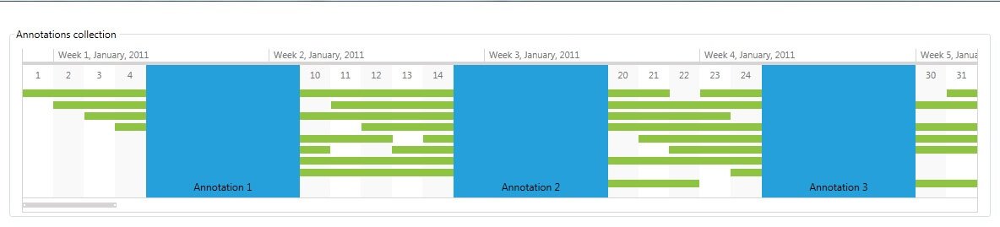
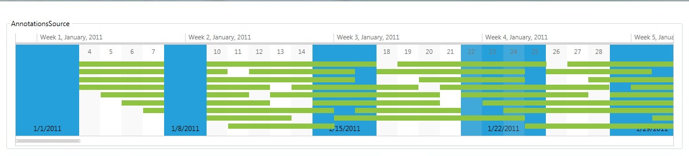
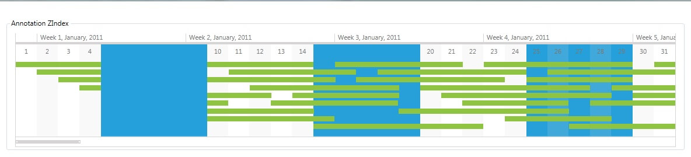
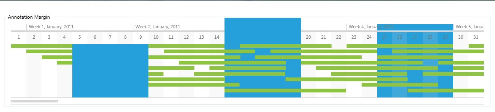

# Annotations

A TimelineAnnotation instance, specifies a single annotation that is positioned in the timeline control according to its StartDate and Duration values.

## Adding Annotations

There are two ways to add annotations to a timeline. The first is to manually add them to the __Annotations collection__ and the second one is to use the __AnnotationsSource__ property.        

__Annotations Collection__

Every timeline contains an Annotations collection which holds all the TimelineAnnotation-s plotted against the timeline.

The following example demonstrates how you can add a couple of annotations to the Annotations collection of a RadTimeline control:           

<snippet id='radtimeline-features-annotations-block_1-xaml' />

__АnnotationsSource__

The AnnotationsSource property specifies a collection, used to generate the annotations of the RadTimeline instance. When AnnotationsSource property is set, the Annotations collection is read-only.
* __AnnotationStartPath property__ - The path to the StartDate source property.
* __AnnotationDurationPath property__ - The path to the Duration source property.
* __AnnotationZIndexPath property property__ - The path to the ZIndex source property.
* __AnnotationContentPath property__ - The path to the Content source property.
* __AnnotationContentTemplate property__ - A DataTemplate that defines the visualization of the content of the generated timeline annotations. The default is null.

The following example demonstrates how you can bind the AnnotationsSource of a RadTimeline control:

<snippet id='radtimeline-features-annotations-block_2-xaml' />

<snippet id='radtimeline-features-annotations-block_3-cs' />
<snippet id='radtimeline-features-annotations-block_4-vb' />

## Properties

* __StartDate property__ - A DateTime value that defines the position of the annotation on the timeline axis. The default value is DateTime.MinValue.
* __Duration property__ - A TimeSpan value that defines the duration of the annotation on the timeline axis and thus its width, according to the current zoom level. The default value is TimeSpan.Zero. In case no duration is specified, the width of the annotation can be specified using the Width property and the width does not depend on the current zoom level.
* __Content property__ - The data used to generate the child elements. The default is null.
* __ContentTemplate property__ - A DataTemplate that defines the visualization of the content. The default is null.
* __Changing the default annotation ZIndex__ - The default ZIndex of a timeline annotation instance is 300. That is, by default, a timeline annotation appears on top of the timeline items (default ZIndex=200) and the period items (default ZIndex=100). You can change the ZIndex of an annotation instance using the attached Canvas.ZIndex property. The following example demonstrates how you can change the default annotation ZIndex value:

<snippet id='radtimeline-features-annotations-block_5-xaml' />

* __Changing the default annotation top margin__  - The default top margin of a timeline annotation instance equals the height of the period items, positioned on top of the timeline line. You can change the default top margin value of an annotation instance using the Margin property. The following example demonstrates how you can change the default annotation top margin value:

<snippet id='radtimeline-features-annotations-block_6-xaml' />

