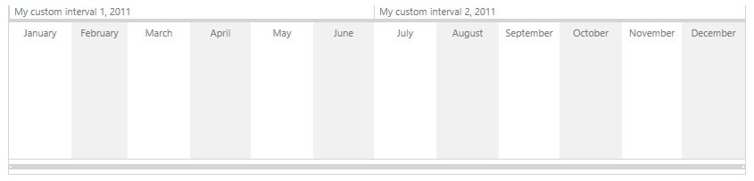

# Custom Interval Types

__RadTimeline__ provides built-in support for a couple of predefined interval types ranging from milliseconds to centuries. For a full list of the predefined intervals, please refer to the [Interval Formatters]() article. For all custom scenarios that the predefined intervals do not cover, the control supports custom interval type implementations.

## Using Custom interval types

The __Intervals__ collection contains items of type __IntervalBase__. That is why, in order to configure a __RadTimeline__ control to use a custom interval type, simply add an instance of that custom interval to the Intervals collection of the control.

The example below shows how you can add a custom interval type to the Intervals collection of a RadTimeline control:


```XAML
	<telerik:RadTimeline PeriodStart="2011-01-01"
						 PeriodEnd="2012-01-01">
		<telerik:RadTimeline.Intervals>
			<example:CustomInterval />
			<telerik:MonthInterval />
		</telerik:RadTimeline.Intervals>
	</telerik:RadTimeline>
```
	
## The IntervalBase class

A custom interval is a class that inherits the __IntervalBase__ class and implements its abstract properties and methods:
* __Formatters__ – Gets a collection of formatter that the interval can use to convert __DateTime__ objects to strings.
* __MinimumPeriodLength__ - Gets the smallest interval period.
* __ExtractIntervalStart__ – Given a __DateTime__ object, this method returns the start of the interval that contains the given DateTime object.
* __IncrementByInterval__ – Given a __DateTime__ object and span, this method increments the specified DateTime object by the specified number of __MinimumPeriodLengths__

Below you can find a sample custom interval implementation:


```C#
	using Telerik.Windows.Controls.TimeBar;
	public class CustomInterval : IntervalBase
	{
		private static readonly Func<DateTime, string>[] formatters;

		static CustomInterval()
		{
			formatters = new Func<DateTime, string>[]
			{
				date => string.Format("My custom interval {0}, {1}", GetNumberOfInterval(date), date.ToString("yyyy")),
				date => string.Format("Custom interval {0}", GetNumberOfInterval(date)),
				date => string.Format("C{0} {1}", GetNumberOfInterval(date), date.ToString("yyyy")),
			};
		}

		public override DateTime ExtractIntervalStart(DateTime date)
		{
			int firstMonthOfInterval = GetFirstMonthOfInterval(date);
			return new DateTime(date.Year, firstMonthOfInterval, 1);
		}

		public override DateTime IncrementByInterval(DateTime date, int intervalSpan)
		{
			return date.AddMonths(intervalSpan * 6);
		}

		public override Func<DateTime, string>[] Formatters
		{
			get
			{
				return formatters;
			}
		}

		public override TimeSpan MinimumPeriodLength
		{
			get
			{
				return TimeSpan.FromDays(180);
			}
		}

		private static int GetNumberOfInterval(DateTime date)
		{
			int number = ((date.Month - 1) / 6) + 1;
			return number;
		}

		private int GetFirstMonthOfInterval(DateTime date)
		{
			int quarter = GetNumberOfInterval(date);
			int firstMonthOfInterval = ((quarter - 1) * 6) + 1;
			return firstMonthOfInterval;
		}
	}
```
```VB.NET
	Imports Telerik.Windows.Controls.TimeBar
	Public Class CustomInterval
		Inherits IntervalBase
		Private Shared ReadOnly m_formatters As Func(Of DateTime, String)()

		Shared Sub New()
			m_formatters = New Func(Of DateTime, String)() {Function([date]) String.Format("My custom interval {0}, {1}", GetNumberOfInterval([date]), [date].ToString("yyyy")), Function([date]) String.Format("Custom interval {0}", GetNumberOfInterval([date])), Function([date]) String.Format("C{0} {1}", GetNumberOfInterval([date]), [date].ToString("yyyy"))}
		End Sub

		Public Overrides Function ExtractIntervalStart([date] As DateTime) As DateTime
			Dim firstMonthOfInterval As Integer = GetFirstMonthOfInterval([date])
			Return New DateTime([date].Year, firstMonthOfInterval, 1)
		End Function

		Public Overrides Function IncrementByInterval([date] As DateTime, intervalSpan As Integer) As DateTime
			Return [date].AddMonths(intervalSpan * 6)
		End Function

		Public Overrides ReadOnly Property Formatters() As Func(Of DateTime, String)()
			Get
				Return m_formatters
			End Get
		End Property

		Public Overrides ReadOnly Property MinimumPeriodLength() As TimeSpan
			Get
				Return TimeSpan.FromDays(180)
			End Get
		End Property

		Private Shared Function GetNumberOfInterval([date] As DateTime) As Integer
			Dim number As Integer = (([date].Month - 1) / 6) + 1
			Return number
		End Function

		Private Function GetFirstMonthOfInterval([date] As DateTime) As Integer
			Dim quarter As Integer = GetNumberOfInterval([date])
			Dim firstMonthOfInterval As Integer = ((quarter - 1) * 6) + 1
			Return firstMonthOfInterval
		End Function
	End Class
```

>tip Find a runnable project of the previous example in the [WPF Samples GitHub repository](https://github.com/telerik/xaml-sdk/tree/master/Timeline/WPF/CustomIntervalTypes).

Using the sample custom interval above, you will get the following result:


## See Also
 * [Intervals Formatters]()
 * [Formatter Provider]()