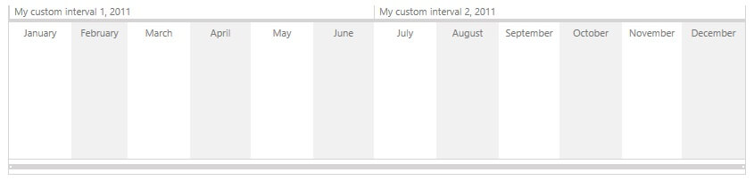

# Custom Interval Types

__RadTimeline__ provides built-in support for a couple of predefined interval types ranging from milliseconds to centuries. For a full list of the predefined intervals, please refer to the [Interval Formatters]() article. For all custom scenarios that the predefined intervals do not cover, the control supports custom interval type implementations.

## Using Custom interval types

The __Intervals__ collection contains items of type __IntervalBase__. That is why, in order to configure a __RadTimeline__ control to use a custom interval type, simply add an instance of that custom interval to the Intervals collection of the control.

The example below shows how you can add a custom interval type to the Intervals collection of a RadTimeline control:

<snippet id='radtimeline-features-custom-interval-types-block_1-xaml' />
	
## The IntervalBase class

A custom interval is a class that inherits the __IntervalBase__ class and implements its abstract properties and methods:
* __Formatters__ – Gets a collection of formatter that the interval can use to convert __DateTime__ objects to strings.
* __MinimumPeriodLength__ - Gets the smallest interval period.
* __ExtractIntervalStart__ – Given a __DateTime__ object, this method returns the start of the interval that contains the given DateTime object.
* __IncrementByInterval__ – Given a __DateTime__ object and span, this method increments the specified DateTime object by the specified number of __MinimumPeriodLengths__

Below you can find a sample custom interval implementation:

<snippet id='radtimeline-features-custom-interval-types-block_2-cs' />
<snippet id='radtimeline-features-custom-interval-types-block_3-vb' />

>tip Find a runnable project of the previous example in the [WPF Samples GitHub repository](https://github.com/telerik/xaml-sdk/tree/master/Timeline/WPF/CustomIntervalTypes).

Using the sample custom interval above, you will get the following result:

## See Also
 * [Intervals Formatters]()
 * [Formatter Provider]()