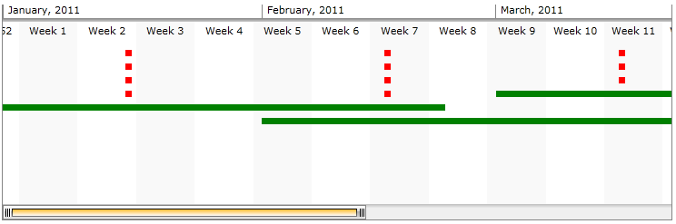

# Customizing Items

There are two ways you can change the template for the __RadTimeline__ items. You can either customize them with the use of ItemTemplateSelector, or with a  __TimelineItemTemplate / TimelineInstantItemTemplate__ property. This help article will walk you through these two approaches:
* [TimelineItemTemplate / TimelineInstantItemTemplate property](#timelineitemtemplate/timelineinstantitemtemplate-property)
* [ItemTemplateSelector](#itemtemplateselector)

## TimelineItemTemplate and TimelineInstantItemTemplate 

> The items with duration can be customized in the same manner as the instant items. To shed more light on the difference between these two items types, you may check the [DataBinding]() topic.

The following example demonstrates how you can add custom Framework Element (Rectangle in this case) to present the instant and duration items. The customizations are made via DataTemplate and applied to the corresponding TimelineItemTemplate/TimelineInstantItemTemplate property in XAML. There is nothing special in code-behind, it is added for completeness of the sample.


```XAML
	 <UserControl.Resources>
	        <DataTemplate x:Key="InstantItemTemplate">
	            <Border Width="10" Height="10" Margin="0,0,0,5">
	                <Rectangle Height="7"
	                    Width="7"
	                    HorizontalAlignment="Center"
	                    VerticalAlignment="Center"
	                    Fill="Red">
	                </Rectangle>
	            </Border>
	        </DataTemplate>
	
	        <DataTemplate x:Key="ItemWithDurationTemplate">
	            <Border Height="10" Margin="0, 0, 0, 5">
	                <Rectangle Height="7"
	                        VerticalAlignment="Center"
	                        Fill="Green"/>
	            </Border>
	        </DataTemplate>
	    </UserControl.Resources>   
	    
	     <Grid x:Name="LayoutRoot" Background="White" Height="250" Width="750">
	        <telerik:RadTimeline x:Name="RadTimeline1"
	                    Margin="6"
	                    VerticalAlignment="Top"
	                    PeriodStart="2011/01/01" PeriodEnd="2011/06/01"
	                    VisiblePeriodStart="2011/01/01" VisiblePeriodEnd="2011/03/22"
	                    StartPath="Date"
	                    DurationPath="Duration"
	                    TimelineItemTemplate="{StaticResource ItemWithDurationTemplate}"
	                    TimelineInstantItemTemplate="{StaticResource InstantItemTemplate}">           
	            <telerik:RadTimeline.Intervals>
	                <telerik:DayInterval />
	                <telerik:WeekInterval />
	                <telerik:MonthInterval />
	                <telerik:YearInterval />
	            </telerik:RadTimeline.Intervals>
	        </telerik:RadTimeline>
	    </Grid>
```


```C#
		List<Item> dataSource = new List<Item>();
		var startDate = new DateTime(2011, 1, 1);
		var endDate = new DateTime(2011, 6, 1);
	
		Random r = new Random();
		for (DateTime i = startDate; i < endDate; i = i.AddMonths(1))
		{
			dataSource.Add(new Item() { Date = i, Duration = TimeSpan.FromDays(r.Next(50, 100)) });
		}
	
		for (int i = 0; i < 15; i++)
		{
			dataSource.Add(new Item() { Date = startDate.AddMonths(r.Next(0, 5)).AddDays(15)});
		}
		RadTimeline1.ItemsSource = dataSource;
	
		public class Item
		{
			public TimeSpan Duration { get; set; }
			public DateTime Date { get; set; }
		}
```


```VB.NET
	    Dim dataSource As New List(Of Item)()
		Dim startDate = New Date(2011, 1, 1)
		Dim endDate = New Date(2011, 6, 1)
	
		Dim r As New Random()
		Dim i As Date = startDate
		Do While i < endDate
			dataSource.Add(New Item() With {.Date = i, .Duration = TimeSpan.FromDays(r.Next(50, 100))})
			i = i.AddMonths(1)
		Loop
	
		For i As Integer = 0 To 14
			dataSource.Add(New Item() With {.Date = startDate.AddMonths(r.Next(0, 5)).AddDays(15)})
		Next i
		RadTimeline1.ItemsSource = dataSource
	
		public class Item
		public TimeSpan Duration {get;set;}
		public Date Date {get;set;}
```


You may see the result below:


## ItemTemplateSelector

Using ItemTemplateSelector is another approach for customizing the __RadTimeline__ items. Aside from the previous one - here a single property is used to change the appearance of both duration and instant item types. This example will demonstrate how you may set the DataTemplates we used in the previous section.            

We'll get started with creating a __CustomItemTemplateSelector__ class. It should inherit the __DataTemplateSelector__ class and override its __SelectTemplate__ method. We'll create two properties with type DataTemplate - these are the InstantItemTemplate and ItemWithDurationTemplate we used in the previous section of this article.            

>We are using the Product class from the previous section as datasource for our Timeline.


```C#
	 public class CustomItemTemplateSelector : DataTemplateSelector
	    {
	        public DataTemplate InstantItemTemplate { get; set; }
	        public DataTemplate ItemWithDurationTemplate { get; set; }
	
	        public override DataTemplate SelectTemplate(object item, DependencyObject container)
	        {
	            TimelineDataItem data = item as TimelineDataItem;
	            Product productItem;
	
	            if (data == null)
	                productItem = item as Product;
	            else
	                productItem = data.DataItem as Product;
	
	            if (productItem == null)
	                return base.SelectTemplate(item, container);
	
	            if (productItem.Duration.Days != 0)
	                return this.ItemWithDurationTemplate;
	            else
	                return this.InstantItemTemplate;
	        }
	    }
```


```VB.NET
	 Public Class CustomItemTemplateSelector
	 Inherits DataTemplateSelector
		Public Property InstantItemTemplate() As DataTemplate
		Public Property ItemWithDurationTemplate() As DataTemplate
	
		Public Overrides Function SelectTemplate(ByVal item As Object, ByVal container As DependencyObject) As DataTemplate
			Dim data As TimelineDataItem = TryCast(item, TimelineDataItem)
			Dim productItem As Product
	
			If data Is Nothing Then
				productItem = TryCast(item, Product)
			Else
				productItem = TryCast(data.DataItem, Product)
			End If
	
			If productItem Is Nothing Then
				Return MyBase.SelectTemplate(item, container)
			End If
	
			If productItem.Duration.Days <> 0 Then
				Return Me.ItemWithDurationTemplate
			Else
				Return Me.InstantItemTemplate
			End If
		End Function
	 End Class
```

We'll extend the View Model we previously created with __CustomItemTemplateSelector__  property and field as shown below:


```C#
	private DataTemplateSelector customItemTemplateSelector;
	public DataTemplateSelector CustomItemTemplateSelector
	{
		get
		{
			return this.customItemTemplateSelector;
		}
		set
		{
			this.customItemTemplateSelector = value;
		}
	}
```


```VB.NET
	Private customItemTemplateSelector_Renamed As DataTemplateSelector
	Public Property CustomItemTemplateSelector() As DataTemplateSelector
		Get
			Return Me.customItemTemplateSelector_Renamed
		End Get
		Set(ByVal value As DataTemplateSelector)
			Me.customItemTemplateSelector_Renamed = value
		End Set
	End Property
```

Now in XAML you may create an instance of the CustomItemTemplateSelector class, set the DataTemplates and provide it to the __ItemTemplateSelector__ property:


```XAML
	  <UserControl.Resources>
	        <DataTemplate x:Key="InstantItemTemplate">
	            <Border Width="10" Height="10" Margin="0,0,0,5">
	                <Rectangle Height="7"
	                   Width="7"
	                   HorizontalAlignment="Center"
	                   VerticalAlignment="Center"
	                   Fill="Red">
	                </Rectangle>
	            </Border>
	        </DataTemplate>
	
	        <DataTemplate x:Key="ItemWithDurationTemplate">
	            <Border Height="10" Margin="0, 0, 0, 5">
	                <Rectangle Height="7"
	                       VerticalAlignment="Center"
	                       Fill="Green"/>
	            </Border>
	        </DataTemplate>
	
	        <local:CustomItemTemplateSelector x:Key="ItemTemplateSelector"
	                                          InstantItemTemplate="{StaticResource InstantItemTemplate}"
	                                          ItemWithDurationTemplate="{StaticResource ItemWithDurationTemplate}"/>
	    </UserControl.Resources>  
	    
	    <UserControl.DataContext>
	        <local:ExampleViewModel CustomItemTemplateSelector="{StaticResource ItemTemplateSelector}"/>
	    </UserControl.DataContext>
	
	    <Grid x:Name="LayoutRoot" Background="White" Height="300" Width="750">
	        <telerik:RadTimeline Height="250" x:Name="RadTimeline1"
	                    VerticalAlignment="Top"
	                    Margin="6"
	                    PeriodStart="2011/01/01" PeriodEnd="2011/06/01"
	                    StartPath="Date"
	                    DurationPath="Duration"
	                    ItemTemplateSelector="{StaticResource ItemTemplateSelector}"     
	                    ItemsSource="{Binding Data}">
	            <telerik:RadTimeline.Intervals>
	                <telerik:YearInterval />
	                <telerik:MonthInterval />
	                <telerik:WeekInterval />
	                <telerik:DayInterval />
	            </telerik:RadTimeline.Intervals>
	        </telerik:RadTimeline>
	    </Grid>
```

The result is the same as the one shown in the previous section image.