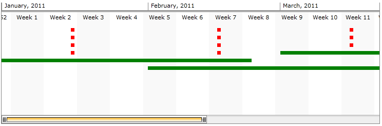

# Customizing Items

There are two ways you can change the template for the __RadTimeline__ items. You can either customize them with the use of ItemTemplateSelector, or with a  __TimelineItemTemplate / TimelineInstantItemTemplate__ property.

## TimelineItemTemplate and TimelineInstantItemTemplate 

> The items with duration can be customized in the same manner as the instant items. To shed more light on the difference between these two items types, you may check the [DataBinding]() topic.

The following example demonstrates how you can add custom Framework Element (Rectangle in this case) to present the instant and duration items. The customizations are made via DataTemplate and applied to the corresponding TimelineItemTemplate/TimelineInstantItemTemplate property in XAML. There is nothing special in code-behind, it is added for completeness of the sample.

<snippet id='radtimeline-features-customizing-items-block_1-xaml' />

<snippet id='radtimeline-features-customizing-items-block_2-cs' />
<snippet id='radtimeline-features-customizing-items-block_3-vb' />

You may see the result below:

## ItemTemplateSelector

Using ItemTemplateSelector is another approach for customizing the __RadTimeline__ items. Aside from the previous one - here a single property is used to change the appearance of both duration and instant item types. This example will demonstrate how you may set the DataTemplates we used in the previous section.            

We'll get started with creating a __CustomItemTemplateSelector__ class. It should inherit the __DataTemplateSelector__ class and override its __SelectTemplate__ method. We'll create two properties with type DataTemplate - these are the InstantItemTemplate and ItemWithDurationTemplate we used in the previous section of this article.            

>We are using the Product class from the previous section as datasource for our Timeline.

<snippet id='radtimeline-features-customizing-items-block_4-cs' />
<snippet id='radtimeline-features-customizing-items-block_5-vb' />

We'll extend the View Model we previously created with __CustomItemTemplateSelector__  property and field as shown below:

<snippet id='radtimeline-features-customizing-items-block_6-cs' />
<snippet id='radtimeline-features-customizing-items-block_7-vb' />

Now in XAML you may create an instance of the CustomItemTemplateSelector class, set the DataTemplates and provide it to the __ItemTemplateSelector__ property:

<snippet id='radtimeline-features-customizing-items-block_8-xaml' />

The result is the same as the one shown in the previous section image.