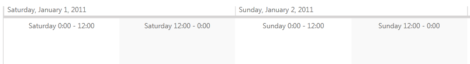
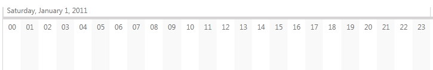
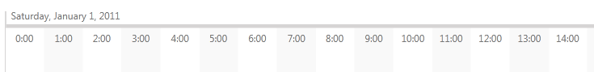

# Formatter Provider

This help topic will give an overview on the Formatter Provider feature of RadTimeline.      

## Using Formatter Providers

RadTimeline provides means for customizing the interval formats through the __FormatterProvider__ property of the IntervalBase class. Using it, you can specify different formats for each interval.

The example below shows how formatter providers can be utilized (once they are implemented):

```XAML
	<telerik:RadTimeline PeriodStart="2011-01-01"
	                    PeriodEnd="2011-01-05"
	                    VisiblePeriodStart="2011-01-01"
	                    VisiblePeriodEnd="2011-01-02.07:00:00">
	    <telerik:RadTimeline.Resources>
	        <local:WeekFormatterProvider x:Key="WeekFormatterProvider"/>
	        <local:DayFormatterProvider x:Key="DayFormatterProvider"/>
	        <local:HourFormatterProvider x:Key="HourFormatterProvider"/>
	    </telerik:RadTimeline.Resources>
	
	    <telerik:RadTimeline.Intervals>
	        <telerik:WeekInterval FormatterProvider="{StaticResource WeekFormatterProvider}"/>
	        <telerik:DayInterval FormatterProvider="{StaticResource DayFormatterProvider}"/>
	        <telerik:HourInterval FormatterProvider="{StaticResource HourFormatterProvider}"/>
	    </telerik:RadTimeline.Intervals>
	</telerik:RadTimeline>
```

## The IIntervalFormatterProvider interface

A formatter provider is a class that implements the __IIntervalFormatterProvider__ interface. This interface has two methods that need to be implemented - __GetFormatters__ and __GetIntervalSpanFormatters__. They both have to return a Func<DateTime, string>[] - an array of functions each of which given a DateTime value returns it as formatted string. E.g. { date => date.ToString("H:mm") }.

* __GetFormatters__ - used in the default scenario when Interval.CurrentIntervalSpan = 1, i.e. there is a period control for every interval item.            

* __GetIntervalSpanFormatters__ - used when one period control corresponds to a couple of interval items. E.g. an HourInterval with CurrentIntervalSpan = 12 interval span will create two hour intervals per each day - (0:00 - 12:00) and (12:00 - 0:00). An appropriate format would be String.Format("{0} - {1}", currentIntevalString, nextIntervalString).
            
Here is a sample hour formatter provider implementation:

```C#
	using  Telerik.Windows.Controls.TimeBar;
	
	public class HourFormatterProvider : IIntervalFormatterProvider
	{
	    private static Func<DateTime, string>[] formatters;
	    private Func<DateTime, string>[] intervalSpanFormatters;
	
	    static HourFormatterProvider()
	    {
	        formatters = new Func<DateTime, string>[]
	        {
	            date => date.ToString("H:mm"),
	            date => date.ToString("HH")
	        };
	    }
	
	    public Func<DateTime, string>[] GetFormatters(IntervalBase interval)
	    {
	        return formatters;
	    }
	
	    public Func<DateTime, string>[] GetIntervalSpanFormatters(IntervalBase interval)
	    {
	        if (this.intervalSpanFormatters == null)
	        {
	            this.intervalSpanFormatters = new Func<DateTime, string>[]
	            {
	                date => String.Format("{0} - {1}", date.ToString("dddd H:mm"), interval.IncrementByCurrentInterval(date).ToString("H:mm"))
	            };
	        }
	
	        return this.intervalSpanFormatters;
	    }
	}
```
```VB.NET
	Imports Telerik.Windows.Controls.TimeBar
	
	Public Class HourFormatterProvider
	Implements IIntervalFormatterProvider
	    Private Shared formatters As Func(Of DateTime, String)()
	    Private intervalSpanFormatters As Func(Of DateTime, String)()
	
	    Shared Sub New()
	        formatters = New Func(Of DateTime, String)() {Function([date]) [date].ToString("H:mm"), Function([date]) [date].ToString("HH")}
	    End Sub
	
	    Public Function GetFormatters(interval As IntervalBase) As Func(Of DateTime, String)() Implements IIntervalFormatterProvider.GetFormatters
	        Return formatters
	    End Function
	
	    Public Function GetIntervalSpanFormatters(interval As IntervalBase) As Func(Of DateTime, String)() Implements IIntervalFormatterProvider.GetIntervalSpanFormatters
	        If Me.intervalSpanFormatters Is Nothing Then
	            Me.intervalSpanFormatters = New Func(Of DateTime, String)() _
	            {Function([date]) [String].Format("{0} - {1}", [date].ToString("dddd H:mm"), interval.IncrementByCurrentInterval([date]).ToString("H:mm"))}
	        End If
	
	        Return Me.intervalSpanFormatters
	    End Function
	End Class
```

Below you can find screenshots showing when each format is used.

GetIntervalSpanFormatters is used (CurrentIntervalSpan is 12)


GetFormatters is used (CurrentIntervalSpan = 1), the current format is "HH"


GetFormatters is used, the current format is "H:mm"


## See Also

* [Intervals Formatters]() 