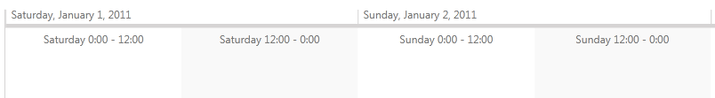
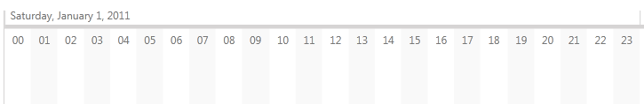
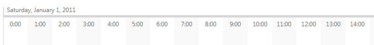

# Formatter Provider

This help topic will give an overview on the Formatter Provider feature of RadTimeline.      

## Using Formatter Providers

RadTimeline provides means for customizing the interval formats through the __FormatterProvider__ property of the IntervalBase class. Using it, you can specify different formats for each interval.

The example below shows how formatter providers can be utilized (once they are implemented):

<snippet id='radtimeline-features-formatter-provider-block_1-xaml' />

## The IIntervalFormatterProvider interface

A formatter provider is a class that implements the __IIntervalFormatterProvider__ interface. This interface has two methods that need to be implemented - __GetFormatters__ and __GetIntervalSpanFormatters__. They both have to return a Func<DateTime, string>[] - an array of functions each of which given a DateTime value returns it as formatted string. E.g. { date => date.ToString("H:mm") }.

* __GetFormatters__ - used in the default scenario when Interval.CurrentIntervalSpan = 1, i.e. there is a period control for every interval item.            

* __GetIntervalSpanFormatters__ - used when one period control corresponds to a couple of interval items. E.g. an HourInterval with CurrentIntervalSpan = 12 interval span will create two hour intervals per each day - (0:00 - 12:00) and (12:00 - 0:00). An appropriate format would be String.Format("{0} - {1}", currentIntevalString, nextIntervalString).
            
Here is a sample hour formatter provider implementation:

<snippet id='radtimeline-features-formatter-provider-block_2-cs' />
<snippet id='radtimeline-features-formatter-provider-block_3-vb' />

Below you can find screenshots showing when each format is used.

GetIntervalSpanFormatters is used (CurrentIntervalSpan is 12)

GetFormatters is used (CurrentIntervalSpan = 1), the current format is "HH"

GetFormatters is used, the current format is "H:mm"

## See Also

* [Intervals Formatters]() 