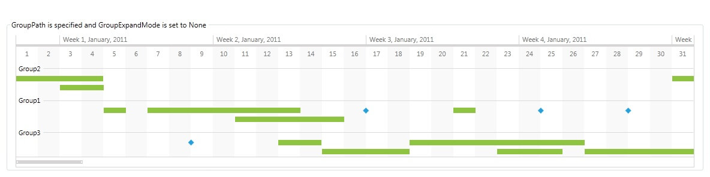
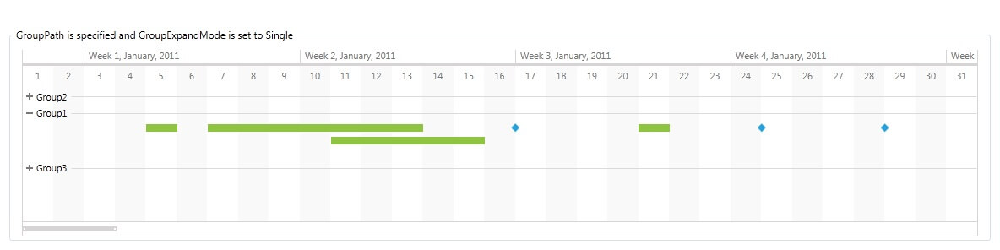
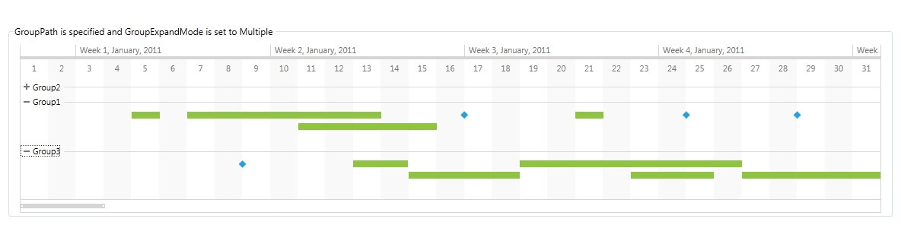

# Grouping

The timeline items in a RadTimeline control can be displayed in groups. Additionally, groups of timeline items can be made expandable/collapsible.

## Setting up the RadTimeline
 
In order to demonstrate the Grouping feature of the control, we will define a model and a viewmodel as demonstrated in __Example 1__.

__Example 1: Defining the model and viewmodel__
```C#
	public class RadTimelineDataItem
	{
		public DateTime StartDate { get; set; }

		public TimeSpan Duration { get; set; }

		public string GroupName { get; set; }
	}

	public class RadTimelineGroupingViewModel
    {
        public RadTimelineGroupingViewModel()
        {
            this.PeriodStart = DateTime.Today;
            this.PeriodEnd = DateTime.Today.AddYears(1);
            this.VisiblePeriodStart = DateTime.Today;
            this.VisiblePeriodEnd = DateTime.Today.AddMonths(1);

            this.GenerateTimelineData();
        }

        public DateTime PeriodStart { get; set; }

        public DateTime PeriodEnd { get; set; }

        public DateTime VisiblePeriodStart { get; set; }

        public DateTime VisiblePeriodEnd { get; set; }

        public ObservableCollection<RadTimelineDataItem> TimelineItems { get; set; }

        private void GenerateTimelineData()
        {
            Random random = new Random();
            ObservableCollection<RadTimelineDataItem> items = new ObservableCollection<RadTimelineDataItem>();

            for (DateTime date = this.PeriodStart; date < this.PeriodEnd; date = date.AddDays(2))
            {
                items.Add(new RadTimelineDataItem() { StartDate = date, Duration = TimeSpan.FromDays(random.Next(0, 10)), GroupName = string.Format("Group{0}", random.Next(1, 4)) });
            }

            this.TimelineItems = items;
        }
    }
```
```VB.NET
	Public Class RadTimelineDataItem
		Public Property StartDate() As Date

		Public Property Duration() As TimeSpan

		Public Property GroupName() As String
	End Class

	Public Class RadTimelineGroupingViewModel
		Public Sub New()
			Me.PeriodStart = Date.Today
			Me.PeriodEnd = Date.Today.AddYears(1)
			Me.VisiblePeriodStart = Date.Today
			Me.VisiblePeriodEnd = Date.Today.AddMonths(1)

			Me.GenerateTimelineData()
		End Sub

		Public Property PeriodStart() As Date

		Public Property PeriodEnd() As Date

		Public Property VisiblePeriodStart() As Date

		Public Property VisiblePeriodEnd() As Date

		Public Property TimelineItems() As ObservableCollection(Of RadTimelineDataItem)

		Private Sub GenerateTimelineData()
			Dim random As New Random()
			Dim items As New ObservableCollection(Of RadTimelineDataItem)()

			Dim [date] As Date = Me.PeriodStart
			Do While [date] < Me.PeriodEnd
				items.Add(New RadTimelineDataItem() With {
					.StartDate = [date],
					.Duration = TimeSpan.FromDays(random.Next(0, 10)),
					.GroupName = String.Format("Group{0}", random.Next(1, 4))
				})
				[date] = [date].AddDays(2)
			Loop

			Me.TimelineItems = items
		End Sub
	End Class
```

## Group Expand Modes

In order to enable grouping, you have to set the __GroupPath__ property of the RadTimeline to a property of the model. In the following examples, we will be setting the __GroupPath__ property to the __GroupName__ property of the __RadTimelineDataItem__ class defined in __Example 1__. After that all __RadTimelineDataItem__ objects with the same __GroupName__ will be placed in the same group.

Through the __GroupExpandMode__ property of the RadTimeline, you can control whether the groups in the RadTimeline can be expanded/collapsed. It can be set to the following values:

* __None (Default)__: A value of __None__ indicates that the groups of timeline items are expanded by default and cannot be collapsed.       

	__Example 2: Setting the GroupExpandMode property to None__
	```XAML
		<!-- GroupPath is specified and GroupExpandMode is set to None -->
		<Grid>
			<Grid.DataContext>
				<local:RadTimelineGroupingViewModel />
			</Grid.DataContext>
			<telerik:RadTimeline PeriodStart="{Binding PeriodStart}"
								PeriodEnd="{Binding PeriodEnd}"
								VisiblePeriodStart="{Binding VisiblePeriodStart}"
								VisiblePeriodEnd="{Binding VisiblePeriodEnd}"
								StartPath="StartDate"
								DurationPath="Duration"
								GroupPath="GroupName"
								GroupExpandMode="None"
								ItemsSource="{Binding TimelineItems}">
				<telerik:RadTimeline.Intervals>
					<telerik:YearInterval />
					<telerik:MonthInterval />
					<telerik:WeekInterval />
					<telerik:DayInterval />
				</telerik:RadTimeline.Intervals>
			</telerik:RadTimeline>
		</Grid>
	```

	#### __Figure 1: Result from Example 2__
	

* __Single__: A value of __Single__ indicates that only one group of timeline items can be expanded at a time. By default, all groups of timeline items are collapsed in this mode.              

	__Example 3: Setting the GroupExpandMode to Single__
	```XAML
		<!-- GroupPath is specified and GroupExpandMode is set to Single -->
		<Grid>
			<Grid.DataContext>
				<local:RadTimelineGroupingViewModel />
			</Grid.DataContext>
			<telerik:RadTimeline PeriodStart="{Binding PeriodStart}"
								PeriodEnd="{Binding PeriodEnd}"
								VisiblePeriodStart="{Binding VisiblePeriodStart}"
								VisiblePeriodEnd="{Binding VisiblePeriodEnd}"
								StartPath="StartDate"
								DurationPath="Duration"
								GroupPath="GroupName"
								GroupExpandMode="Single"
								ItemsSource="{Binding TimelineItems}">
				<telerik:RadTimeline.Intervals>
					<telerik:YearInterval />
					<telerik:MonthInterval />
					<telerik:WeekInterval />
					<telerik:DayInterval />
				</telerik:RadTimeline.Intervals>
			</telerik:RadTimeline>
		</Grid>
	```

	#### __Figure 2: Result from Example 3__
	

* __Multiple__: A value of __Multiple__ indicates that multiple groups of timeline items can be expanded at a time. By default, all groups of timeline items are collapsed in this mode.      

	__Example 4: Setting the GroupExpandMode to Multiple__
	```XAML
		<!-- GroupPath is specified and GroupExpandMode is set to Multiple -->
		<Grid>
			<Grid.DataContext>
				<local:RadTimelineGroupingViewModel />
			</Grid.DataContext>
			<telerik:RadTimeline PeriodStart="{Binding PeriodStart}"
								PeriodEnd="{Binding PeriodEnd}"
								VisiblePeriodStart="{Binding VisiblePeriodStart}"
								VisiblePeriodEnd="{Binding VisiblePeriodEnd}"
								StartPath="StartDate"
								DurationPath="Duration"
								GroupPath="GroupName"
								GroupExpandMode="Multiple"
								ItemsSource="{Binding TimelineItems}">
				<telerik:RadTimeline.Intervals>
					<telerik:YearInterval />
					<telerik:MonthInterval />
					<telerik:WeekInterval />
					<telerik:DayInterval />
				</telerik:RadTimeline.Intervals>
			</telerik:RadTimeline>
		</Grid>
	```

	#### __Figure 2: Result from Example 4__
	

## Changing the default collapsed state of expandable groups

>The styles used in this section are __implicit__. In order to apply them you have to use [NoXAML](#noxaml-assemblies) DLL-s. For more information check the [Implicit Styles](#setting-a-theme-using-implicit-styles) topic.

By default, the groups of timeline items are collapsed when the __GroupExpandMode__ is set to either Single or Multiple. You can use the following style to change this default state:        

__Example 5: Setting the IsExpanded property of the TimelineItemGroupControl through a style__
```XAML
	<!-- If you don't use NoXAML dlls you don't need the BasedOn setting. See the note in the begining of this help section. -->
    <Window.Resources>
	<Style TargetType="telerik:TimelineItemGroupControl" BasedOn="{StaticResource TimelineItemGroupControlStyle}">
	    <Setter Property="IsExpanded" Value="True" />
	</Style>
    </Window.Resources>
```

In order to change the default state of specific groups of timeline items, you can use a converter:        

__Example 6: Setting the IsExpanded property of the TimelineItemGroupControl with a converter__
```XAML
	<!-- If you don't use NoXAML dlls you don't need the BasedOn setting. See the note in the begining of this help section. -->
    <Window.Resources>
	<Style TargetType="telerik:TimelineItemGroupControl" BasedOn="{StaticResource TimelineItemGroupControlStyle}">
	    <Setter Property="IsExpanded" Value="{Binding GroupKey, Converter={StaticResource groupKeyToIsExpandedConverter}}" />
	</Style>
    </Window.Resources>
```

__Example 7: Defining the GroupKeyToIsExpandedConverter__
```C#
	public class GroupKeyToIsExpandedConverter : IValueConverter
	{
	    public object Convert(object value, Type targetType, object parameter, CultureInfo culture)
	    {
	        string groupKey = value as string;
	
	        if (groupKey != null && groupKey == "Group1")
	            return true;
	
	        return false;
	    }
	
	    public object ConvertBack(object value, Type targetType, object parameter, CultureInfo culture)
	    {
	        throw new NotImplementedException();
	    }
	}
```
```VB.NET
	Public Class GroupKeyToIsExpandedConverter
		Implements IValueConverter
		Public Function Convert(value As Object, targetType As Type, parameter As Object, culture As CultureInfo) As Object
			Dim groupKey As String = TryCast(value, String)
	
			If groupKey IsNot Nothing AndAlso groupKey = "Group1" Then
				Return True
			End If
	
			Return False
		End Function
	
		Public Function ConvertBack(value As Object, targetType As Type, parameter As Object, culture As CultureInfo) As Object
			Throw New NotImplementedException()
		End Function
	End Class
```
