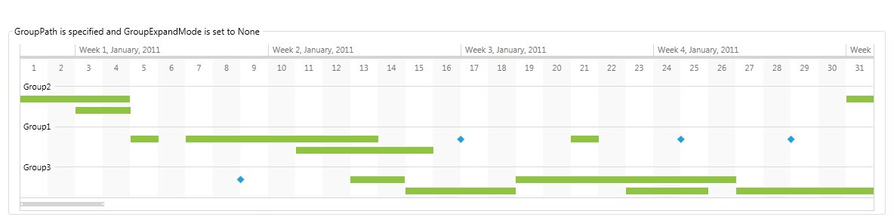
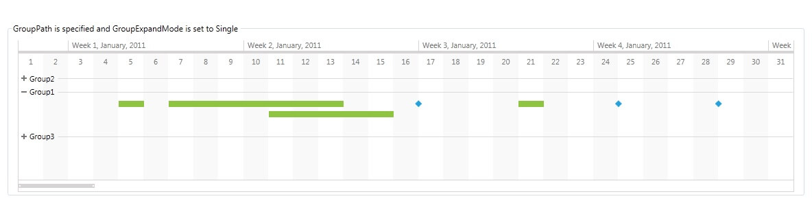
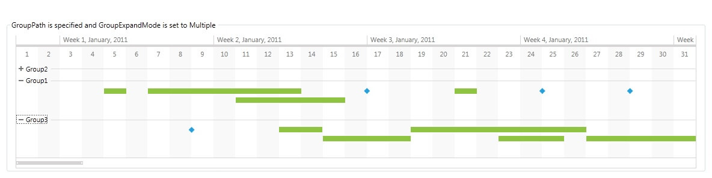

# Grouping

The timeline items in a RadTimeline control can be displayed in groups. Additionally, groups of timeline items can be made expandable/collapsible.

## Setting up the RadTimeline
 
In order to demonstrate the Grouping feature of the control, we will define a model and a viewmodel as demonstrated in __Example 1__.

__Example 1: Defining the model and viewmodel__
<snippet id='radtimeline-features-grouping-block_1-cs' />
<snippet id='radtimeline-features-grouping-block_2-vb' />

## Group Expand Modes

In order to enable grouping, you have to set the __GroupPath__ property of the RadTimeline to a property of the model. In the following examples, we will be setting the __GroupPath__ property to the __GroupName__ property of the __RadTimelineDataItem__ class defined in __Example 1__. After that all __RadTimelineDataItem__ objects with the same __GroupName__ will be placed in the same group.

Through the __GroupExpandMode__ property of the RadTimeline, you can control whether the groups in the RadTimeline can be expanded/collapsed. It can be set to the following values:

* __None (Default)__: A value of __None__ indicates that the groups of timeline items are expanded by default and cannot be collapsed.       

	__Example 2: Setting the GroupExpandMode property to None__
	<snippet id='radtimeline-features-grouping-block_3-xaml' />

	#### __Figure 1: Result from Example 2__
	

* __Single__: A value of __Single__ indicates that only one group of timeline items can be expanded at a time. By default, all groups of timeline items are collapsed in this mode.              

	__Example 3: Setting the GroupExpandMode to Single__
	<snippet id='radtimeline-features-grouping-block_4-xaml' />

	#### __Figure 2: Result from Example 3__
	

* __Multiple__: A value of __Multiple__ indicates that multiple groups of timeline items can be expanded at a time. By default, all groups of timeline items are collapsed in this mode.      

	__Example 4: Setting the GroupExpandMode to Multiple__
	<snippet id='radtimeline-features-grouping-block_5-xaml' />

	#### __Figure 2: Result from Example 4__
	

## Changing the default collapsed state of expandable groups

>The styles used in this section are __implicit__. In order to apply them you have to use [NoXAML](#noxaml-assemblies) DLL-s. For more information check the [Implicit Styles](#setting-a-theme-using-implicit-styles) topic.

By default, the groups of timeline items are collapsed when the __GroupExpandMode__ is set to either Single or Multiple. You can use the following style to change this default state:        

__Example 5: Setting the IsExpanded property of the TimelineItemGroupControl through a style__
<snippet id='radtimeline-features-grouping-block_6-xaml' />

In order to change the default state of specific groups of timeline items, you can use a converter:        

__Example 6: Setting the IsExpanded property of the TimelineItemGroupControl with a converter__
<snippet id='radtimeline-features-grouping-block_7-xaml' />

__Example 7: Defining the GroupKeyToIsExpandedConverter__
<snippet id='radtimeline-features-grouping-block_8-cs' />
<snippet id='radtimeline-features-grouping-block_9-vb' />