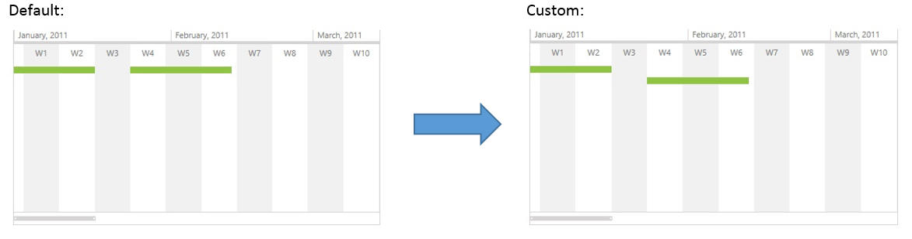
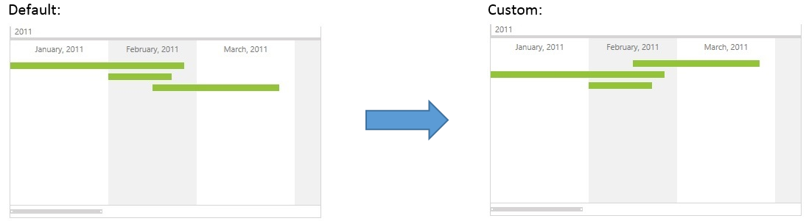

# Vertical Position of the RadTimeline Items

By default, __RadTimeline__ positions its items first by their __StartDate__ and then by their __Duration__, placing them in rows starting close to the control‘s timeline and moving away from it with every row. If an item, for example, starts earlier in time, it will be positioned closer to the control’s timeline. For items that start on the same date, items with smaller duration will be positioned closer to the control’s timeline. The control places an item on the next row, in case the span of this item overlaps with the span of an already positioned item.

While for most cases, this positioning logic is adequate, there are scenarios when you would like to apply your own custom logic for the vertical positioning of the timeline items. There are three approaches that you can use to change the default vertical positioning.

* The first approach is to specify a larger minimum gap between items. This value is taken into account when calculating whether the span of an item overlaps the span of an already positioned item.

* The second approach is to simply turn off the ordering by __StartDate__ and __Duration__.

* The third approach includes specifying your own custom vertical positioning logic.

## Using the MinimumItemGap property

The first item in the __ItemsSource__ of the __RadTimeline__ control – that is, the one that starts earliest in time and has the smallest duration out of the items that start at this time, is placed in the first row. In case the span of the second item overlaps the span of the first item then the second item is placed in the second row. By default, two timeline items overlap in case the difference between the end date of the first and the start date of the second is less than __TimeSpan.FromTicks(1)__.        

You can change this default value of __TimeSpan.FromTicks(1)__ in order to influence the vertical ordering of timeline items using the __MinimumItemGap__ property. Have a look at the different result that the control produces with the default value of the __MinimumItemGap__ property (TimeSpan.FromTicks(1)) and a custom value of __TimeSpan.FromDays(8)__ with the following __ItemsSource__:        

1. Item 0: StartDate = new DateTime(2011, 1, 1), Duration = TimeSpan.FromDays(16)

2. Item 1: StartDate = new DateTime(2011, 1, 24), Duration = TimeSpan.FromDays(20)

#### __XAML__

```XAML
	 <telerik:RadTimeline PeriodStart="2011-01-01"
	                        PeriodEnd="2012-01-01"
	                        StartPath="Date"
	                        DurationPath="Time"
	                        ItemsSource="{Binding Items}"
	                        MinimumItemGap="7:00:00:00">
	    <telerik:RadTimeline.Intervals>
	        <telerik:DayInterval />
	        <telerik:WeekInterval />
	        <telerik:MonthInterval />
	        <telerik:YearInterval />
	    </telerik:RadTimeline.Intervals>
	</telerik:RadTimeline>
	
```



## Using the AutoSort proprety

You can switch on/off the default ordering by __StartDate__ and __Duration__ by using the Boolean __AutoSort__ property of __RadTimeline__. Its default value is “True”. By setting this property to “False”, you influence the vertical positioning in the following manner:

The first item in the __ItemsSource__ of the __RadTimeline__ control is placed in the first row. In case the span of the second item overlaps the span of the first item then the second item is placed in the second row.

The code sample below demonstrates how you can set the __AutoSort__ property of a __RadTimeline__ control:

#### __XAML__

```XAML
	  <telerik:RadTimeline PeriodStart="2011-01-01"
	                        PeriodEnd="2012-01-01"
	                        AutoSort="False"
	                        StartPath="Date"
	                        DurationPath="Time"
	                        ItemsSource="{Binding Items}">
	    <telerik:RadTimeline.Intervals>
	        <telerik:DayInterval />
	        <telerik:WeekInterval />
	        <telerik:MonthInterval />
	        <telerik:YearInterval />
	    </telerik:RadTimeline.Intervals>
	</telerik:RadTimeline>
```

You can check the difference in the result with __AutoSort__ set to True/False with the following __ItemsSource__:

1. Item 0: StartDate = new DateTime(2011, 2, 15), Duration = TimeSpan.FromDays(40)

2. Item 1: StartDate = new DateTime(2011, 1, 1), Duration = TimeSpan.FromDays(55)

3. Item 2: StartDate = new DateTime(2011, 2, 1), Duration = TimeSpan.FromDays(20)



## Using Item RowIndex Generators

Using the __ItemRowIndexGenerator__ property of the __RadTimeline__ control you can specify a custom __IItemRowIndexGenerator__ instance that determines the __RowIndex__ of every timeline item.

The example below shows how you can specify a custom item __RowIndex__ generator for a __RadTimeline__ control:

#### __XAML__

```XAML
	 <telerik:RadTimeline PeriodStart="2011-01-01"
	                     PeriodEnd="2012-01-01"
	                     StartPath="Date"
	                     DurationPath="Time"
	                     ItemsSource="{Binding Items}">
	    <telerik:RadTimeline.ItemRowIndexGenerator>
	        <example:NewLineRowIndexGenerator />
	    </telerik:RadTimeline.ItemRowIndexGenerator>
	    <telerik:RadTimeline.Intervals>
	        <telerik:DayInterval />
	        <telerik:WeekInterval />
	        <telerik:MonthInterval />
	        <telerik:YearInterval />
	    </telerik:RadTimeline.Intervals>
	</telerik:RadTimeline>
```

### The IItemRowIndexGenerator interface

An item __RowIndex__ generator is a class that implements the __IItemRowIndexGenerator__ interface. This interface has one method that needs to be implemented - __GenerateRowIndexes__. This method accepts a list of __TimelineRowItem__ instances as argument. Every __TimelineRowItem__ is basically a wrapper for the item and its __RowIndex__ as calculated by the RadTimeline control itself. You can change the automatically calculated __RowIndex__ of an item, by specifying a custom __TimelineRowItem.RowIndex__ value for the appropriate __TimelineRowItem__ instance. You can use the __TimelineRowItem.DataItem__ property to identify the items that you want to position manually.

Below you can find an implementation of a sample generator that positions every item in a new row:

#### __C#__

```C#
		using System.Collections.Generic;
		using Telerik.Windows.Controls.Timeline;
	
		public class TimelineData
		{
			public DateTime Date { get; set; }
			public TimeSpan Time { get; set; }
			public int RowIndex { get; set; }
		}
	
		public class NewLineRowIndexGenerator : IItemRowIndexGenerator
		{
			public void GenerateRowIndexes(List<TimelineRowItem> dataItems)
			{
				foreach (TimelineRowItem item in dataItems)
				{
					item.RowIndex = (item.DataItem as TimelineData).RowIndex;
				}
			}
		}
```

#### __VB.NET__

```VB.NET
		Public Class TimelineData
			Public Property [Date]() As DateTime
				Get
					Return m_Date
				End Get
				Set
					m_Date = Value
				End Set
			End Property
			Private m_Date As DateTime
			Public Property Time() As TimeSpan
				Get
					Return m_Time
				End Get
				Set
					m_Time = Value
				End Set
			End Property
			Private m_Time As TimeSpan
			Public Property RowIndex() As Integer
				Get
					Return m_RowIndex
				End Get
				Set
					m_RowIndex = Value
				End Set
			End Property
			Private m_RowIndex As Integer
		End Class
	
		Public Class NewLineRowIndexGenerator
			Implements IItemRowIndexGenerator
			Public Sub GenerateRowIndexes(dataItems As List(Of TimelineRowItem))
				For Each item As TimelineRowItem In dataItems
					item.RowIndex = TryCast(item.DataItem, TimelineData).RowIndex
				Next
			End Sub
		End Class
```

Using the item RowIndex generator above, you will get the following result:

