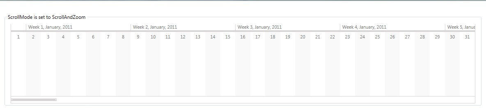
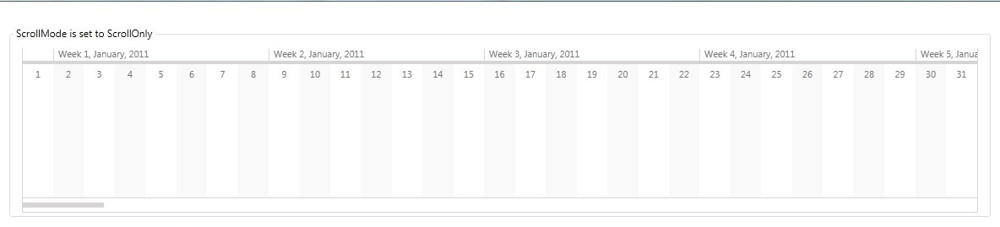
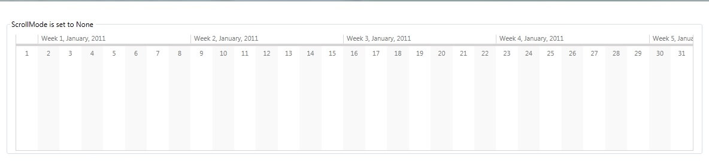

# ScrollMode

The ScrollMode property of RadTimeline configures the horizontal scrolling and zooming behavior of control.
      

## Scroll Modes

__ScrollAndZoom (Default)__

A value of ScrollAndZoom indicates that both scrolling and zooming are enabled for
          the RadTimeline instance. The slider of the RadTimeline control and the resize handles
          of the slider selection are visible. The user can adjust the zoom level of the control either
          with the mouse wheel, or by dragging the resize handles of the slider selection.
          The horizontal scroll offset can be changed by dragging the selection of the slider.
        

Additional features that change the scroll offset and zoom level:
        

* Double-click on the slider selection – changes the current zoom level to 1.
              That is, the visible period expands to show the whole period.
            

* Double-click on the slider right resize handle – changes the VisiblePeriodEnd to PeriodEnd.
            

* Double-click on the slider left resize handle – changes the VisiblePeriodStart to PeriodStart.
            

__ScrollOnly__

The ScrollIOnly value indicates that only scrolling is enabled for the RadTimeline instance.
          The Slider of the RadTimeline control is visible, but the resize handles of the slider selection are collapsed.
          The horizontal scroll offset can be changed either with the mouse wheel or by dragging the selection of the slider.
        

__None__

In order to disable both scrolling and zooming of a RadTimeline instance, specify a None value for the ScrollMode property.
          In this case, the slider of the RadTimeline control is collapsed and the mouse wheel event is not handled.
        

# See Also
