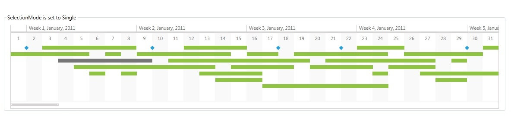
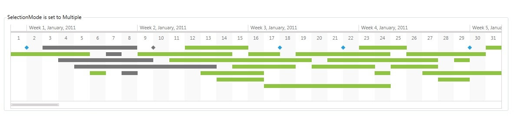
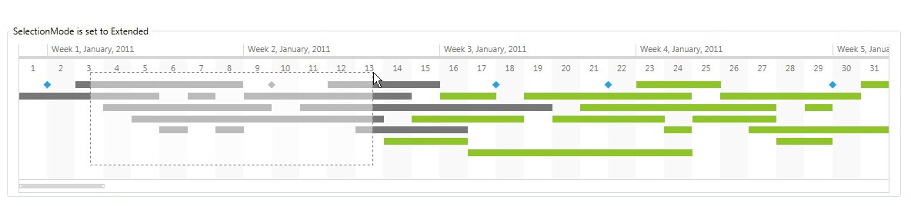

# Selection

This help topic will demonstrate how you can make the timeline more interactive by enabling and configuring the selection feature.      

## Properties Controlling the Selection Behavior

The RadTimeline control supports Single, Multiple and Extended selection modes. By default, the selection functionality of the control is disabled.

__IsSelectionEnabled__ - a Boolean value that indicates whether the selection functionality is enabled for the RadTimeline control. The default value is false.

__SelectionMode__ - a SelectionMode value that indicates the selection mode for the RadTimeline control. The default value is Single.        

__SelectedItem__ - an object that represents the current selection in the RadTimeline control.
        
If the SelectionMode property of the RadTimeline control is set to Single, this property returns the selected item.  In multiple selection modes (Multiple and Extended), the property can return any selected item. In order to get a list of all selected items in multiple selection modes, use the SelectedItems property.

__SelectedItems__ an IList<System.Object> containing the currently selected items in the RadTimeline control. In multiple selection modes, this property returns all selected items in the RadTimeline control. In single selection mode, it returns a list, containing the SelectedItem.        

__SelectionChanged event__ - occurs when the SelectedItem in single selection mode or SelectedItems in multiple selection modes change.        

The following example demonstrates how you can use the SelectionChanged event:

```XAML
	<telerik:RadTimeline SelectionMode="Single"
	                     IsSelectionEnabled="True"
	                     SelectionChanged="RadTimeline_SelectionChanged"/>	
```

```C#
	private void RadTimeline_SelectionChanged(object sender, SelectionChangeEventArgs e)
	{
	    var selectedItem = (sender as RadTimeline).SelectedItem;
	
	    if (selectedItem != null)
	    {
	        //Do something with the selected item.
	    }
	}
```
```VB.NET
	Private Sub RadTimeline_SelectionChanged(sender As Object, e As SelectionChangeEventArgs)
		Dim selectedItem = TryCast(sender, RadTimeline).SelectedItem			
		If selectedItem IsNot Nothing Then
		'Do something with the selected item.
		End If
	End Sub
```

## Selection Modes

__Single SelectionMode (Default)__

In Single selection mode, the user can select only one timeline item at a time. Selecting another item first unselects the currently selected one and then selects the new timeline item. Clicking the empty space between timeline items clears the selection.        

The following example demonstrates how to enable the __Single__ selection mode for a timeline control:

```XAML
	<telerik:RadTimeline SelectionMode="Single"
	                     IsSelectionEnabled="True"
	                     PeriodStart="2011-01-01"
	                     PeriodEnd="2012-01-01"
	                     VisiblePeriodStart="2011-01-01"
	                     VisiblePeriodEnd="2011-02-01"
	                     StartPath="StartDate"
	                     DurationPath="Duration"
	                     ItemsSource="{Binding TimelineItems}">
	    <telerik:RadTimeline.Intervals>
	        <telerik:YearInterval />
	        <telerik:MonthInterval />
	        <telerik:WeekInterval />
	        <telerik:DayInterval />
	    </telerik:RadTimeline.Intervals>
	</telerik:RadTimeline>
```



__Multiple SelectionMode__

The Multiple selection mode value indicates that the user can select multiple timeline items by selecting them one after the other. Clicking a timeline item in this mode toggles the selected state of the item.

The following example demonstrates how to enable the __Multiple__ selection mode for a timeline control:

```XAML
	<telerik:RadTimeline SelectionMode="Multiple"
	                     IsSelectionEnabled="True"
	                     PeriodStart="2011-01-01"
	                     PeriodEnd="2012-01-01"
	                     VisiblePeriodStart="2011-01-01"
	                     VisiblePeriodEnd="2011-02-01"
	                     StartPath="StartDate"
	                     DurationPath="Duration"
	                     ItemsSource="{Binding TimelineItems}">
	    <telerik:RadTimeline.Intervals>
	        <telerik:YearInterval />
	        <telerik:MonthInterval />
	        <telerik:WeekInterval />
	        <telerik:DayInterval />
	    </telerik:RadTimeline.Intervals>
	</telerik:RadTimeline>
```



__Extended SelectionMode__

In the Extended selection mode case, the user can select timeline items in the following manner:

* When the CTRL key is not pressed
	* One timeline item is selected at a time and previous selection is cleared.
	* Clicking on the empty space between timeline items clears the selection.
	* Range selection by click-and-drag clears previous selection.
* When the CTRL key is pressed, the user can extend the current selection
	* Clicking a timeline item toggles its selected state.
	* Clicking the empty space between timeline items preserves current selection.
	* Range selection by click-and-drag extends current selection with the newly selected timeline items.

The following example demonstrates how to enable the __Extended__ selection mode for a timeline control:

```XAML
	<telerik:RadTimeline SelectionMode="Extended"
	                     IsSelectionEnabled="True"
	                     PeriodStart="2011-01-01"
	                     PeriodEnd="2012-01-01"
	                     VisiblePeriodStart="2011-01-01"
	                     VisiblePeriodEnd="2011-02-01"
	                     StartPath="StartDate"
	                     DurationPath="Duration"
	                     ItemsSource="{Binding TimelineItems}">
	    <telerik:RadTimeline.Intervals>
	        <telerik:YearInterval />
	        <telerik:MonthInterval />
	        <telerik:WeekInterval />
	        <telerik:DayInterval />
	    </telerik:RadTimeline.Intervals>
	</telerik:RadTimeline>
```

