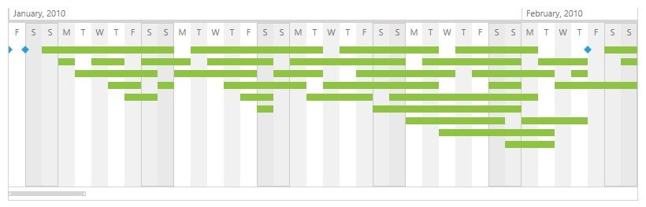

# Special Slots

__RadTimeline__ provides an easy way to mark certain intervals along the visible range of the control as special slots. This is done through a custom __RangeGenerator__ class which implements __ITimeRangeGenerator__ interface. This interface defines the __GetRanges()__ method. Given the current visible period, this method returns __IEnumerable<IPeriodSpan>__ - an array of __PeriodSpan__ instances each of which defines a special slot with a start and end date. E.g. new PeriodSpan(System.DateTime date, System.TimeSpan slotSpan)

Below you can find a sample weekends generator implementation:
	
#### __C#__
```C#
	using Telerik.Windows.Controls;
	using Telerik.Windows.Controls.TimeBar;

	public class WeekendsGenerator : ITimeRangeGenerator
	{
	  public System.Collections.Generic.IEnumerable<IPeriodSpan> GetRanges(SelectionRange<DateTime> visibleRange)
	  {
		  TimeSpan slotSpan = TimeSpan.FromDays(2);
		  var differenceFirstVisible = DayOfWeek.Saturday - visibleRange.Start.DayOfWeek;
		  DateTime day = new DateTime(visibleRange.Start.Year, visibleRange.Start.Month, visibleRange.Start.Day);

		  for (DateTime current = day.AddDays(differenceFirstVisible); current < visibleRange.End; current += TimeSpan.FromDays(7))
		  {
			  yield return new PeriodSpan(current, slotSpan);
		  }
	  }
	}
```

#### __VB.NET__
```VB.NET
	Imports Telerik.Windows.Controls
	Imports Telerik.Windows.Controls.TimeBar

	Public Class WeekendsGenerator
	  Implements ITimeRangeGenerator
	  Public Function GetRanges(visibleRange As SelectionRange(Of DateTime)) As System.Collections.Generic.IEnumerable(Of IPeriodSpan)
		  Dim slotSpan As TimeSpan = TimeSpan.FromDays(2)
		  Dim differenceFirstVisible = DayOfWeek.Saturday - visibleRange.Start.DayOfWeek
		  Dim day As New DateTime(visibleRange.Start.Year, visibleRange.Start.Month, visibleRange.Start.Day)

		  Dim current As DateTime = day.AddDays(differenceFirstVisible)
		  While current < visibleRange.[End]
			  yield Return New PeriodSpan(current, slotSpan)
			  current += TimeSpan.FromDays(7)
		  End While
	  End Function
	End Class
```

Using the __SpecialSlotsGenerator__ property of the __RadTimeline__ control you can specify a custom __ITimeRangeGenerator__ instance that defines certain time intervals as special. The example below shows how you can specify a time range generator for a __RadTimeline__ control:
	
#### __XAML__
```XAML
	<telerik:RadTimeline PeriodStart="1-Jan-2010" PeriodEnd="1-Jan-2011">
		<telerik:RadTimeline.SpecialSlotsGenerator>
		  <example:WeekendsGenerator />
		</telerik:RadTimeline.SpecialSlotsGenerator>
		<telerik:RadTimeline.Intervals>
		  <telerik:MonthInterval />
		  <telerik:DayInterval />
		</telerik:RadTimeline.Intervals>
	</telerik:RadTimeline>
```

Using the sample weekends generator above, you will get the following result:


## See Also
 * [Intervals Formatters]()
 * [Formatter Provider]()
 * [Annotations]()
