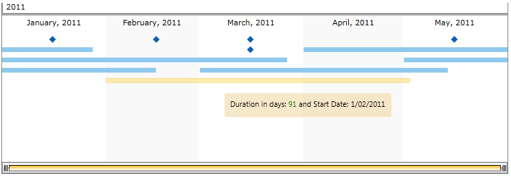

# Tooltips

__RadTimeline__ supports tooltips for its items. You can specify a tooltip template and display the details of the item itself. The purpose of this topic is to show you how this can be achieved.

The tooltip is triggered by setting the __ToolTipTemplate__ property and is used to visualize arbitrary information per data point. The user has full control over the visualization of the tooltip itself and over the information that the tooltip will display.

For the purpose we'll need a timeline, which is bound to a collection of custom objects. The objects in the data source will be used directly as values for the Timeline items as well as content for our tooltips. You can learn how to bind the Timeline from our [DataBinding]() topic as well as the [MVVM support]() topic.        

We create a sample class with two properties - Duration of TimeSpan type and Date of DateTime type. Then set values for the properties and create a method that returns a collection of business objects. This way the Timeline will be able to display information about the currently hovered data point via the ToolTipTemplate.


```C#
	public class Product
	    {
		public TimeSpan Duration { get; set; }
		public DateTime Date { get; set; }
	
		public static ObservableCollection<Product> GetData(int count)
		{
			var startDate = new DateTime(2010, 1, 1);
			var endDate = new DateTime(2012, 2, 1);
			Random r = new Random();
			ObservableCollection<Product> result = new ObservableCollection<Product>();
	
			for (DateTime i = startDate; i < endDate; i = i.AddMonths(1))
			{
				result.Add(new Product() { Date = i, Duration = TimeSpan.FromDays(r.Next(50, 100)) });
			}
	
			for (int i = 0; i < 15; i++)
			{
				result.Add(new Product()
				{
					Date = startDate.AddMonths(r.Next(0, 25)).AddDays(15)
				});
			}
	
			return result;
		}
	}
```
```VB.NET
	Public Class Product
		Public Property Duration() As TimeSpan
		Public Property [Date]() As Date
	
		Public Shared Function GetData(ByVal count As Integer) As ObservableCollection(Of Product)
			Dim startDate = New Date(2010, 1, 1)
			Dim endDate = New Date(2012, 2, 1)
			Dim r As New Random()
			Dim result As New ObservableCollection(Of Product)()
	
			Dim i As Date = startDate
			Do While i < endDate
				result.Add(New Product() With {.Date = i, .Duration = TimeSpan.FromDays(r.Next(50, 100))})
				i = i.AddMonths(1)
			Loop
	
			For i As Integer = 0 To 14
				result.Add(New Product() With {.Date = startDate.AddMonths(r.Next(0, 25)).AddDays(15)})
			Next i
	
			Return result
		End Function
	End Class
```

Our *ViewModel* class consists of a single property - the collection of business objects that will be used as itemssource for the Timeline. In the constructor of the class call the GetData method we previously created in our Product class with as many items as you want to generate for your Timeline.


```C#
	public class ExampleViewModel : ViewModelBase
	{
		private ObservableCollection<Product> _data;
		public ObservableCollection<Product> Data
		{
			get
			{
				return this._data;
			}
			set
			{
				if (this._data != value)
				{
					this._data = value;
					this.OnPropertyChanged("Data");
				}
			}
		}
	
		public ExampleViewModel()
		{
			this.Data = Product.GetData(15);
		}
	}
```
```VB.NET
	   Public Class ExampleViewModel
		   Inherits ViewModelBase
			Private _data As ObservableCollection(Of Product)
			Public Property Data() As ObservableCollection(Of Product)
				Get
					Return Me._data
				End Get
				Set(ByVal value As ObservableCollection(Of Product))
					If Me._data IsNot value Then
						Me._data = value
						Me.OnPropertyChanged("Data")
					End If
				End Set
			End Property
	
			Public Sub New()
				Me.Data = Product.GetData(15)
			End Sub
	   End Class
```

Now we need to define our tooltip behavior and set its tooltip template. It will display the value of the hovered Timeline item.


```XAML
	 <UserControl.DataContext>
	        <local:ExampleViewModel/>
	    </UserControl.DataContext>
	    
	    <UserControl.Resources>
	        <local:DurationToBrushConverter x:Key="DurationToBrushConverter"/>
	
	        <DataTemplate x:Key="ToolTipTemplate">
	            <Grid>
	                <Rectangle Margin="0" RadiusY="2" RadiusX="2" Fill="Wheat" Opacity="0.7"/>
	                <StackPanel Orientation="Horizontal" Margin="8,8,8,12">
	                    <TextBlock FontFamily="Segoe UI" Text="Duration in days: "/>
	                    <TextBlock FontFamily="Segoe UI" Text="{Binding Duration, StringFormat=\{0:%d\}}"
	                               Foreground="{Binding Duration, Converter={StaticResource DurationToBrushConverter}}"/>
	                    <TextBlock FontFamily="Segoe UI" Text=" and Start Date: "/>
	                    <TextBlock FontFamily="Segoe UI" Text="{Binding Date, StringFormat='d/MM/yyyy'}"/>
	                </StackPanel>
	            </Grid>
	        </DataTemplate>
	    </UserControl.Resources>  
	
	    <Grid x:Name="LayoutRoot" Background="White" Height="300" Width="750">
	        <telerik:RadTimeline Height="250" x:Name="RadTimeline1"
	                    VerticalAlignment="Top"
	                    Margin="6"
	                    PeriodStart="2011/01/01" PeriodEnd="2011/06/01"
	                    StartPath="Date"
	                    DurationPath="Duration"
	                    ToolTipTemplate="{StaticResource ToolTipTemplate}"  
	                    ItemsSource="{Binding Data}">
	            <telerik:RadTimeline.Intervals>
	                <telerik:YearInterval />
	                <telerik:MonthInterval />
	                <telerik:WeekInterval />
	                <telerik:DayInterval />
	            </telerik:RadTimeline.Intervals>
	        </telerik:RadTimeline>
	    </Grid>
```


Aside from binding the Timeline, we added a binding converter. Its purpose is to show you how you may set custom foreground for the tooltip information based on condition. You may find the DurationToBrushConverter implementations in the code snippet below:        


```C#
	public class DurationToBrushConverter : IValueConverter
	{
		public object Convert(object value, Type targetType, object parameter, System.Globalization.CultureInfo culture)
		{
			TimeSpan durationDifference = (TimeSpan)value;
			if (durationDifference.Days == 0)
			{
				return new SolidColorBrush(Colors.Red);
			}
			if (durationDifference.Days > 70)
			{
				return new SolidColorBrush(Colors.Green);
			}
			return new SolidColorBrush(Colors.Black);
		}
	
		public object ConvertBack(object value, Type targetType, object parameter, System.Globalization.CultureInfo culture)
		{
			throw new NotImplementedException();
		}
	}
```
```VB.NET
	 Public Class DurationToBrushConverter
		 Implements IValueConverter
			Public Function Convert(ByVal value As Object, ByVal targetType As Type, ByVal parameter As Object, ByVal culture As System.Globalization.CultureInfo) As Object
				Dim durationDifference As TimeSpan = CType(value, TimeSpan)
				If durationDifference.Days = 0 Then
					Return New SolidColorBrush(Colors.Red)
				End If
				If durationDifference.Days > 70 Then
					Return New SolidColorBrush(Colors.Green)
				End If
				Return New SolidColorBrush(Colors.Black)
			End Function
	
			Public Function ConvertBack(ByVal value As Object, ByVal targetType As Type, ByVal parameter As Object, ByVal culture As System.Globalization.CultureInfo) As Object
				Throw New NotImplementedException()
			End Function
	 End Class
```

A sample tooltip can be seen below:
