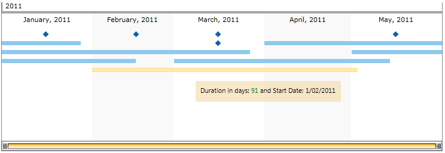

# Tooltips

__RadTimeline__ supports tooltips for its items. You can specify a tooltip template and display the details of the item itself. The purpose of this topic is to show you how this can be achieved.

The tooltip is triggered by setting the __ToolTipTemplate__ property and is used to visualize arbitrary information per data point. The user has full control over the visualization of the tooltip itself and over the information that the tooltip will display.

For the purpose we'll need a timeline, which is bound to a collection of custom objects. The objects in the data source will be used directly as values for the Timeline items as well as content for our tooltips. You can learn how to bind the Timeline from our [DataBinding]() topic as well as the [MVVM support]() topic.        

We create a sample class with two properties - Duration of TimeSpan type and Date of DateTime type. Then set values for the properties and create a method that returns a collection of business objects. This way the Timeline will be able to display information about the currently hovered data point via the ToolTipTemplate.

<snippet id='radtimeline-features-tooltips-block_1-cs' />
<snippet id='radtimeline-features-tooltips-block_2-vb' />

Our *ViewModel* class consists of a single property - the collection of business objects that will be used as itemssource for the Timeline. In the constructor of the class call the GetData method we previously created in our Product class with as many items as you want to generate for your Timeline.

<snippet id='radtimeline-features-tooltips-block_3-cs' />
<snippet id='radtimeline-features-tooltips-block_4-vb' />

Now we need to define our tooltip behavior and set its tooltip template. It will display the value of the hovered Timeline item.

<snippet id='radtimeline-features-tooltips-block_5-xaml' />

Aside from binding the Timeline, we added a binding converter. Its purpose is to show you how you may set custom foreground for the tooltip information based on condition. You may find the DurationToBrushConverter implementations in the code snippet below:        

<snippet id='radtimeline-features-tooltips-block_6-cs' />
<snippet id='radtimeline-features-tooltips-block_7-vb' />

A sample tooltip can be seen below:
