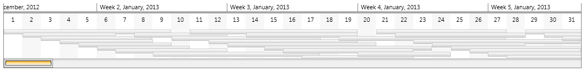
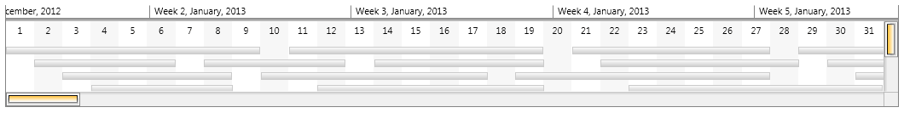
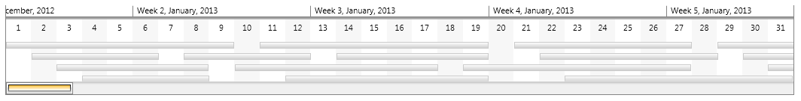
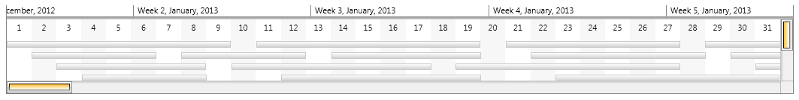

# Vertical ScrollBar

The VerticalScrollBarVisibility property of RadTimeline configures the vertical scrolling behavior of control.
      

## 

__Disabled (Default)__

When the VerticalScrollBarVisibility is Disabled RadTimeline will try to fit all of its items on the view port.
        

__Auto__

When the vertical scrolling is in automatic mode, RadTimeline will automatically arrange its items so they are
          optimally visible. If the vertical space is enough, no scroll bar will be displayed.
        

__Hidden__

When the vertical scroll bar is hidden, the items inside RadTimeline will be arranged optimally, 
          however if the items occupy more than the available vertical space, the user will not be able to scroll vertically.
        

__Visible__

In this mode items will be arranged optimally and the scroll bar will remain always visible.
        

# See Also
