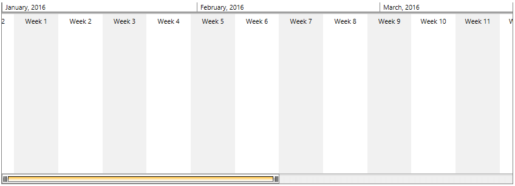
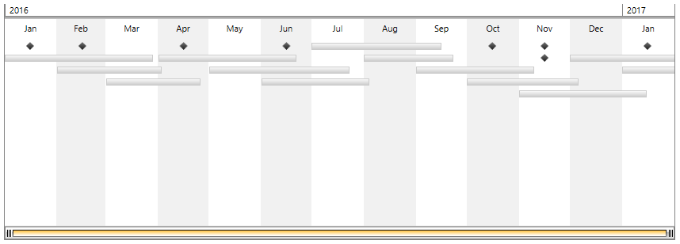

# Getting Started with {{ site.framework_name }} Timeline

This topic will walk you through the creating of __RadTimeline__.    

## Adding Telerik Assemblies Using NuGet

To use __RadTimeline__ when working with NuGet packages, install the `Telerik.Windows.Controls.DataVisualization.for.Wpf.Xaml` package. The [package name may vary]() slightly based on the Telerik dlls set - [Xaml or NoXaml]()

Read more about NuGet installation in the [Installing UI for WPF from NuGet Package]() article.

>tip With the 2025 Q1 release, the Telerik UI for WPF has a new licensing mechanism. You can learn more about it [here]().

## Adding Assembly References Manually

If you are not using NuGet packages, you can add a reference to the following assemblies:

* __Telerik.Licensing.Runtime__
* __Telerik.Windows.Controls.dll__
* __Telerik.Windows.Controls.DataVisualization.dll__
* __Telerik.Windows.Data.dll__

## Adding RadTimeline to the Project

You can include the control in your page by either dragging it from the toolbox in Visual Studio or manually creating the control. __Example 1__ demonstrate how to create __RadTimeline__ in XAML.

#### __[XAML] Example 1: Creating RadTimeline control__

{{region xaml-radtimeline-getting-started_0}}
	   <telerik:RadTimeline PeriodStart="2016/01/01" 
                            PeriodEnd="2016/06/01" 
                            VisiblePeriodStart="2016/01/01" 
                            VisiblePeriodEnd="2016/03/22"
                            StartPath="Date"
                            DurationPath="Duration">
            <telerik:RadTimeline.Intervals>
                <telerik:MonthInterval />
                <telerik:WeekInterval />
                <telerik:DayInterval />
                <telerik:HourInterval />
            </telerik:RadTimeline.Intervals>
        </telerik:RadTimeline>
{{endregion}}

#### __Figure 1: RadTimeline visualization__

## RadTimeline items

The RadTimeline control presents its data in two types of occurrences(events). The first one is a one-time occurrence which happens once in a time. The second type represents periodical occurrence. It requires a strict __Start__ and __End__ time to be presented.

#### __Figure 2: RadTimeline items visualization__

>tip More information about how to populate the control with __TimelineItems__ and __TimelineInstantItems__ can be found in the [DataBinding help article]() in our documentation.

## Setting a Theme

The controls from our suite support different themes. You can see how to apply a theme different than the default one in the [Setting a Theme]() help article.

>important Changing the theme using implicit styles will affect all controls that have styles defined in the merged resource dictionaries. This is applicable only for the controls in the scope in which the resources are merged. 

To change the theme, you can follow the steps below:

* Choose between the themes and add reference to the corresponding theme assembly (ex: **Telerik.Windows.Themes.Windows8.dll**). You can see the different themes applied in the **Theming** examples from our [WPF Controls Examples](https://demos.telerik.com/wpf/)[Silverlight Controls Examples](https://demos.telerik.com/silverlight/#Timeline/Theming) application.

* Merge the ResourceDictionaries with the namespace required for the controls that you are using from the theme assembly. For the RadTimeline, you will need to merge the following resources:

	* __Telerik.Windows.Controls__
	* __Telerik.Windows.Controls.DataVisualization__

__Example 2__ demonstrates how to merge the ResourceDictionaries so that they are applied globally for the entire application.

#### __[XAML] Example 2: Merge the ResourceDictionaries__  
{{region radtimeline-getting-started_7}}
	<Application.Resources>
		<ResourceDictionary>
			<ResourceDictionary.MergedDictionaries>
				<ResourceDictionary Source="/Telerik.Windows.Themes.Windows8;component/Themes/System.Windows.xaml"/>
				<ResourceDictionary Source="/Telerik.Windows.Themes.Windows8;component/Themes/Telerik.Windows.Controls.xaml"/>
				<ResourceDictionary Source="/Telerik.Windows.Themes.Windows8;component/Themes/Telerik.Windows.Controls.DataVisualization.xaml"/>
			</ResourceDictionary.MergedDictionaries>
		</ResourceDictionary>
	</Application.Resources>
{{endregion}}

>Alternatively, you can use the theme of the control via the [StyleManager](https://docs.telerik.com/devtools/wpf/styling-and-appearance/stylemanager/common-styling-apperance-setting-theme-wpf)[StyleManager](https://docs.telerik.com/devtools/silverlight/styling-and-appearance/stylemanager/common-styling-apperance-setting-theme).

__Figure 2__ shows a RadTimeline with the **Windows8** theme applied.

#### __Figure 2: RadTimeline with the Windows8 theme__


## Telerik UI for WPF Learning Resources

* [Telerik UI for WPF Timeline Component](https://www.telerik.com/products/wpf/timeline.aspx)
* [Getting Started with Telerik UI for WPF Components]()
* [Telerik UI for WPF Installation]()
* [Telerik UI for WPF and WinForms Integration]()
* [Telerik UI for WPF Visual Studio Templates]()
* [Setting a Theme with Telerik UI for WPF]()
* [Telerik UI for WPF Virtual Classroom (Training Courses for Registered Users)](https://learn.telerik.com/learn/course/external/view/elearning/16/telerik-ui-for-wpf) 
* [Telerik UI for WPF License Agreement](https://www.telerik.com/purchase/license-agreement/wpf-dlw-s)


## See Also
 * [Overview]()
 * [MVVM Support]()
