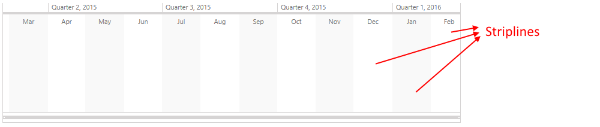
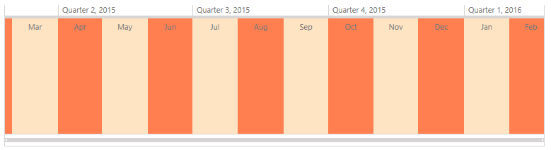

# Change the periods' strip line background

This help topic will demonstrate how to change the background of the strip lines displayed behind the RadTimeline control’s periods. 

The lines are represented by __TimelineStripLineControl__ which exposes couple of Style properties that can be used for changing its background. They accept a Style targeting a native Border element that is used for drawing the strip lines. 
* __NormalStyle__ - this style is applied on each odd strip line occurrence
* __AlternateStyle__ - this style is applied on each even strip line occurrence

You can use an implicit Style to set the style on the __TimelineStripLineControls__. The following example demonstrates this approach:
 

<snippet id='radtimeline-how-to-howto-change-striplines-background-block_1-xaml' />
	

<snippet id='radtimeline-how-to-howto-change-striplines-background-block_2-xaml' />

> The RadTimeline control doesn't expose a property that sets/gets the Style for the TimelineStripLineControls and this is why we define the style implicitly in the resources.
	

## See Also
 * [Overview] ()
 * [Properties]()
 * [DataBinding]()
 * [SDK Examples]()