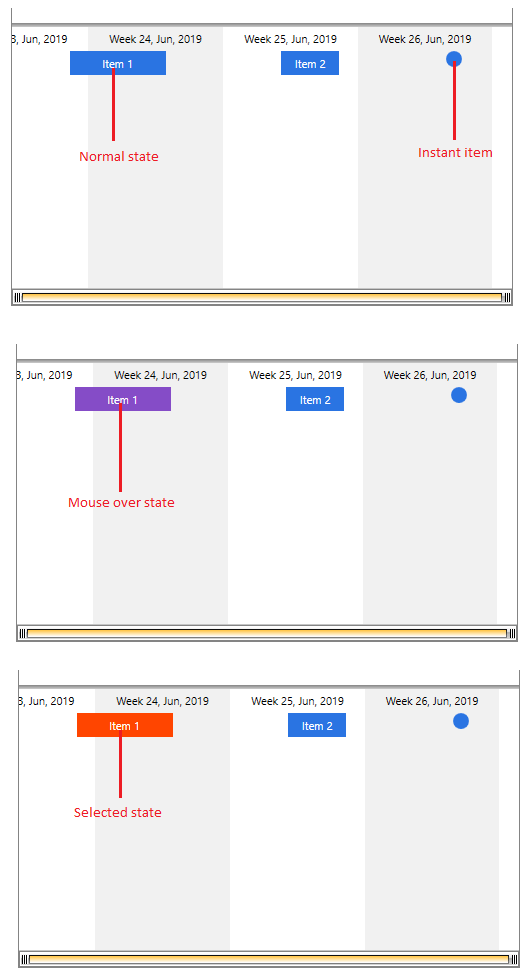

# Use Custom Items with Selection and Mouse Over Visual States

This article shows how to customize the timeline items and keep their visual states using `TimelineItemTemplate` and `TimelineInstantItemTemplate`. 

> If you want to simply change the appearance of the items and don't mind losing their highlighting (like mouse-over color, selected color, pressed color, etc.), follow the steps in the [Customizing Items]() article.

## Setting up the Models 

This section shows how to set up a very basic model that can be used to populate the `RadTimeline` control's `ItemsSource`.

__Example 1: Item model definition__
```C#
	public class ItemModel
	{
		public DateTime Start { get; set; }
		public TimeSpan Duration { get; set; }
		public string Title { get; set; }
	}
```

The `Start` and `Duration` properties define the length of the item in the timeline and `Title` holds text information about the item.

## Setting up the Data

This section shows how to populate a collection of `ItemModel` objects and assign it as the source of the `RadTimeline` control. This is done via the `ItemsSource` property.

__Example 2: Setting up the data__
```C#
	public MainWindow()
	{
		InitializeComponent();

		var startDate = new DateTime(2019, 6, 5);            
		var source = new ObservableCollection<ItemModel>();
		source.Add(new ItemModel() { Title = "Item 1", Start = startDate.AddDays(3), Duration = TimeSpan.FromDays(5) });
		source.Add(new ItemModel() { Title = "Item 2", Start = startDate.AddDays(14), Duration = TimeSpan.FromDays(3) });
		source.Add(new ItemModel() { Title = "Instant Item", Start = startDate.AddDays(23) });
		this.timeline.ItemsSource = source;
	}
```

## Modifying the Item Template

This section shows how to create a custom item template and apply it to the control using the `TimelineItemTemplate` property. Then you can add triggers to animate the background of the custom element when the mouse is over and when the item is selected.

__Example 3: Defining timeline control and an item template__
```C#
	<telerik:RadTimeline x:Name="timeline"                             
						 IsSelectionEnabled="True"
						 StartPath="Start"
						 DurationPath="Duration"
						 PeriodStart="2019-6-5"
						 PeriodEnd="2019-7-1">
            <telerik:RadTimeline.Intervals>
                <telerik:MonthInterval/>
                <telerik:WeekInterval/>
                <telerik:DayInterval />
                <telerik:HourInterval />
            </telerik:RadTimeline.Intervals>
            <telerik:RadTimeline.TimelineItemTemplate>
                <DataTemplate>
                    <Border x:Name="border" Background="#2A74E2" Height="24">
                        <TextBlock Text="{Binding DataItem.Title}" TextAlignment="Center"
                                   VerticalAlignment="Center" Foreground="White" />
                    </Border>
                    <DataTemplate.Triggers>
                        <Trigger Property="IsMouseOver" Value="True">
                            <Setter Property="Background" Value="#854CC7" TargetName="border"/>
                        </Trigger>
                        <DataTrigger Binding="{Binding IsSelected}" Value="True">
                            <Setter Property="Background" Value="OrangeRed" TargetName="border"/>
                        </DataTrigger> 
                    </DataTemplate.Triggers>
                </DataTemplate>
            </telerik:RadTimeline.TimelineItemTemplate>            
        </telerik:RadTimeline>
```

This example uses the `Triggers` collection of the `DataTemplate` in order to animate the background of the element in the template.

## Modifying the Instant Item Template

This section shows how to create a custom instant item template and apply it to the control using the `TimelineInstantItemTemplate` property. Then you can add triggers to animate the background of the custom element when the mouse is over and when the item is selected.

__Example 4: Defining timeline control and an instant item template__
```C#
	<telerik:RadTimeline x:Name="timeline"                             
						 IsSelectionEnabled="True"
						 StartPath="Start"
						 DurationPath="Duration"
						 PeriodStart="2019-6-5"
						 PeriodEnd="2019-7-1">
            <telerik:RadTimeline.Intervals>
                <telerik:MonthInterval/>
                <telerik:WeekInterval/>
                <telerik:DayInterval />
                <telerik:HourInterval />
            </telerik:RadTimeline.Intervals>
            <telerik:RadTimeline.TimelineInstantItemTemplate>
                <DataTemplate>
                     <Ellipse x:Name="ellipse" Fill="#2A74E2" Width="16" Height="16" 
                             telerik:RadToolTipService.ToolTipContent="{Binding DataItem.Title}" />
                    <DataTemplate.Triggers>
                        <Trigger Property="IsMouseOver" Value="True">
                            <Setter Property="Fill" Value="#854CC7" TargetName="ellipse"/>
                        </Trigger>
                        <DataTrigger Binding="{Binding IsSelected}" Value="True">
                            <Setter Property="Fill" Value="OrangeRed" TargetName="ellipse"/>
                        </DataTrigger>
                    </DataTemplate.Triggers>
                </DataTemplate>
            </telerik:RadTimeline.TimelineInstantItemTemplate>            
        </telerik:RadTimeline>
```

This example uses the `Triggers` collection of the `DataTemplate` in order to animate the elements in the template.

#### Figure 1: Customize item and instant item templates


## See Also  
* [Getting Started]()
* [Selection]()
