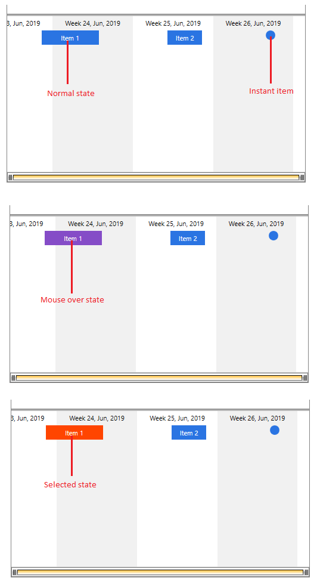

# Use Custom Items with Selection and Mouse Over Visual States

This article shows how to customize the timeline items and keep their visual states using `TimelineItemTemplate` and `TimelineInstantItemTemplate`. 

> If you want to simply change the appearance of the items and don't mind losing their highlighting (like mouse-over color, selected color, pressed color, etc.), follow the steps in the [Customizing Items]() article.

## Setting up the Models 

This section shows how to set up a very basic model that can be used to populate the `RadTimeline` control's `ItemsSource`.

__Example 1: Item model definition__
<snippet id='radtimeline-how-to-howto-customize-items-keep-visual-states-block_1-cs' />

The `Start` and `Duration` properties define the length of the item in the timeline and `Title` holds text information about the item.

## Setting up the Data

This section shows how to populate a collection of `ItemModel` objects and assign it as the source of the `RadTimeline` control. This is done via the `ItemsSource` property.

__Example 2: Setting up the data__
<snippet id='radtimeline-how-to-howto-customize-items-keep-visual-states-block_2-cs' />

## Modifying the Item Template

This section shows how to create a custom item template and apply it to the control using the `TimelineItemTemplate` property. Then you can add triggers to animate the background of the custom element when the mouse is over and when the item is selected.

__Example 3: Defining timeline control and an item template__
<snippet id='radtimeline-how-to-howto-customize-items-keep-visual-states-block_3-cs' />

This example uses the `Triggers` collection of the `DataTemplate` in order to animate the background of the element in the template.

## Modifying the Instant Item Template

This section shows how to create a custom instant item template and apply it to the control using the `TimelineInstantItemTemplate` property. Then you can add triggers to animate the background of the custom element when the mouse is over and when the item is selected.

__Example 4: Defining timeline control and an instant item template__
<snippet id='radtimeline-how-to-howto-customize-items-keep-visual-states-block_4-cs' />

This example uses the `Triggers` collection of the `DataTemplate` in order to animate the elements in the template.

#### Figure 1: Customize item and instant item templates

## See Also  
* [Getting Started]()
* [Selection]()