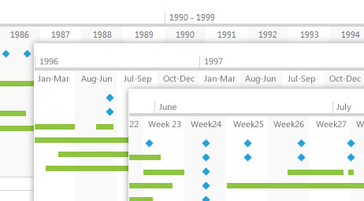

# Overview

## 





Thank you for choosing __RadTimeline__!
        

The RadTimeline control is used to visualize a sequence of events over a specified period of time.
          Its main purpose is to allow intuitive visualization of the events, lightweight scrolling and navigating through the period.
        

__RadTimeline's__ key features list:
        

* __Intervals__ - The developer can specify the possible time units for
            the timeline out of a predefined list of supported time units.
            The control chooses the best time unit from the collection according to the current zoom level.
          

* __Zoom__ - The user can zoom in and out in order to display a
            certain sub-period in greater detail or get a better overview of the whole period.
          

* __Two types of items__ - items with duration and instant items (events with no duration).
          

* __Item tooltip__ - The developer can specify a tooltip template
            for the event items, in order to display their details.
          

* __Customizeable templates__ - you can customize the appearance of the
            control through TimelineItemTemplate, TimelineInstantItemTemplate and ItemTemplateSelector.
          
