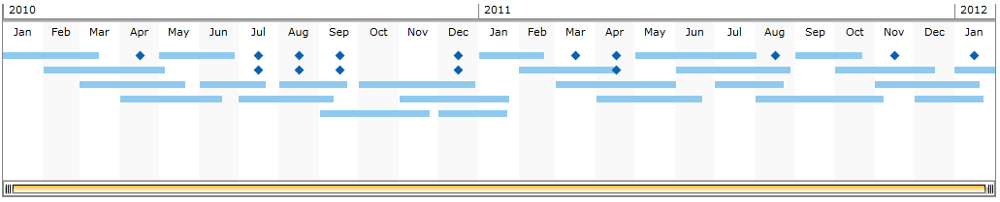

# DataBinding

>In order to use __RadTimeline__ control in your projects you have to add references to __Telerik.Windows.Controls.DataVisualization.dll, Telerik.Windows.Controls.dll and Telerik.Windows.Data.dll.__

This help topic aims to show you how easy and intuitive is to bind the __RadTimeline__ control.        

Before continuing with the code sample here's something important that you need to know about the RadTimeline and the way it presents the data. It has two types of occurences(events) - one-time occurence (happens once in a time, like birthday on a lifetime time line). The other type has a periodical occurrence. It requires a strict Start and End time to be presented.        

This article will demonstrate the binding of both. Let's start with our business object - a class with 3 properties - a Start and End date for our sample data and a collection of another class. This collection will represent our data so we'll need a duration property of TimeSpan type and a DateTime property.        


```C#
	public class Product
	{
		public IEnumerable<Item> Data { get; set; }

		public DateTime StartDate { get; set; }
		public DateTime EndDate { get; set; }
	}

	public class Item
	{
		public TimeSpan Duration { get; set; }
		public DateTime Date { get; set; }
	}
```
```VB.NET
	Public Class Product
		Public Property Data() As IEnumerable(Of Item)

		Public Property StartDate() As Date
		Public Property EndDate() As Date
	End Class

	Public Class Item
		Public Property Duration() As TimeSpan
		Public Property [Date]() As Date
	End Class
```

Now we'll need to set values to the newly created properties and assign an instance of our class (the so called business object) to the DataContext that will be used to bind the RadTimeline:        


```C#
	public MainPage() //MainWindow in WPF
	{
		InitializeComponent();
		
		var startDate = new DateTime(2010, 1, 1);
		var endDate = new DateTime(2012, 2, 1);
	
		var items = new List<Item>();
		Random r = new Random();
		for (DateTime i = startDate; i < endDate; i = i.AddMonths(1))
		{
			items.Add(new Item() { Date = i, Duration = TimeSpan.FromDays(r.Next(50, 100))} );
		}
	
		for (int i = 0; i < 15; i++)
		{
			items.Add(new Item()
			{
				Date = startDate.AddMonths(r.Next(0, 25)).AddDays(15)
			});
		}
		
		this.DataContext = new Product() { Data = items, StartDate = startDate, EndDate = endDate, };
	}	
```
```VB.NET
	Public Sub New()
		InitializeComponent()
	
		Dim startDate = New Date(2010, 1, 1)
		Dim endDate = New Date(2012, 2, 1)
	
		Dim items = New List(Of Item)()
		Dim r As New Random()
		Dim i As Date = startDate
		Do While i < endDate
			items.Add(New Item() With {.Date = i, .Duration = TimeSpan.FromDays(r.Next(50, 100))})
			i = i.AddMonths(1)
		Loop
	
		For i As Integer = 0 To 14
			items.Add(New Item() With {.Date = startDate.AddMonths(r.Next(0, 25)).AddDays(15)})
		Next i
	
		Me.DataContext = New Product() With {.Data = items, .StartDate = startDate, .EndDate = endDate}
	End Sub
```

The following XAML creates a RadTimeline and binds it to our prepared collection of data using the properties mentioned in our [Properties]() topic.        


```XAML
	<telerik:RadTimeline Height="250"
						VerticalAlignment="Top"
						Margin="6"
						PeriodStart="{Binding StartDate, Mode=TwoWay}"
						PeriodEnd="{Binding EndDate, Mode=TwoWay}"
						StartPath="Date"
						DurationPath="Duration"
						ItemsSource="{Binding Data}">
		<telerik:RadTimeline.Intervals>
			<telerik:YearInterval />
			<telerik:MonthInterval />
			<telerik:WeekInterval />
			<telerik:DayInterval />
		</telerik:RadTimeline.Intervals>
	</telerik:RadTimeline>
```

The result can be seen below:

