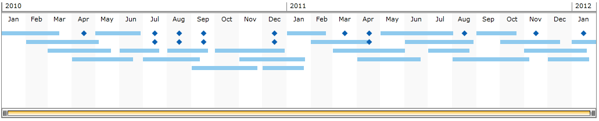

# DataBinding

>In order to use __RadTimeline__ control in your projects you have to add references to __Telerik.Windows.Controls.DataVisualization.dll, Telerik.Windows.Controls.dll and Telerik.Windows.Data.dll.__

This help topic aims to show you how easy and intuitive is to bind the __RadTimeline__ control.        

Before continuing with the code sample here's something important that you need to know about the RadTimeline and the way it presents the data. It has two types of occurences(events) - one-time occurence (happens once in a time, like birthday on a lifetime time line). The other type has a periodical occurrence. It requires a strict Start and End time to be presented.        

This article will demonstrate the binding of both. Let's start with our business object - a class with 3 properties - a Start and End date for our sample data and a collection of another class. This collection will represent our data so we'll need a duration property of TimeSpan type and a DateTime property.        

<snippet id='radtimeline-populating-with-data-databinding-block_1-cs' />
<snippet id='radtimeline-populating-with-data-databinding-block_2-vb' />

Now we'll need to set values to the newly created properties and assign an instance of our class (the so called business object) to the DataContext that will be used to bind the RadTimeline:        

<snippet id='radtimeline-populating-with-data-databinding-block_3-cs' />
<snippet id='radtimeline-populating-with-data-databinding-block_4-vb' />

The following XAML creates a RadTimeline and binds it to our prepared collection of data using the properties mentioned in our [Properties]() topic.        

<snippet id='radtimeline-populating-with-data-databinding-block_5-xaml' />

The result can be seen below:

