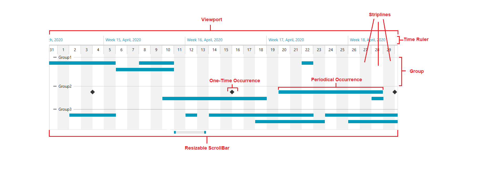

# Visual Structure

This section defines the terms and concepts used in the scope of the __RadTimeline__ control. They can be helpful when contacting with the support service in order to describe your issue better. Below you can see snapshots and explanations of the main visual elements of the control:

__Viewport__: The rectangular region representing the time span between __VisiblePeriodStart__ and __VisiblePeriodEnd__. 

__Resizable ScrollBar__: You can use the Resizable ScrollBar or the __SelectionThumb__ to change the time span of the TimeBar control.

__Time Ruler__: The area where the time periods are shown.

__One-Time Occurrence__: The one-time occurrence items happen one in a time, and the __TimelineInstantItem__ framework element represents it.

__Periodical Occurrence__: The periodical occurrence items happen periodical, and __TimelineItem__ framework element represents it.

__Group__: The timeline items in the RadTimeline control can be displayed in groups. The groups can be expanded or collapse.

__Striplines__: The lines are represented by a __TimelineStripLineControl__ framework control.

