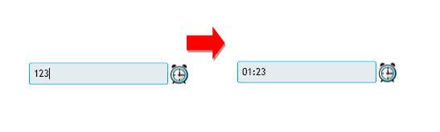
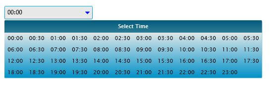

# Dynamic Creation

The following snippet creates a TimePicker in XAML and code-behind:

#### __XAML__

```XAML
	<telerik:RadTimePicker />
```

#### __C#__

```C#
	RadTimePicker timePicker = new RadTimePicker();
```

RadTimePicker exposes  SelectedTime event that can be handled: __SelectedTimeChanged.__ The event can be handled as demonstrated in the next example.

#### __XAML__

```XAML
	<StackPanel>
	    <telerik:RadTimePicker SelectionChanged="timePicker_SelectedTimeChanged"/>
	    <TextBlock x:Name="message" />
	</StackPanel>
```

or you can use only code-behind.

#### __C#__

```C#
	public partial class Page : UserControl
	{
	    public Page()
	    {
	        InitializeComponent();
	        this.timePicker.SelectionChanged += new
	                      SelectionChangedEventHandler(timePicker_SelectedTimeChanged);
	    }
	    void timePicker_SelectedTimeChanged(object sender, EventArgs e)
	    {
	        this.text.Text = timePicker.SelectedTime.ToString();
	    }
```

RadTimePickers times can be set using binding to data object or through __StartTime,EndTime and TimeInterval__ properties. If you do not want to set anything RadTimePicker has default values:

StartTime ="0:0:0";

EndTime = "23:59:0";

TimeInterval = "1:0:0";

In the next example you can see how to set this properties in XAML and code-behind:

#### __XAML__

```XAML
	<telerik:RadTimePicker x:Name="timePicker" EndTime="2:0:0"/>
```

#### __C#__

```C#
	public partial class Page : UserControl
	{
	    public Page()
	    {
	        InitializeComponent();
	        this.timePicker.TimeInterval = new TimeSpan(0, 25, 0);
	        this.timePicker.StartTime = new TimeSpan(2, 0, 0);
	    }
```

You may switch between different data sources at runtime as demonstrated in the next example:

#### __C#__

```C#
	public partial class Page : UserControl
	{
	    public Page()
	    {
	        InitializeComponent();
	        this.buttonBind.Click += new RoutedEventHandler(buttonBind_Click);
	    }
	    void buttonBind_Click(object sender, RoutedEventArgs e)
	    {
	        this.timePicker.ClockItemsSource = LoadDataObjects();
	    }
	    public ObservableCollection<TimeSpan> LoadDataObjects()
	    {
	        ObservableCollection<TimeSpan> times = new ObservableCollection<TimeSpan>()
	        { 
	           new TimeSpan(9,0,0),
	           new TimeSpan(10,0,0),
	           new TimeSpan(10,5,0),
	           new TimeSpan(10,22,0),
	           new TimeSpan(10,38,0),
	           new TimeSpan(11,54,0),
	           new TimeSpan(12,56,0),
	           new TimeSpan(12,59,0)
	        };
	        return times;
	    }
```

Instead of selecting the time from the clock you can also type the time you want in the TextBox. RadTime picker has KeyEvents support and Parser that validate entered time as soon as the enter key is pressed.



You can also fully customize TimePickers Header with __HeaderContent__ property and IconStyle with __IconButtonStyle__ property. For more information review Appearance section.

