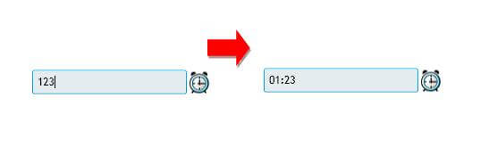
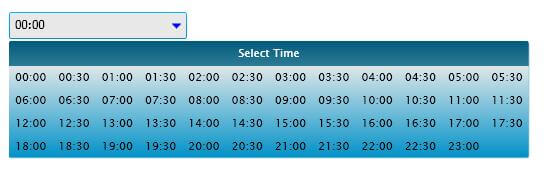

# Dynamic Creation

The following snippet creates a TimePicker in XAML and code-behind:

<snippet id='radtimepicker-features-radtimepicker-dynamic-creation-block_1-xaml' />

<snippet id='radtimepicker-features-radtimepicker-dynamic-creation-block_2-cs' />

RadTimePicker exposes  SelectedTime event that can be handled: __SelectedTimeChanged.__ The event can be handled as demonstrated in the next example.

<snippet id='radtimepicker-features-radtimepicker-dynamic-creation-block_3-xaml' />

or you can use only code-behind.

<snippet id='radtimepicker-features-radtimepicker-dynamic-creation-block_4-cs' />

RadTimePickers times can be set using binding to data object or through __StartTime,EndTime and TimeInterval__ properties. If you do not want to set anything RadTimePicker has default values:

StartTime ="0:0:0";

EndTime = "23:59:0";

TimeInterval = "1:0:0";

In the next example you can see how to set this properties in XAML and code-behind:

<snippet id='radtimepicker-features-radtimepicker-dynamic-creation-block_5-xaml' />

<snippet id='radtimepicker-features-radtimepicker-dynamic-creation-block_6-cs' />

You may switch between different data sources at runtime as demonstrated in the next example:

<snippet id='radtimepicker-features-radtimepicker-dynamic-creation-block_7-cs' />

Instead of selecting the time from the clock you can also type the time you want in the TextBox. RadTime picker has KeyEvents support and Parser that validate entered time as soon as the enter key is pressed.

You can also fully customize TimePickers Header with __HeaderContent__ property and IconStyle with __IconButtonStyle__ property. For more information review Appearance section.

