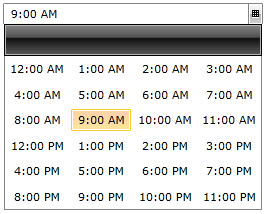

# Overview

## 



__RadTimePicker__ is a convenient way to get rid of boring time parsing and data validation. RadTimePicker is easy and simple, but yet essential way to improve end-user experience. Moreover, you can control the layout of the popup that shows time values as well as to use the rich data model in Silverlight to populate content dynamically.
        

# See Also

 * [Required Parts]()
