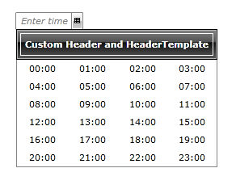

# Header Template

In __RadTimePicker__ it is possible to customize the built-in text and template of the __Header__ and __HeaderTemplate__.        

The next example will demonstrate the necessary steps in order to customize the Header and HeaderTemplate of the RadTimePicker control.        

1. First you will need to declare a __Style__ that targets __RadClock__:            

	#### __XAML__

	{{region radtimepicker-header-template_0}}
		
	{{endregion}}

1. Next you will need to set the __Header__ property of the newly declared Style:            

	#### __XAML__

	{{region radtimepicker-header-template_1}}
		
	{{endregion}}

1. After that you will need to set the __HeaderTemplate__:            

	#### __XAML__

	{{region radtimepicker-header-template_2}}
		
	{{endregion}}

1. Finally all you need to do is set the newly created Style to the __ClockStyle__ of the control:            

	#### __XAML__

	{{region radtimepicker-header-template_3}}
		<telerik:RadTimePicker ClockStyle="{StaticResource RadClockStyle}"/>
	{{endregion}}

The next screenshot shows the final result:

