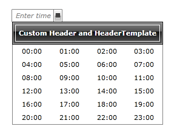

# Header Template

In __RadTimePicker__ it is possible to customize the built-in text and template of the __Header__ and __HeaderTemplate__.        

The next example will demonstrate the necessary steps in order to customize the Header and HeaderTemplate of the RadTimePicker control. 

> Please note that if you are using [NoXaml]() dlls, you need to base your style on the default one for the theme. You can read more about that in the [Styling the Controls]() article.      

__Example 1: Define Style targeting RadClock__

<snippet id='radtimepicker-styles-and-templates-header-template-block_1-xaml' />

__Example 2: Set Header property__

<snippet id='radtimepicker-styles-and-templates-header-template-block_2-xaml' />

__Example 3: Set HeaderTemplate property__

<snippet id='radtimepicker-styles-and-templates-header-template-block_3-xaml' />

__Example 4: Set RadTimePicker's ClockStyle property__

<snippet id='radtimepicker-styles-and-templates-header-template-block_4-xaml' />

#### __Figure 1: RadTimePicker with styled header__

