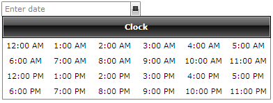
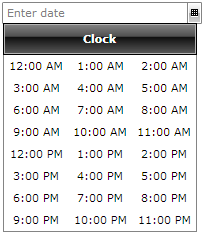

# Layout Support

The __RadTimePicker__  is style able control that support all kinds of Panel layouts. This example demonstrates how you can build a custom Time Picker by simply setting the __ItemsPanel__ property of the ClockStyle.

First, we need to define new ItemsPanel and set it in the ClockStyle.


```XAML
	<!--Layout 1-->
	<Style x:Key="RadUniformGridStyle1" TargetType="telerik:RadUniformGrid">
	    <Setter Property="Rows" Value="4"/>
	    <Setter Property="ChildrenFlow" Value="Horizontal" />
	</Style>
	
	<Style TargetType="telerik:RadClock" x:Key="RadClockStyle1">
	    <Setter Property="Header" Value="Clock" />
	
	    <Setter Property="ItemsPanel">
	        <Setter.Value>
	            <ItemsPanelTemplate>
	                <telerik:RadUniformGrid x:Name="uniformGrid" Style="{StaticResource RadUniformGridStyle1}" />
	            </ItemsPanelTemplate>
	        </Setter.Value>
	    </Setter>
	</Style>
	
	<!--Layout 1-->
	<Style x:Key="RadUniformGridStyle2" TargetType="telerik:RadUniformGrid">
	    <Setter Property="Columns" Value="3"/>
	    <Setter Property="ChildrenFlow" Value="Horizontal" />
	</Style>
	
	<Style TargetType="telerik:RadClock" x:Key="RadClockStyle2">
	    <Setter Property="Header" Value="Clock" />
	    <Setter Property="ItemsPanel">
	        <Setter.Value>
	            <ItemsPanelTemplate>
	                <telerik:RadUniformGrid x:Name="uniformGrid" Style="{StaticResource RadUniformGridStyle2}" />
	            </ItemsPanelTemplate>
	        </Setter.Value>
	    </Setter>
	</Style>
```

Then, set the ClockStyle property to the TimePicker.


```XAML
	<Grid x:Name="LayoutRoot" Background="White">
	    <telerik:RadDateTimePicker InputMode="TimePicker" Margin="68,0,0,0" ClockStyle="{StaticResource RadClockStyle1}"
	VerticalAlignment="Center" HorizontalAlignment="Left" Width="200"/>
	
	    <telerik:RadDateTimePicker InputMode="TimePicker" Margin="0,229,101,229" ClockStyle="{StaticResource RadClockStyle2}" 
	HorizontalAlignment="Right" Width="200" d:LayoutOverrides="Height"/>
```

This is how the first layout looks like:



This is how the second layout looks like:


