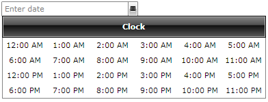
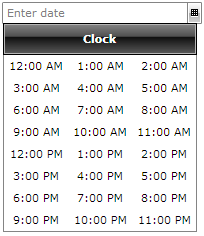

# Layout Support

The __RadTimePicker__  is style able control that support all kinds of Panel layouts. This example demonstrates how you can build a custom Time Picker by simply setting the __ItemsPanel__ property of the ClockStyle.

First, we need to define new ItemsPanel and set it in the ClockStyle.

<snippet id='radtimepicker-styles-and-templates-layout-support-block_1-xaml' />

Then, set the ClockStyle property to the TimePicker.

<snippet id='radtimepicker-styles-and-templates-layout-support-block_2-xaml' />

This is how the first layout looks like:

This is how the second layout looks like:

