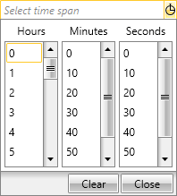

# Overview

Thank you for choosing Telerik __RadTimeSpanPicker__!

__RadTimeSpanPicker__ is a UI component that provides a full control over picking a specific time span and duration using the built-in components for days, hours, minutes, seconds and milliseconds. You could easily define some minimum/maximum ranges and specific value step for the components. __RadTimeSpanPicker__ also provides the ability to create custom components to meet any specific user scenarios.

## Key Features

* __TimeSpanComponents__ - __RadTimeSpanPicker__ supports built-in components for picking days, hours, minutes, seconds and milliseconds. A specific minimum/maximum ranges and value step could be set for each component separately.

* __Styling and Appearance__ - You can easily customize the appearance of the control.

* __Watermark__ - __RadTimeSpanPicker__ allows the user to set a desired watermark content using the __TimeSpanWatermarkContent__ property and modify it as needed using the __TimeSpanWatermarkTemplate__ property.

* __Events__ - Support of routed events and some specific for the control events.

You can check __RadTimeSpanPicker__ demos at: [https://demos.telerik.com/wpf](https://demos.telerik.com/wpf).

## See Also

 * [Getting Started]()

 * [Visual Structure]()
