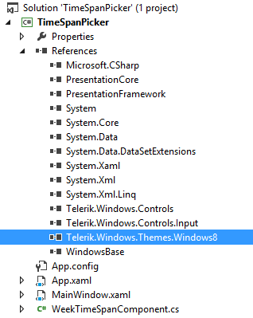
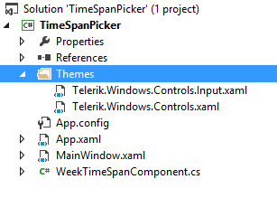
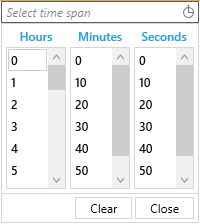

# Setting a Theme

This article will demonstrates how the user could easily apply one of the built-in themes to __RadTimeSpanPicker__.

>__RadTimeSpanPicker__ like all other WPF Telerik controls supports styling using Implicit Styles. [Here]() you could find some more detailed information concerning Implicit Styles.

The first thing you need to do in order a theme to be applied correctly is to merge the following Xaml files:

* Telerik.Windows.Controls.xaml

* Telerik.Windows.Controls.Input.xaml

There are two apporaches that you could use in order to merge the files:

* The first one is directly from the theme assembly:

For example let's demonstrate how to apply Windows8 theme to __RadTimeSpanPicker__ - please, notice that the Telerik.Windows.Themes.Windows8.dll should be added as well:

__Figure 1:__ Adding the needed references	


After that merge the xaml files in the App.xaml as shown in __Example 1__:

__Example 1: Merging the .xaml files__
```XAML
	<Application.Resources>
	    <ResourceDictionary>
	        <ResourceDictionary.MergedDictionaries>
	            <ResourceDictionary Source="/Telerik.Windows.Themes.Windows8;component/Themes/Telerik.Windows.Controls.xaml" />
	            <ResourceDictionary Source="/Telerik.Windows.Themes.Windows8;component/Themes/Telerik.Windows.Controls.Input.xaml" />
	        </ResourceDictionary.MergedDictionaries>
	    </ResourceDictionary>
	</Application.Resources>
```
	
* The second appraoch that you could use in order to apply the desired theme is to add references to the required assemblies from Binaries.NoXaml folder. For that purpose a folder named Themes needs to be created. That folder should contain the corresponding .xaml files from Themes.Implicit/../Windows8/../Themes/ folder located in the installation folder:

	__Figure 2:__ Copying the .xaml files
	
	
	__Example 2__ shows how to merge the copied .xaml files.            

	__Example 2: Merging the .xaml files__

	```XAML
		<Application.Resources>
		    <ResourceDictionary>
		        <ResourceDictionary.MergedDictionaries>
		            <ResourceDictionary Source="Themes/Telerik.Windows.Controls.xaml" />
		            <ResourceDictionary Source="Themes/Telerik.Windows.Controls.Navigation.xaml" />
		        </ResourceDictionary.MergedDictionaries>
		    </ResourceDictionary>
		</Application.Resources>
	```
	
Either way you choose, the end result will be the following:

__Figure 3:__ TimeSpanPicker with Windows8 theme applied


## See Also

 * [Getting Started]()

 * [Visual Structure]()