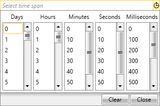
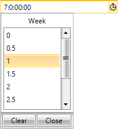

# TimeSpanComponents

This topic provides a detailed information for the built-in components of __RadTimeSpanPicker__ and how a custom component could be created:

* [Built-in TimeSpanComponents](#built-in-timespancomponents)

* [Custom TimeSpanComponent](#custom-timespancomponent)


## Built-in TimeSpanComponents

__RadTimeSpanPicker__ provides the ability of selecting the desired time span using some of the built-in components. There are five predefined components from which you could easily choose days, hours, minutes, seconds and milliseconds. Each component can be configured - you can set some minimum and maximum range, a value step that defines the difference between two sequential selectable values. Users cannot change the ItemsSource of neither of the predefined components, because they derive from StepTimeSpanComponent, thus their ItemsSource is populated from Minimum, Maximum and Step steps and cannot be explicitly set. Also you can change the Header.

* __DayTimeSpanComponent__ - a component used for picking interval of days. By design it has a minimum range set to 0 and maximum to 30 with a step set to 1.

* __HourTimeSpanComponent__ - a component for picking interval of  hours. Again by design the minimum range is set to 0 with step set to 1 while the maximum is set 24.

* __MinuteTimeSpanComponent__ - a component used for picking interval of  minutes. Has the same minimum range and maximum of 60. It has a step = 10.

* __SecondTimeSpanComponent__ - represents a component for picking interval of seconds with minimum range set to 0 and maximum one set to 60 - also has a step = 10.

* __MillisecondTimeSpanComponent__ - represents a component for picking interval of milliseconds. It has a maximum range set to 1000. The step has a set value of 100.

>Overall all components have Minimum = 0. However, their Step and Maximum vary.

In order to include each one of the components in __RadTimeSpanPicker__, they have to be defined as follows:

__Defining TimeSpanComponents__

```XAML
	<UserControl xmlns:telerik="http://schemas.telerik.com/2008/xaml/presentation">
	    <Grid x:Name="LayoutRoot" Background="White">
	        <telerik:RadTimeSpanPicker>
	            <telerik:RadTimeSpanPicker.TimeSpanComponents>
	                <telerik:DayTimeSpanComponent Step="1.5" Maximum="22"/>
	                <telerik:HourTimeSpanComponent/>
	                <telerik:MinuteTimeSpanComponent Step="30"/>
	                <telerik:SecondTimeSpanComponent/>
	                <telerik:MillisecondTimeSpanComponent Minimum="100" Maximum="9000" Step="150"/>
	            </telerik:RadTimeSpanPicker.TimeSpanComponents>
	        </telerik:RadTimeSpanPicker>
	    </Grid>
	</UserControl>
```

You can also define them in code-behind:

__Defining TimeSpanComponents in code__

```C#
	RadTimeSpanPicker timeSpanPicker = new RadTimeSpanPicker();
	DayTimeSpanComponent dayComponent = new DayTimeSpanComponent();
	HourTimeSpanComponent hourComponent = new HourTimeSpanComponent();
	MinuteTimeSpanComponent minuteComponent = new MinuteTimeSpanComponent();
	SecondTimeSpanComponent secondComponent = new SecondTimeSpanComponent();
	MillisecondTimeSpanComponent millisecondComponent = new MillisecondTimeSpanComponent();
	timeSpanPicker.TimeSpanComponents.Add(dayComponent);
	timeSpanPicker.TimeSpanComponents.Add(hourComponent);
	timeSpanPicker.TimeSpanComponents.Add(minuteComponent);
	timeSpanPicker.TimeSpanComponents.Add(secondComponent);
	timeSpanPicker.TimeSpanComponents.Add(millisecondComponent);
```

__Defining TimeSpanComponents code__

```VB
	Dim timeSpanPicker As New RadTimeSpanPicker()
	Dim dayComponent As New DayTimeSpanComponent()
	Dim hourComponent As New HourTimeSpanComponent()
	Dim minuteComponent As New MinuteTimeSpanComponent()
	Dim secondComponent As New SecondTimeSpanComponent()
	Dim millisecondComponent As New MillisecondTimeSpanComponent()
	timeSpanPicker.TimeSpanComponents.Add(dayComponent)
	timeSpanPicker.TimeSpanComponents.Add(hourComponent)
	timeSpanPicker.TimeSpanComponents.Add(minuteComponent)
	timeSpanPicker.TimeSpanComponents.Add(secondComponent)
	timeSpanPicker.TimeSpanComponents.Add(millisecondComponent)
```

__Figure 1:__ RadTimeSpanPicker with all five built-in components
	


### Key properties

All five predefined TimeSpanComponents have various properties, which can be set so they could be configured in accordance with your scenario. In the following section we will go through some common properties.

* __ItemSource__ - represents the collection of available items the user could choose from. Its main purpose is to populate the Items inside the TimeSpanComponents.

* __Minimum__ - this is a property of type decimal that is used to define the minimum value of the selectable items in the ItemSource collection of __RadTimeSpanPicker__.

* __Maximum__ - represents the maximum value of the selectable items in the ItemSource that the user could pick. Again, like the Minimum property it is of type decimal.

* __Step__ - it defines the value steps difference between two sequential selectable values. It is used to increment each value that populate the ItemsSource collection. It is of type decimal.

* __Header__ - a property of type string that represents the title of the TimeSpanComponent.

## Custom TimeSpanComponent

If none of the built-in TimeSpanComponents satisfy your requirements you could easily create a custom one. When you create a custom TimeSpanComponent you gain the ability to change the way the items from the ItemSource collection will be represented in ticks.

In order to implement the desired TimeSpanComponent you need to create a class that derives either from the __TimeSpanComponentBase__ or the __StepTimeSpanComponentBase__ class.

The __TimeSpanComponentBase__ class is a base class that is used as a DataContext for RadTimeSpanPickerComponent. This class consist of the following methods:

* __GetTicksFromItem(object item)__-  returns a TimeSpan as ticks value corresponding to the passed item from the ItemsSource.

* __GetSelectedIndexFromTimeSpan__ - returns the index of the item from the ItemsSource that should be selected for a particular TimeSpan value - is not mandatory to be overridden. It should be overridden when the user wants to choose which item to select when the RadTimeSpanPicker.Value changes.

The __TimeSpanComponentBase__ class also contains the __ItemsSource__ and __Header__ properties.

The __StepTimeSpanComponentBase__ class derives from the __TimeSpanComponentBase__. The main difference with its base class is that it uses the __Maximum__, __Minimum__ and __Step__ properties to populate the ItemSource collection.

The following example will demonstrate how to create a custom TimeSpanComponent that represents weeks.

Firstly you need to create a custom class that inherits the __StepTimeSpanComponentBase__ class:

__Creating custom TimeSpanComponent__

```C#
	public class WeekTimeSpanComponent : StepTimeSpanComponentBase
	{
	    protected override Freezable CreateInstanceCore()
	    {
	        return new WeekTimeSpanComponent();
	    }
	    //....
```

__Creating custom TimeSpanComponent__

```VB
	Public Class WeekTimeSpanComponent
	    Inherits StepTimeSpanComponentBase
	    Protected Overrides Function CreateInstanceCore() As Freezable
	        Return New WeekTimeSpanComponent()
	    End Function
	    '...
```

Because the __TimeSpanComponentBase__ class derives from the __Freezable__ class the __CreateInstanceCore__ should always be overridden.

Next thing you have to do is to override the __GetTicksFromItem__ method that should return the ticks value that corresponds to each item from the ItemSource and turns the week into a valid time span value:

__Override GetTicksFromItem__

```C#
	public override long GetTicksFromItem(object item)
	{
	    if (item != null)
	    {
	        var ticksForOneUnitMultiplier = 7;
	        decimal selectedItemDecimal;
	        if (decimal.TryParse(item.ToString(), out selectedItemDecimal))
	        {
	            return TimeSpan.FromDays((double)(ticksForOneUnitMultiplier * selectedItemDecimal)).Ticks;
	        }
	    }
	
	    return 0;
	}
```

__Override GetTicksFromItem__
```VB
	Public Overrides Function GetTicksFromItem(item As Object) As Long
	    If item IsNot Nothing Then
	        Dim ticksForOneUnitMultiplier = 7
	        Dim selectedItemDecimal As Decimal
	        If Decimal.TryParse(item.ToString(), selectedItemDecimal) Then
	            Return TimeSpan.FromDays((ticksForOneUnitMultiplier * selectedItemDecimal)).Ticks
	        End If
	    End If
	    Return 0
	End Function
```

Finally all you need to do is to add the newly created TimeSpanComponent into the TimeSpanComponents collection:

__Add the custom TimeSpanComponent__

```XAML
	<telerik:RadTimeSpanPicker>
	    <telerik:RadTimeSpanPicker.TimeSpanComponents>
	        <local:WeekTimeSpanComponent Minimum = "0" Maximum = "4" Step = "0.5" Header = "Week"/>
	    </telerik:RadTimeSpanPicker.TimeSpanComponents>
	</telerik:RadTimeSpanPicker>
```

The following figure demonstrate the final result:
__Figure 2:__ TimeSpanComponent that consist of weeks:
	


## See Also

 * [Overview]()

 * [Getting Started]()
