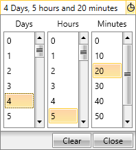

# Key Properties

This help article will provide information about the __StringFormat__ property, a key property of the __RadTimeSpanPicker__ control.

## StringFormat

You can use the __StringFormat__ property for formatting the representation of the selected TimeSpan value to any desired format. By using it the current format of the TimeSpan could easily be changed.

The following example demonstrates how to set the __StringFormat__ property.

__Example 1: Setting the StringFormat of the RadTimeSpanPicker__

```XAML
	<telerik:RadTimeSpanPicker StringFormat="d' Days, 'h' hours and 'mm' minutes'">
	    <telerik:RadTimeSpanPicker.TimeSpanComponents>
	        <telerik:DayTimeSpanComponent/>
	        <telerik:HourTimeSpanComponent/>
	        <telerik:MinuteTimeSpanComponent/>
	    </telerik:RadTimeSpanPicker.TimeSpanComponents>
	</telerik:RadTimeSpanPicker>
```

#### __Figure 1: The new StringFormat representation of the TimeSpan__


>You can find detailed inforamation about the supported formats of the TimeSpan [here](https://msdn.microsoft.com/en-us/library/ee372287%28v=vs.110%29.aspx).

## See Also

 * [Overview]()

 * [Getting Started]()
